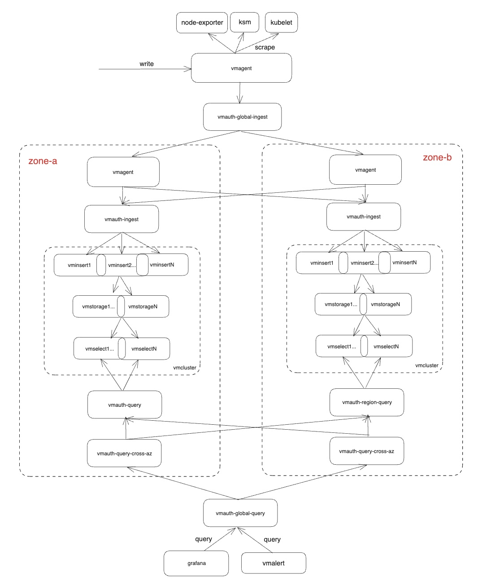

# Victoria Metrics Helm Chart for Running VMCluster on Multiple Availability Zones

  
[](https://artifacthub.io/packages/helm/victoriametrics/victoria-metrics-distributed)
[](https://slack.victoriametrics.com/)

A Helm chart for Running VMCluster on Multiple Availability Zones

## Prerequisites

* Install the follow packages: ``git``, ``kubectl``, ``helm``, ``helm-docs``. See this [tutorial](../../REQUIREMENTS.md).

* PV support on underlying infrastructure.

* Multiple availability zones.

## Chart Details

This chart is for setting up multiple VictoriaMetrics cluster instances on multiple [availability zones](https://kubernetes.io/docs/setup/best-practices/multiple-zones/). It includes both per availability zone components and global components.
The default topology is like


Per availability zone components:
1. vmagent: remotes write to all availability zones to ensure data completeness.
2. vmauth-ingest: performs l`east_loaded` policy for spreading requests to vminsert instances located in the same availability zone.
3. vmcluster: supports different setup per availability zone.
4. vmauth-query: performs `least_loaded` policy for spreading requests to vmselect instances located in the same availability zone.
5. vmauth-query-cross-az: performs `first_available` policy on vmselect instances of all the availability zones, prefers "local" vmselect to reduce cross zone traffic.

Global components:
1. vmagent: an extra vmagent to scrape targets and remote write to `vmauth-global-ingest`.
2. vmauth-global-ingest: global write entrance.
3. vmauth-global-query: global query entrance.
4. grafana

Note:
As the diagram showed above, this chart doesn't include components like vmalert, alertmanager, etc by default. If needed, you can create those resources using victoria-metrics-k8s-stack chart.

### When&Why use `victoria-metrics-distributed` chart?

One of the best practice for running production kubernetes cluster is running with [multiple availability zones](https://kubernetes.io/docs/setup/best-practices/multiple-zones/). And to avoid zone outage, we also want to spread our application pods on multiple availability zones.
For VictoriaMetrics, there are two ways:
1. set up one vmcluster but spread the components on different zones by using `topologySpreadConstraints`.
For example, set up vmcluster with two vminsert&vmstorage&vmselect instances and `replicationFactor=2`, and set `topologySpreadConstraints` for them like:
```
    topologySpreadConstraints:
      - maxSkew: 1
        topologyKey: topology.kubernetes.io/zone
        whenUnsatisfiable: DoNotSchedule
```
Then each zone has a complete set of vminsert&vmstorage&vmselect, vmcluster can still serve write and query requests when one zone failure.
But VictoriaMetrics components themselves don't support zone-awareness, means in the above example, if you have more than two vmstorage nodes and `replicationFactor=2`, vmstorage can't ensure that duplicated data written to vmstorage instances on different availability zone, thus data could be incomplete when one availability zone is down.
2. use `victoria-metrics-distributed` chart, set up vmcluster for each availability zone, use the global write entrance to ingest data and the global query entrance to query.

### How to use multitenancy?

By default, all the data that write to `vmauth-global-ingest` will be stored with tenant 0. If you want to write to different tenants, creating extra VMUser for `vmauth-global-ingest`.
For example, ingesting data with tenant `1088` with follow steps:
1. create tenant VMUser for vmauth `vmauth-global-ingest` to use:
```
apiVersion: operator.victoriametrics.com/v1beta1
kind: VMUser
metadata:
  name: tenant-1088-rw
  labels:
    tenant-test: "true"
spec:
  targetRefs:
  - static:
      ## list all the zone vmagent here
      url: "http://vmagent-vmagent-zone-a:8429"
      url: "http://vmagent-vmagent-zone-b:8429"
    paths:
    - "/api/v1/write"
    - "/prometheus/api/v1/write"
    - "/write"
    - "/api/v1/import"
    - "/api/v1/import/.+"
    target_path_suffix: /insert/1088/
  username: tenant-1088
  password: dangerous
```

add vmuser selector in vmauth `vmauth-global-ingest`
```
spec:
  userSelector:
    matchLabels:
      tenant-test: "true"
```

2. send data to `vmauth-global-ingest` with tenant user's token
Example command for writing the data using vmagent for above tenant 1088:
```
/path/to/vmagent -remoteWrite.url=http://vmauth-vmauth-global-ingest:8427/prometheus/api/v1/write -remoteWrite.basicAuth.username=tenant-1088 -remoteWrite.basicAuth.password=dangerous
```

### How to roll out components?

All the components under each availability zone can be configured separately, it's recommend to upgrade one zone at a time, stop ingesting and querying until upgrade is completed.
```
availabilityZones:
  # stop ingest and query from zone-a until upgrade is completed
  - name: zone-a
    # allow data ingestion to this zone
    allowIngest: false
    # allow data query from this zone through global query endpoint
    allowQuery: false
```

## How to install

Access a Kubernetes cluster.

Add a chart helm repository with follow commands:

```console
helm repo add vm https://victoriametrics.github.io/helm-charts/

helm repo update
```

List versions of ``vm/victoria-metrics-distributed``` chart available to installation:

```console
helm search repo vm/victoria-metrics-distributed` -l
```

Export default values of ``victoria-metrics-distributed``` chart to file ``values.yaml``:

```console
helm show values vm/victoria-metrics-distributed` > values.yaml
```

Change the values according to the need of the environment in ``values.yaml`` file.

Test the installation with command:

```console
helm install vmcluster vm/victoria-metrics-distributed` -f values.yaml -n NAMESPACE --debug --dry-run
```

Install chart with command:

```console
helm install vmcluster vm/victoria-metrics-distributed` -f values.yaml -n NAMESPACE
```

Get the pods lists by running this commands:

```console
kubectl get pods -A | grep 'vminsert\|vmselect\|vmstorage'
```

Get the application by running this command:

```console
helm list -f vmcluster -n NAMESPACE
```

See the history of versions of ``vmcluster`` application with command.

```console
helm history vmcluster -n NAMESPACE
```

## How to uninstall

Remove application with command.

```console
helm uninstall vmcluster -n NAMESPACE
```

## Documentation of Helm Chart

Install ``helm-docs`` following the instructions on this [tutorial](../../REQUIREMENTS.md).

Generate docs with ``helm-docs`` command.

```bash
cd charts/victoria-metrics-distributed`

helm-docs
```

The markdown generation is entirely go template driven. The tool parses metadata from charts and generates a number of sub-templates that can be referenced in a template file (by default ``README.md.gotmpl``). If no template file is provided, the tool has a default internal template that will generate a reasonably formatted README.

## Parameters

The following tables lists the configurable parameters of the chart and their default values.

Change the values according to the need of the environment in ``victoria-metrics-distributed`/values.yaml`` file.

| Key | Type | Default | Description |
|-----|------|---------|-------------|
| availabilityZones[0].allowIngest | bool | `true` |  |
| availabilityZones[0].allowQuery | bool | `true` |  |
| availabilityZones[0].name | string | `"zone-a"` |  |
| availabilityZones[0].nodeSelector."topology.kubernetes.io/zone" | string | `"zone-a"` |  |
| availabilityZones[0].topologySpreadConstraints[0].maxSkew | int | `1` |  |
| availabilityZones[0].topologySpreadConstraints[0].topologyKey | string | `"kubernetes.io/hostname"` |  |
| availabilityZones[0].topologySpreadConstraints[0].whenUnsatisfiable | string | `"ScheduleAnyway"` |  |
| availabilityZones[0].vmagent.annotations | object | `{}` |  |
| availabilityZones[0].vmagent.enabled | bool | `true` |  |
| availabilityZones[0].vmagent.name | string | `"vmagent"` |  |
| availabilityZones[0].vmagent.spec | object | `{}` |  |
| availabilityZones[0].vmauthCrossAZQuery.enabled | bool | `true` |  |
| availabilityZones[0].vmauthCrossAZQuery.name | string | `"vmauth-query-cross-az"` |  |
| availabilityZones[0].vmauthCrossAZQuery.spec | object | `{}` |  |
| availabilityZones[0].vmauthIngest.enabled | bool | `true` |  |
| availabilityZones[0].vmauthIngest.name | string | `"vmauth-ingest"` |  |
| availabilityZones[0].vmauthIngest.spec.extraArgs.discoverBackendIPs | string | `"true"` |  |
| availabilityZones[0].vmauthIngest.spec.image.tag | string | `"v1.100.0"` |  |
| availabilityZones[0].vmauthQueryPerZone.enabled | bool | `true` |  |
| availabilityZones[0].vmauthQueryPerZone.name | string | `"vmauth-query"` |  |
| availabilityZones[0].vmauthQueryPerZone.spec | object | `{}` |  |
| availabilityZones[0].vmcluster.enabled | bool | `true` |  |
| availabilityZones[0].vmcluster.spec.replicationFactor | int | `2` |  |
| availabilityZones[0].vmcluster.spec.retentionPeriod | string | `"14"` |  |
| availabilityZones[0].vmcluster.spec.vminsert.extraArgs | object | `{}` |  |
| availabilityZones[0].vmcluster.spec.vminsert.replicaCount | int | `2` |  |
| availabilityZones[0].vmcluster.spec.vminsert.resources | object | `{}` |  |
| availabilityZones[0].vmcluster.spec.vmselect.extraArgs | object | `{}` |  |
| availabilityZones[0].vmcluster.spec.vmselect.replicaCount | int | `2` |  |
| availabilityZones[0].vmcluster.spec.vmselect.resources | object | `{}` |  |
| availabilityZones[0].vmcluster.spec.vmstorage.replicaCount | int | `2` |  |
| availabilityZones[0].vmcluster.spec.vmstorage.resources | object | `{}` |  |
| availabilityZones[0].vmcluster.spec.vmstorage.storageDataPath | string | `"/vm-data"` |  |
| availabilityZones[1].allowIngest | bool | `true` |  |
| availabilityZones[1].allowQuery | bool | `true` |  |
| availabilityZones[1].name | string | `"zone-b"` |  |
| availabilityZones[1].nodeSelector."topology.kubernetes.io/zone" | string | `"zone-b"` |  |
| availabilityZones[1].topologySpreadConstraints[0].maxSkew | int | `1` |  |
| availabilityZones[1].topologySpreadConstraints[0].topologyKey | string | `"kubernetes.io/hostname"` |  |
| availabilityZones[1].topologySpreadConstraints[0].whenUnsatisfiable | string | `"ScheduleAnyway"` |  |
| availabilityZones[1].vmagent.annotations | object | `{}` |  |
| availabilityZones[1].vmagent.enabled | bool | `true` |  |
| availabilityZones[1].vmagent.name | string | `"vmagent"` |  |
| availabilityZones[1].vmagent.spec | object | `{}` |  |
| availabilityZones[1].vmauthCrossAZQuery.enabled | bool | `true` |  |
| availabilityZones[1].vmauthCrossAZQuery.name | string | `"vmauth-query-cross-az"` |  |
| availabilityZones[1].vmauthCrossAZQuery.spec | object | `{}` |  |
| availabilityZones[1].vmauthIngest.enabled | bool | `true` |  |
| availabilityZones[1].vmauthIngest.name | string | `"vmauth-ingest"` |  |
| availabilityZones[1].vmauthIngest.spec.extraArgs.discoverBackendIPs | string | `"true"` |  |
| availabilityZones[1].vmauthIngest.spec.image.tag | string | `"v1.100.0"` |  |
| availabilityZones[1].vmauthQueryPerZone.enabled | bool | `true` |  |
| availabilityZones[1].vmauthQueryPerZone.name | string | `"vmauth-query"` |  |
| availabilityZones[1].vmauthQueryPerZone.spec | object | `{}` |  |
| availabilityZones[1].vmcluster.annotations | object | `{}` |  |
| availabilityZones[1].vmcluster.enabled | bool | `true` |  |
| availabilityZones[1].vmcluster.spec.replicationFactor | int | `1` |  |
| availabilityZones[1].vmcluster.spec.retentionPeriod | string | `"14"` |  |
| availabilityZones[1].vmcluster.spec.vminsert.replicaCount | int | `1` |  |
| availabilityZones[1].vmcluster.spec.vmselect.replicaCount | int | `1` |  |
| availabilityZones[1].vmcluster.spec.vmstorage.replicaCount | int | `1` |  |
| availabilityZones[1].vmcluster.spec.vmstorage.resources | object | `{}` |  |
| extraVMAgent.enabled | bool | `true` |  |
| extraVMAgent.spec.selectAllByDefault | bool | `true` |  |
| fullnameOverride | string | `""` | Overrides the chart's computed fullname. Used to change the full prefix of resource names. E.g. myRelease-mimir-ingester-1 to fullnameOverride-ingester-1. Note: Grafana provided dashboards rely on the default naming and will need changes. |
| nameOverride | string | `""` | Overrides the chart's name. Used to change mimir/enterprise-metrics infix in the resource names. E.g. myRelease-mimir-ingester-1 to myRelease-nameOverride-ingester-1. This option is used to align resource names with Cortex, when doing a migration from Cortex to Grafana Mimir. Note: Grafana provided dashboards rely on the default naming and will need changes. |
| victoria-metrics-k8s-stack.alertmanager.enabled | bool | `false` |  |
| victoria-metrics-k8s-stack.crds.enabled | bool | `true` |  |
| victoria-metrics-k8s-stack.enabled | bool | `true` |  |
| victoria-metrics-k8s-stack.grafana.enabled | bool | `true` |  |
| victoria-metrics-k8s-stack.grafana.sidecar.datasources.enabled | bool | `true` |  |
| victoria-metrics-k8s-stack.victoria-metrics-operator.enabled | bool | `true` |  |
| victoria-metrics-k8s-stack.vmagent.enabled | bool | `false` |  |
| victoria-metrics-k8s-stack.vmalert.enabled | bool | `false` |  |
| victoria-metrics-k8s-stack.vmcluster.enabled | bool | `false` |  |
| victoria-metrics-k8s-stack.vmsingle.enabled | bool | `false` |  |
| vmauthIngestGlobal.enabled | bool | `true` |  |
| vmauthIngestGlobal.name | string | `"vmauth-global-ingest"` |  |
| vmauthIngestGlobal.spec | object | `{}` |  |
| vmauthQueryGlobal.enabled | bool | `true` |  |
| vmauthQueryGlobal.name | string | `"vmauth-global-query"` |  |
| vmauthQueryGlobal.spec | object | `{}` |  |
