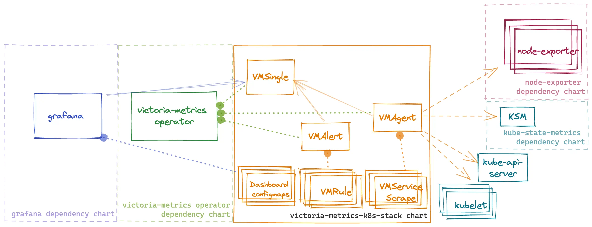

Kubernetes monitoring on VictoriaMetrics stack. Includes VictoriaMetrics Operator, Grafana dashboards, ServiceScrapes and VMRules

* [Overview](#Overview)
* [Configuration](#Configuration)
* [Prerequisites](#Prerequisites)
* [Dependencies](#Dependencies)
* [Quick Start](#How-to-install)
* [Uninstall](#How-to-uninstall)
* [Version Upgrade](#Upgrade-guide)
* [Troubleshooting](#Troubleshooting)
* [Values](#Parameters)

## Overview
This chart is an All-in-one solution to start monitoring kubernetes cluster.
It installs multiple dependency charts like [grafana](https://github.com/grafana/helm-charts/tree/main/charts/grafana), [node-exporter](https://github.com/prometheus-community/helm-charts/tree/main/charts/prometheus-node-exporter), [kube-state-metrics](https://github.com/prometheus-community/helm-charts/tree/main/charts/kube-state-metrics) and [victoria-metrics-operator](https://github.com/VictoriaMetrics/helm-charts/tree/master/charts/victoria-metrics-operator).
Also it installs Custom Resources like [VMSingle](https://docs.victoriametrics.com/operator/resources/vmsingle), [VMCluster](https://docs.victoriametrics.com/operator/resources/vmcluster), [VMAgent](https://docs.victoriametrics.com/operator/resources/vmagent), [VMAlert](https://docs.victoriametrics.com/operator/resources/vmalert).

By default, the operator [converts all existing prometheus-operator API objects](https://docs.victoriametrics.com/operator/migration/index.html#objects-conversion) into corresponding VictoriaMetrics Operator objects.

To enable metrics collection for kubernetes this chart installs multiple scrape configurations for kubernetes components like kubelet and kube-proxy, etc. Metrics collection is done by [VMAgent](https://docs.victoriametrics.com/operator/resources/vmagent). So if want to ship metrics to external VictoriaMetrics database you can disable VMSingle installation by setting `vmsingle.enabled` to `false` and setting `vmagent.vmagentSpec.remoteWrite.url` to your external VictoriaMetrics database.

This chart also installs bunch of dashboards and recording rules from [kube-prometheus](https://github.com/prometheus-operator/kube-prometheus) project.



## Configuration

Configuration of this chart is done through helm values.

### Dependencies

Dependencies can be enabled or disabled by setting `enabled` to `true` or `false` in `values.yaml` file.

**!Important:** for dependency charts anything that you can find in values.yaml of dependency chart can be configured in this chart under key for that dependency. For example if you want to configure `grafana` you can find all possible configuration options in [values.yaml](https://github.com/grafana/helm-charts/blob/main/charts/grafana/values.yaml) and you should set them in values for this chart under grafana: key. For example if you want to configure `grafana.persistence.enabled` you should set it in values.yaml like this:
```yaml
#################################################
###              dependencies               #####
#################################################
# Grafana dependency chart configuration. For possible values refer to https://github.com/grafana/helm-charts/tree/main/charts/grafana#configuration
grafana:
  enabled: true
  persistence:
    type: pvc
    enabled: false
```

### VictoriaMetrics components

This chart installs multiple VictoriaMetrics components using Custom Resources that are managed by [victoria-metrics-operator](https://docs.victoriametrics.com/operator/design)
Each resource can be configured using `spec` of that resource from API docs of [victoria-metrics-operator](https://docs.victoriametrics.com/operator/api). For example if you want to configure `VMAgent` you can find all possible configuration options in [API docs](https://docs.victoriametrics.com/operator/api#vmagent) and you should set them in values for this chart under `vmagent.spec` key. For example if you want to configure `remoteWrite.url` you should set it in values.yaml like this:
```yaml
vmagent:
  spec:
    remoteWrite:
      - url: "https://insert.vmcluster.domain.com/insert/0/prometheus/api/v1/write"
```

### ArgoCD issues

#### Operator self signed certificates
When deploying K8s stack using ArgoCD without Cert Manager (`.Values.victoria-metrics-operator.admissionWebhooks.certManager.enabled: false`)
it will rerender operator's webhook certificates on each sync since Helm `lookup` function is not respected by ArgoCD.
To prevent this please update you K8s stack Application `spec.syncPolicy` and `spec.ignoreDifferences` with a following:

```yaml
apiVersion: argoproj.io/v1alpha1
kind: Application
...
spec:
  ...
  destination:
    ...
    namespace: <k8s-stack-namespace>
  ...
  syncPolicy:
    syncOptions:
    # https://argo-cd.readthedocs.io/en/stable/user-guide/sync-options/#respect-ignore-difference-configs
    # argocd must also ignore difference during apply stage
    # otherwise it ll silently override changes and cause a problem
    - RespectIgnoreDifferences=true
  ignoreDifferences:
    - group: ""
      kind: Secret
      name: <fullname>-validation
      namespace: <k8s-stack-namespace>
      jsonPointers:
        - /data
    - group: admissionregistration.k8s.io
      kind: ValidatingWebhookConfiguration
      name: <fullname>-admission
      jqPathExpressions:
      - '.webhooks[]?.clientConfig.caBundle'
```
where `<fullname>` is output of `{{ include "vm-operator.fullname" }}` for your setup

#### `metadata.annotations: Too long: must have at most 262144 bytes` on dashboards

If one of dashboards ConfigMap is failing with error `Too long: must have at most 262144 bytes`, please make sure you've added `argocd.argoproj.io/sync-options: ServerSideApply=true` annotation to your dashboards:

```yaml
defaultDashboards:
  annotations:
    argocd.argoproj.io/sync-options: ServerSideApply=true
```

argocd.argoproj.io/sync-options: ServerSideApply=true

#### Resources are not completely removed after chart uninstallation

This chart uses `pre-delete` Helm hook to cleanup resources managed by operator, but it's not supported in ArgoCD and this hook is ignored.
To have a control over resources removal please consider using either [ArgoCD sync phases and waves](https://argo-cd.readthedocs.io/en/stable/user-guide/sync-waves/) or [installing operator chart separately](#install-operator-separately)

### Rules and dashboards

This chart by default install multiple dashboards and recording rules from [kube-prometheus](https://github.com/prometheus-operator/kube-prometheus)
you can disable dashboards with `defaultDashboards.enabled: false` and `experimentalDashboardsEnabled: false`
and rules can be configured under `defaultRules`

### Adding external dashboards

By default, this chart uses sidecar in order to provision default dashboards. If you want to add you own dashboards there are two ways to do it:

- Add dashboards by creating a ConfigMap. An example ConfigMap:
```yaml
apiVersion: v1
kind: ConfigMap
metadata:
  labels:
    grafana_dashboard: "1"
  name: grafana-dashboard
data:
  dashboard.json: |-
      {...}
```

- Use init container provisioning. Note that this option requires disabling sidecar and will remove all default dashboards provided with this chart. An example configuration:
```yaml
grafana:
  sidecar:
    dashboards:
      enabled: false
  dashboards:
    vmcluster:
      gnetId: 11176
      revision: 38
      datasource: VictoriaMetrics
```
When using this approach, you can find dashboards for VictoriaMetrics components published [here](https://grafana.com/orgs/victoriametrics).

### Prometheus scrape configs
This chart installs multiple scrape configurations for kubernetes monitoring. They are configured under `#ServiceMonitors` section in `values.yaml` file. For example if you want to configure scrape config for `kubelet` you should set it in values.yaml like this:
```yaml
kubelet:
  enabled: true
  # spec for VMNodeScrape crd
  # https://docs.victoriametrics.com/operator/api#vmnodescrapespec
  spec:
    interval: "30s"
```

### Using externally managed Grafana

If you want to use an externally managed Grafana instance but still want to use the dashboards provided by this chart you can set
 `grafana.enabled` to `false` and set `defaultDashboards.enabled` to `true`. This will install the dashboards
 but will not install Grafana.

For example:
```yaml
defaultDashboards:
  enabled: true

grafana:
  enabled: false
```

This will create ConfigMaps with dashboards to be imported into Grafana.

If additional configuration for labels or annotations is needed in order to import dashboard to an existing Grafana you can
set `.grafana.sidecar.dashboards.additionalDashboardLabels` or `.grafana.sidecar.dashboards.additionalDashboardAnnotations` in `values.yaml`:

For example:
```yaml
defaultDashboards:
  enabled: true
  labels:
    key: value
  annotations:
    key: value
```

### Using alternative image registry

All images of VictoriaMetrics components are available on [Docker Hub](https://hub.docker.com/u/victoriametrics) and [Quay](https://quay.io/organization/victoriametrics).
It is possible to override default image registry for all components deployed by operator and operator itself by using the following values:
```yaml
victoria-metrics-operator:
  image:
    registry: "quay.io"
  env:
    - name: "VM_USECUSTOMCONFIGRELOADER"
      value: "true"
    - name: VM_CUSTOMCONFIGRELOADERIMAGE
      value: "quay.io/victoriametrics/operator:config-reloader-v0.53.0"
    - name: VM_VLOGSDEFAULT_IMAGE
      value: "quay.io/victoriametrics/victoria-logs"
    - name: "VM_VMALERTDEFAULT_IMAGE"
      value: "quay.io/victoriametrics/vmalert"
    - name: "VM_VMAGENTDEFAULT_IMAGE"
      value: "quay.io/victoriametrics/vmagent"
    - name: "VM_VMSINGLEDEFAULT_IMAGE"
      value: "quay.io/victoriametrics/victoria-metrics"
    - name: "VM_VMCLUSTERDEFAULT_VMSELECTDEFAULT_IMAGE"
      value: "quay.io/victoriametrics/vmselect"
    - name: "VM_VMCLUSTERDEFAULT_VMSTORAGEDEFAULT_IMAGE"
      value: "quay.io/victoriametrics/vmstorage"
    - name: "VM_VMCLUSTERDEFAULT_VMINSERTDEFAULT_IMAGE"
      value: "quay.io/victoriametrics/vminsert"
    - name: "VM_VMBACKUP_IMAGE"
      value: "quay.io/victoriametrics/vmbackupmanager"
    - name: "VM_VMAUTHDEFAULT_IMAGE"
      value: "quay.io/victoriametrics/vmauth"
    - name: "VM_VMALERTMANAGER_ALERTMANAGERDEFAULTBASEIMAGE"
      value: "quay.io/prometheus/alertmanager"
```

## Prerequisites

* Install the follow packages: ``git``, ``kubectl``, ``helm``, ``helm-docs``. See this [tutorial](https://docs.victoriametrics.com/helm/requirements/).

* Add dependency chart repositories

```shell
helm repo add grafana https://grafana.github.io/helm-charts
helm repo add prometheus-community https://prometheus-community.github.io/helm-charts
helm repo update
```

* PV support on underlying infrastructure.

## How to install

Access a Kubernetes cluster.

### Setup chart repository (can be omitted for OCI repositories)

Add a chart helm repository with follow commands:

```console
helm repo add vm https://victoriametrics.github.io/helm-charts/

helm repo update
```
List versions of `vm/victoria-metrics-k8s-stack` chart available to installation:

```console
helm search repo vm/victoria-metrics-k8s-stack -l
```

### Install `victoria-metrics-k8s-stack` chart

Export default values of `victoria-metrics-k8s-stack` chart to file `values.yaml`:

  - For HTTPS repository

    ```console
    helm show values vm/victoria-metrics-k8s-stack > values.yaml
    ```
  - For OCI repository

    ```console
    helm show values oci://ghcr.io/victoriametrics/helm-charts/victoria-metrics-k8s-stack > values.yaml
    ```

Change the values according to the need of the environment in ``values.yaml`` file.

Test the installation with command:

  - For HTTPS repository

    ```console
    helm install vmks vm/victoria-metrics-k8s-stack -f values.yaml -n NAMESPACE --debug --dry-run
    ```

  - For OCI repository

    ```console
    helm install vmks oci://ghcr.io/victoriametrics/helm-charts/victoria-metrics-k8s-stack -f values.yaml -n NAMESPACE --debug --dry-run
    ```

Install chart with command:

  - For HTTPS repository

    ```console
    helm install vmks vm/victoria-metrics-k8s-stack -f values.yaml -n NAMESPACE
    ```

  - For OCI repository

    ```console
    helm install vmks oci://ghcr.io/victoriametrics/helm-charts/victoria-metrics-k8s-stack -f values.yaml -n NAMESPACE
    ```

Get the pods lists by running this commands:

```console
kubectl get pods -A | grep 'vmks'
```

Get the application by running this command:

```console
helm list -f vmks -n NAMESPACE
```

See the history of versions of `vmks` application with command.

```console
helm history vmks -n NAMESPACE
```

### Install operator separately

To have control over an order of managed resources removal or to be able to remove a whole namespace with managed resources it's recommended to disable operator in k8s-stack chart (`victoria-metrics-operator.enabled: false`) and [install it](https://docs.victoriametrics.com/helm/victoriametrics-operator/) separately. To move operator from existing k8s-stack release to a separate one please follow the steps below:

- disable cleanup webhook (`victoria-metrics-operator.crds.cleanup.enabled: false`) and apply changes
- disable operator (`victoria-metrics-operator.enabled: false`) and apply changes
- [deploy operator](https://docs.victoriametrics.com/helm/victoriametrics-operator/) separately with `crds.plain: true`

If you're planning to delete k8s-stack by a whole namespace removal please consider deploying operator in a separate namespace as due to uncontrollable removal order process can hang if operator is removed before at least one resource it manages.

### Install locally (Minikube)

To run VictoriaMetrics stack locally it's possible to use [Minikube](https://github.com/kubernetes/minikube). To avoid dashboards and alert rules issues please follow the steps below:

Run Minikube cluster

```shell
minikube start --container-runtime=containerd --extra-config=scheduler.bind-address=0.0.0.0 --extra-config=controller-manager.bind-address=0.0.0.0 --extra-config=etcd.listen-metrics-urls=http://0.0.0.0:2381
```

Install helm chart

```shell
helm install [RELEASE_NAME] vm/victoria-metrics-k8s-stack -f values.yaml -f values.minikube.yaml -n NAMESPACE --debug --dry-run
```

## How to uninstall

Remove application with command.

```console
helm uninstall vmks -n NAMESPACE
```

CRDs created by this chart are not removed by default and should be manually cleaned up:

```shell
kubectl get crd | grep victoriametrics.com | awk '{print $1 }' | xargs -i kubectl delete crd {}
```

## Troubleshooting

- If you cannot install helm chart with error `configmap already exist`. It could happen because of name collisions, if you set too long release name.
  Kubernetes by default, allows only 63 symbols at resource names and all resource names are trimmed by helm to 63 symbols.
  To mitigate it, use shorter name for helm chart release name, like:
```shell
# stack - is short enough
helm upgrade -i stack vm/victoria-metrics-k8s-stack
```
  Or use override for helm chart release name:
```shell
helm upgrade -i some-very-long-name vm/victoria-metrics-k8s-stack --set fullnameOverride=stack
```

## Upgrade guide

Usually, helm upgrade doesn't requires manual actions. Just execute command:

```shell
$ helm upgrade [RELEASE_NAME] vm/victoria-metrics-k8s-stack
```

But release with CRD update can only be patched manually with kubectl.
Since helm does not perform a CRD update, we recommend that you always perform this when updating the helm-charts version:

```shell
# 1. check the changes in CRD
$ helm show crds vm/victoria-metrics-k8s-stack --version [YOUR_CHART_VERSION] | kubectl diff -f -

# 2. apply the changes (update CRD)
$ helm show crds vm/victoria-metrics-k8s-stack --version [YOUR_CHART_VERSION] | kubectl apply -f - --server-side
```

All other manual actions upgrades listed below:

### Upgrade to 0.29.0

To provide more flexibility for VMAuth configuration all `<component>.vmauth` params were moved to `vmauth.spec`.
Also `.vm.write` and `.vm.read` variables are available in `vmauth.spec`, which represent `vmsingle`, `vminsert`, `externalVM.write` and `vmsingle`, `vmselect`, `externalVM.read` parsed URLs respectively.

If your configuration in version < 0.29.0 looked like below:

```yaml
vmcluster:
  vmauth:
    vmselect:
      - src_paths:
          - /select/.*
        url_prefix:
          - /
    vminsert:
      - src_paths:
          - /insert/.*
        url_prefix:
          - /
```

In 0.29.0 it should look like:

```yaml
vmauth:
  spec:
    unauthorizedAccessConfig:
      - src_paths:
          - '{{ .vm.read.path }}/.*'
        url_prefix:
          - '{{ urlJoin (omit .vm.read "path") }}/'
      - src_paths:
          - '{{ .vm.write.path }}/.*'
        url_prefix:
          - '{{ urlJoin (omit .vm.write "path") }}/'
```

### Upgrade to 0.13.0

- node-exporter starting from version 4.0.0 is using the Kubernetes recommended labels. Therefore you have to delete the daemonset before you upgrade.

```shell
kubectl delete daemonset -l app=prometheus-node-exporter
```
- scrape configuration for kubernetes components was moved from `vmServiceScrape.spec` section to `spec` section. If you previously modified scrape configuration you need to update your `values.yaml`

- `grafana.defaultDashboardsEnabled` was renamed to `defaultDashboardsEnabled` (moved to top level). You may need to update it in your `values.yaml`

### Upgrade to 0.6.0

 All `CRD` must be update to the latest version with command:

```shell
kubectl apply -f https://raw.githubusercontent.com/VictoriaMetrics/helm-charts/master/charts/victoria-metrics-k8s-stack/crds/crd.yaml

```

### Upgrade to 0.4.0

 All `CRD` must be update to `v1` version with command:

```shell
kubectl apply -f https://raw.githubusercontent.com/VictoriaMetrics/helm-charts/master/charts/victoria-metrics-k8s-stack/crds/crd.yaml

```

### Upgrade from 0.2.8 to 0.2.9

 Update `VMAgent` crd

command:
```shell
kubectl apply -f https://raw.githubusercontent.com/VictoriaMetrics/operator/v0.16.0/config/crd/bases/operator.victoriametrics.com_vmagents.yaml
```

 ### Upgrade from 0.2.5 to 0.2.6

New CRD added to operator - `VMUser` and `VMAuth`, new fields added to exist crd.
Manual commands:
```shell
kubectl apply -f https://raw.githubusercontent.com/VictoriaMetrics/operator/v0.15.0/config/crd/bases/operator.victoriametrics.com_vmusers.yaml
kubectl apply -f https://raw.githubusercontent.com/VictoriaMetrics/operator/v0.15.0/config/crd/bases/operator.victoriametrics.com_vmauths.yaml
kubectl apply -f https://raw.githubusercontent.com/VictoriaMetrics/operator/v0.15.0/config/crd/bases/operator.victoriametrics.com_vmalerts.yaml
kubectl apply -f https://raw.githubusercontent.com/VictoriaMetrics/operator/v0.15.0/config/crd/bases/operator.victoriametrics.com_vmagents.yaml
kubectl apply -f https://raw.githubusercontent.com/VictoriaMetrics/operator/v0.15.0/config/crd/bases/operator.victoriametrics.com_vmsingles.yaml
kubectl apply -f https://raw.githubusercontent.com/VictoriaMetrics/operator/v0.15.0/config/crd/bases/operator.victoriametrics.com_vmclusters.yaml
```

## Documentation of Helm Chart

Install ``helm-docs`` following the instructions on this [tutorial](https://docs.victoriametrics.com/helm/requirements/).

Generate docs with ``helm-docs`` command.

```bash
cd charts/victoria-metrics-k8s-stack

helm-docs
```

The markdown generation is entirely go template driven. The tool parses metadata from charts and generates a number of sub-templates that can be referenced in a template file (by default ``README.md.gotmpl``). If no template file is provided, the tool has a default internal template that will generate a reasonably formatted README.

## Parameters

The following tables lists the configurable parameters of the chart and their default values.

Change the values according to the need of the environment in ``victoria-metrics-k8s-stack/values.yaml`` file.

<table class="helm-vars">
  <thead>
    <th class="helm-vars-key">Key</th>
    <th class="helm-vars-description">Description</th>
  </thead>
  <tbody>
    <tr id="additionalvictoriametricsmap">
      <td><a href="#additionalvictoriametricsmap"><pre class="chroma"><code><span class="line"><span class="cl"><span class="nt">additionalVictoriaMetricsMap</span><span class="p">:</span><span class="w"> </span><span class="kc">null</span></span></span></code></pre>
</a></td>
      <td><em><code>(string)</code></em><p>Provide custom recording or alerting rules to be deployed into the cluster.</p>
</td>
    </tr>
    <tr id="alertmanager-annotations">
      <td><a href="#alertmanager-annotations"><pre class="chroma"><code><span class="line"><span class="cl"><span class="nt">alertmanager.annotations</span><span class="p">:</span><span class="w"> </span>{}</span></span></code></pre>
</a></td>
      <td><em><code>(object)</code></em><p>Alertmanager annotations</p>
</td>
    </tr>
    <tr id="alertmanager-config">
      <td><a href="#alertmanager-config"><pre class="chroma"><code><span class="line"><span class="cl"><span class="nt">alertmanager.config</span><span class="p">:</span><span class="w">
</span></span></span><span class="line"><span class="cl"><span class="w">    </span><span class="nt">receivers</span><span class="p">:</span><span class="w">
</span></span></span><span class="line"><span class="cl"><span class="w">        </span>- <span class="nt">name</span><span class="p">:</span><span class="w"> </span><span class="l">blackhole</span><span class="w">
</span></span></span><span class="line"><span class="cl"><span class="w">    </span><span class="nt">route</span><span class="p">:</span><span class="w">
</span></span></span><span class="line"><span class="cl"><span class="w">        </span><span class="nt">receiver</span><span class="p">:</span><span class="w"> </span><span class="l">blackhole</span></span></span></code></pre>
</a></td>
      <td><em><code>(object)</code></em><p>Alertmanager configuration</p>
</td>
    </tr>
    <tr id="alertmanager-enabled">
      <td><a href="#alertmanager-enabled"><pre class="chroma"><code><span class="line"><span class="cl"><span class="nt">alertmanager.enabled</span><span class="p">:</span><span class="w"> </span><span class="kc">true</span></span></span></code></pre>
</a></td>
      <td><em><code>(bool)</code></em><p>Create VMAlertmanager CR</p>
</td>
    </tr>
    <tr id="alertmanager-ingress">
      <td><a href="#alertmanager-ingress"><pre class="chroma"><code><span class="line"><span class="cl"><span class="nt">alertmanager.ingress</span><span class="p">:</span><span class="w">
</span></span></span><span class="line"><span class="cl"><span class="w">    </span><span class="nt">annotations</span><span class="p">:</span><span class="w"> </span>{}<span class="w">
</span></span></span><span class="line"><span class="cl"><span class="w">    </span><span class="nt">enabled</span><span class="p">:</span><span class="w"> </span><span class="kc">false</span><span class="w">
</span></span></span><span class="line"><span class="cl"><span class="w">    </span><span class="nt">extraPaths</span><span class="p">:</span><span class="w"> </span><span class="p">[]</span><span class="w">
</span></span></span><span class="line"><span class="cl"><span class="w">    </span><span class="nt">hosts</span><span class="p">:</span><span class="w">
</span></span></span><span class="line"><span class="cl"><span class="w">        </span>- <span class="l">alertmanager.domain.com</span><span class="w">
</span></span></span><span class="line"><span class="cl"><span class="w">    </span><span class="nt">labels</span><span class="p">:</span><span class="w"> </span>{}<span class="w">
</span></span></span><span class="line"><span class="cl"><span class="w">    </span><span class="nt">path</span><span class="p">:</span><span class="w"> </span><span class="s1">&#39;{{ .Values.alertmanager.spec.routePrefix | default &#34;/&#34; }}&#39;</span><span class="w">
</span></span></span><span class="line"><span class="cl"><span class="w">    </span><span class="nt">pathType</span><span class="p">:</span><span class="w"> </span><span class="l">Prefix</span><span class="w">
</span></span></span><span class="line"><span class="cl"><span class="w">    </span><span class="nt">tls</span><span class="p">:</span><span class="w"> </span><span class="p">[]</span></span></span></code></pre>
</a></td>
      <td><em><code>(object)</code></em><p>Alertmanager ingress configuration</p>
</td>
    </tr>
    <tr id="alertmanager-ingress-extrapaths">
      <td><a href="#alertmanager-ingress-extrapaths"><pre class="chroma"><code><span class="line"><span class="cl"><span class="nt">alertmanager.ingress.extraPaths</span><span class="p">:</span><span class="w"> </span><span class="p">[]</span></span></span></code></pre>
</a></td>
      <td><em><code>(list)</code></em><p>Extra paths to prepend to every host configuration. This is useful when working with annotation based services.</p>
</td>
    </tr>
    <tr id="alertmanager-monzotemplate">
      <td><a href="#alertmanager-monzotemplate"><pre class="chroma"><code><span class="line"><span class="cl"><span class="nt">alertmanager.monzoTemplate</span><span class="p">:</span><span class="w">
</span></span></span><span class="line"><span class="cl"><span class="w">    </span><span class="nt">enabled</span><span class="p">:</span><span class="w"> </span><span class="kc">true</span></span></span></code></pre>
</a></td>
      <td><em><code>(object)</code></em><p>Better alert templates for <a href="https://gist.github.com/milesbxf/e2744fc90e9c41b47aa47925f8ff6512" target="_blank">slack source</a></p>
</td>
    </tr>
    <tr id="alertmanager-spec">
      <td><a href="#alertmanager-spec"><pre class="chroma"><code><span class="line"><span class="cl"><span class="nt">alertmanager.spec</span><span class="p">:</span><span class="w">
</span></span></span><span class="line"><span class="cl"><span class="w">    </span><span class="nt">configSecret</span><span class="p">:</span><span class="w"> </span><span class="s2">&#34;&#34;</span><span class="w">
</span></span></span><span class="line"><span class="cl"><span class="w">    </span><span class="nt">externalURL</span><span class="p">:</span><span class="w"> </span><span class="s2">&#34;&#34;</span><span class="w">
</span></span></span><span class="line"><span class="cl"><span class="w">    </span><span class="nt">image</span><span class="p">:</span><span class="w">
</span></span></span><span class="line"><span class="cl"><span class="w">        </span><span class="nt">tag</span><span class="p">:</span><span class="w"> </span><span class="l">v0.28.1</span><span class="w">
</span></span></span><span class="line"><span class="cl"><span class="w">    </span><span class="nt">port</span><span class="p">:</span><span class="w"> </span><span class="s2">&#34;9093&#34;</span><span class="w">
</span></span></span><span class="line"><span class="cl"><span class="w">    </span><span class="nt">replicaCount</span><span class="p">:</span><span class="w"> </span><span class="m">1</span><span class="w">
</span></span></span><span class="line"><span class="cl"><span class="w">    </span><span class="nt">routePrefix</span><span class="p">:</span><span class="w"> </span><span class="l">/</span><span class="w">
</span></span></span><span class="line"><span class="cl"><span class="w">    </span><span class="nt">selectAllByDefault</span><span class="p">:</span><span class="w"> </span><span class="kc">true</span></span></span></code></pre>
</a></td>
      <td><em><code>(object)</code></em><p>Full spec for VMAlertmanager CRD. Allowed values described <a href="https://docs.victoriametrics.com/operator/api#vmalertmanagerspec" target="_blank">here</a></p>
</td>
    </tr>
    <tr id="alertmanager-spec-configsecret">
      <td><a href="#alertmanager-spec-configsecret"><pre class="chroma"><code><span class="line"><span class="cl"><span class="nt">alertmanager.spec.configSecret</span><span class="p">:</span><span class="w"> </span><span class="s2">&#34;&#34;</span></span></span></code></pre>
</a></td>
      <td><em><code>(string)</code></em><p>If this one defined, it will be used for alertmanager configuration and config parameter will be ignored</p>
</td>
    </tr>
    <tr id="alertmanager-templatefiles">
      <td><a href="#alertmanager-templatefiles"><pre class="chroma"><code><span class="line"><span class="cl"><span class="nt">alertmanager.templateFiles</span><span class="p">:</span><span class="w"> </span>{}</span></span></code></pre>
</a></td>
      <td><em><code>(object)</code></em><p>Extra alert templates</p>
</td>
    </tr>
    <tr id="alertmanager-usemanagedconfig">
      <td><a href="#alertmanager-usemanagedconfig"><pre class="chroma"><code><span class="line"><span class="cl"><span class="nt">alertmanager.useManagedConfig</span><span class="p">:</span><span class="w"> </span><span class="kc">false</span></span></span></code></pre>
</a></td>
      <td><em><code>(bool)</code></em><p>enable storing .Values.alertmanager.config in VMAlertmanagerConfig instead of k8s Secret.
Note: VMAlertmanagerConfig and plain Alertmanager config structures are not equal.
If you&rsquo;re migrating existing config, please make sure that <code>.Values.alertmanager.config</code>:</p>

<ul>
<li>with <code>useManagedConfig: false</code> has structure described <a href="https://prometheus.io/docs/alerting/latest/configuration/" target="_blank">here</a>.</li>
<li>with <code>useManagedConfig: true</code> has structure described <a href="https://docs.victoriametrics.com/operator/api/#vmalertmanagerconfig" target="_blank">here</a>.</li>
</ul>
</td>
    </tr>
    <tr id="argocdreleaseoverride">
      <td><a href="#argocdreleaseoverride"><pre class="chroma"><code><span class="line"><span class="cl"><span class="nt">argocdReleaseOverride</span><span class="p">:</span><span class="w"> </span><span class="s2">&#34;&#34;</span></span></span></code></pre>
</a></td>
      <td><em><code>(string)</code></em><p>If this chart is used in &ldquo;Argocd&rdquo; with &ldquo;releaseName&rdquo; field then VMServiceScrapes couldn&rsquo;t select the proper services. For correct working need set value &lsquo;argocdReleaseOverride=$ARGOCD_APP_NAME&rsquo;</p>
</td>
    </tr>
    <tr id="coredns-enabled">
      <td><a href="#coredns-enabled"><pre class="chroma"><code><span class="line"><span class="cl"><span class="nt">coreDns.enabled</span><span class="p">:</span><span class="w"> </span><span class="kc">true</span></span></span></code></pre>
</a></td>
      <td><em><code>(bool)</code></em><p>Enabled CoreDNS metrics scraping</p>
</td>
    </tr>
    <tr id="coredns-service-enabled">
      <td><a href="#coredns-service-enabled"><pre class="chroma"><code><span class="line"><span class="cl"><span class="nt">coreDns.service.enabled</span><span class="p">:</span><span class="w"> </span><span class="kc">true</span></span></span></code></pre>
</a></td>
      <td><em><code>(bool)</code></em><p>Create service for CoreDNS metrics</p>
</td>
    </tr>
    <tr id="coredns-service-port">
      <td><a href="#coredns-service-port"><pre class="chroma"><code><span class="line"><span class="cl"><span class="nt">coreDns.service.port</span><span class="p">:</span><span class="w"> </span><span class="m">9153</span></span></span></code></pre>
</a></td>
      <td><em><code>(int)</code></em><p>CoreDNS service port</p>
</td>
    </tr>
    <tr id="coredns-service-selector">
      <td><a href="#coredns-service-selector"><pre class="chroma"><code><span class="line"><span class="cl"><span class="nt">coreDns.service.selector</span><span class="p">:</span><span class="w">
</span></span></span><span class="line"><span class="cl"><span class="w">    </span><span class="nt">k8s-app</span><span class="p">:</span><span class="w"> </span><span class="l">kube-dns</span></span></span></code></pre>
</a></td>
      <td><em><code>(object)</code></em><p>CoreDNS service pod selector</p>
</td>
    </tr>
    <tr id="coredns-service-targetport">
      <td><a href="#coredns-service-targetport"><pre class="chroma"><code><span class="line"><span class="cl"><span class="nt">coreDns.service.targetPort</span><span class="p">:</span><span class="w"> </span><span class="m">9153</span></span></span></code></pre>
</a></td>
      <td><em><code>(int)</code></em><p>CoreDNS service target port</p>
</td>
    </tr>
    <tr id="coredns-vmscrape">
      <td><a href="#coredns-vmscrape"><pre class="chroma"><code><span class="line"><span class="cl"><span class="nt">coreDns.vmScrape</span><span class="p">:</span><span class="w">
</span></span></span><span class="line"><span class="cl"><span class="w">    </span><span class="nt">spec</span><span class="p">:</span><span class="w">
</span></span></span><span class="line"><span class="cl"><span class="w">        </span><span class="nt">endpoints</span><span class="p">:</span><span class="w">
</span></span></span><span class="line"><span class="cl"><span class="w">            </span>- <span class="nt">bearerTokenFile</span><span class="p">:</span><span class="w"> </span><span class="l">/var/run/secrets/kubernetes.io/serviceaccount/token</span><span class="w">
</span></span></span><span class="line"><span class="cl"><span class="w">              </span><span class="nt">port</span><span class="p">:</span><span class="w"> </span><span class="l">http-metrics</span><span class="w">
</span></span></span><span class="line"><span class="cl"><span class="w">        </span><span class="nt">jobLabel</span><span class="p">:</span><span class="w"> </span><span class="l">jobLabel</span><span class="w">
</span></span></span><span class="line"><span class="cl"><span class="w">        </span><span class="nt">namespaceSelector</span><span class="p">:</span><span class="w">
</span></span></span><span class="line"><span class="cl"><span class="w">            </span><span class="nt">matchNames</span><span class="p">:</span><span class="w">
</span></span></span><span class="line"><span class="cl"><span class="w">                </span>- <span class="l">kube-system</span></span></span></code></pre>
</a></td>
      <td><em><code>(object)</code></em><p>Spec for VMServiceScrape CRD is <a href="https://docs.victoriametrics.com/operator/api.html#vmservicescrapespec" target="_blank">here</a></p>
</td>
    </tr>
    <tr id="defaultdashboards-annotations">
      <td><a href="#defaultdashboards-annotations"><pre class="chroma"><code><span class="line"><span class="cl"><span class="nt">defaultDashboards.annotations</span><span class="p">:</span><span class="w"> </span>{}</span></span></code></pre>
</a></td>
      <td><em><code>(object)</code></em></td>
    </tr>
    <tr id="defaultdashboards-dashboards">
      <td><a href="#defaultdashboards-dashboards"><pre class="chroma"><code><span class="line"><span class="cl"><span class="nt">defaultDashboards.dashboards</span><span class="p">:</span><span class="w">
</span></span></span><span class="line"><span class="cl"><span class="w">    </span><span class="nt">node-exporter-full</span><span class="p">:</span><span class="w">
</span></span></span><span class="line"><span class="cl"><span class="w">        </span><span class="nt">enabled</span><span class="p">:</span><span class="w"> </span><span class="kc">true</span><span class="w">
</span></span></span><span class="line"><span class="cl"><span class="w">    </span><span class="nt">victoriametrics-operator</span><span class="p">:</span><span class="w">
</span></span></span><span class="line"><span class="cl"><span class="w">        </span><span class="nt">enabled</span><span class="p">:</span><span class="w"> </span><span class="kc">true</span><span class="w">
</span></span></span><span class="line"><span class="cl"><span class="w">    </span><span class="nt">victoriametrics-vmalert</span><span class="p">:</span><span class="w">
</span></span></span><span class="line"><span class="cl"><span class="w">        </span><span class="nt">enabled</span><span class="p">:</span><span class="w"> </span><span class="kc">true</span></span></span></code></pre>
</a></td>
      <td><em><code>(object)</code></em><p>Create dashboards as ConfigMap despite dependency it requires is not installed</p>
</td>
    </tr>
    <tr id="defaultdashboards-dashboards-node-exporter-full">
      <td><a href="#defaultdashboards-dashboards-node-exporter-full"><pre class="chroma"><code><span class="line"><span class="cl"><span class="nt">defaultDashboards.dashboards.node-exporter-full</span><span class="p">:</span><span class="w">
</span></span></span><span class="line"><span class="cl"><span class="w">    </span><span class="nt">enabled</span><span class="p">:</span><span class="w"> </span><span class="kc">true</span></span></span></code></pre>
</a></td>
      <td><em><code>(object)</code></em><p>In ArgoCD using client-side apply this dashboard reaches annotations size limit and causes k8s issues without server side apply See <a href="https://github.com/VictoriaMetrics/helm-charts/tree/master/charts/victoria-metrics-k8s-stack#metadataannotations-too-long-must-have-at-most-262144-bytes-on-dashboards" target="_blank">this issue</a></p>
</td>
    </tr>
    <tr id="defaultdashboards-defaulttimezone">
      <td><a href="#defaultdashboards-defaulttimezone"><pre class="chroma"><code><span class="line"><span class="cl"><span class="nt">defaultDashboards.defaultTimezone</span><span class="p">:</span><span class="w"> </span><span class="l">utc</span></span></span></code></pre>
</a></td>
      <td><em><code>(string)</code></em></td>
    </tr>
    <tr id="defaultdashboards-enabled">
      <td><a href="#defaultdashboards-enabled"><pre class="chroma"><code><span class="line"><span class="cl"><span class="nt">defaultDashboards.enabled</span><span class="p">:</span><span class="w"> </span><span class="kc">true</span></span></span></code></pre>
</a></td>
      <td><em><code>(bool)</code></em><p>Enable custom dashboards installation</p>
</td>
    </tr>
    <tr id="defaultdashboards-grafanaoperator-enabled">
      <td><a href="#defaultdashboards-grafanaoperator-enabled"><pre class="chroma"><code><span class="line"><span class="cl"><span class="nt">defaultDashboards.grafanaOperator.enabled</span><span class="p">:</span><span class="w"> </span><span class="kc">false</span></span></span></code></pre>
</a></td>
      <td><em><code>(bool)</code></em><p>Create dashboards as CRDs (requires grafana-operator to be installed)</p>
</td>
    </tr>
    <tr id="defaultdashboards-grafanaoperator-spec-allowcrossnamespaceimport">
      <td><a href="#defaultdashboards-grafanaoperator-spec-allowcrossnamespaceimport"><pre class="chroma"><code><span class="line"><span class="cl"><span class="nt">defaultDashboards.grafanaOperator.spec.allowCrossNamespaceImport</span><span class="p">:</span><span class="w"> </span><span class="kc">false</span></span></span></code></pre>
</a></td>
      <td><em><code>(bool)</code></em></td>
    </tr>
    <tr id="defaultdashboards-grafanaoperator-spec-instanceselector-matchlabels-dashboards">
      <td><a href="#defaultdashboards-grafanaoperator-spec-instanceselector-matchlabels-dashboards"><pre class="chroma"><code><span class="line"><span class="cl"><span class="nt">defaultDashboards.grafanaOperator.spec.instanceSelector.matchLabels.dashboards</span><span class="p">:</span><span class="w"> </span><span class="l">grafana</span></span></span></code></pre>
</a></td>
      <td><em><code>(string)</code></em></td>
    </tr>
    <tr id="defaultdashboards-labels">
      <td><a href="#defaultdashboards-labels"><pre class="chroma"><code><span class="line"><span class="cl"><span class="nt">defaultDashboards.labels</span><span class="p">:</span><span class="w"> </span>{}</span></span></code></pre>
</a></td>
      <td><em><code>(object)</code></em></td>
    </tr>
    <tr id="defaultdatasources-alertmanager">
      <td><a href="#defaultdatasources-alertmanager"><pre class="chroma"><code><span class="line"><span class="cl"><span class="nt">defaultDatasources.alertmanager</span><span class="p">:</span><span class="w">
</span></span></span><span class="line"><span class="cl"><span class="w">    </span><span class="nt">datasources</span><span class="p">:</span><span class="w">
</span></span></span><span class="line"><span class="cl"><span class="w">        </span>- <span class="nt">access</span><span class="p">:</span><span class="w"> </span><span class="l">proxy</span><span class="w">
</span></span></span><span class="line"><span class="cl"><span class="w">          </span><span class="nt">jsonData</span><span class="p">:</span><span class="w">
</span></span></span><span class="line"><span class="cl"><span class="w">            </span><span class="nt">implementation</span><span class="p">:</span><span class="w"> </span><span class="l">prometheus</span><span class="w">
</span></span></span><span class="line"><span class="cl"><span class="w">          </span><span class="nt">name</span><span class="p">:</span><span class="w"> </span><span class="l">Alertmanager</span><span class="w">
</span></span></span><span class="line"><span class="cl"><span class="w">    </span><span class="nt">perReplica</span><span class="p">:</span><span class="w"> </span><span class="kc">false</span></span></span></code></pre>
</a></td>
      <td><em><code>(object)</code></em><p>List of alertmanager datasources. Alertmanager generated <code>url</code> will be added to each datasource in template if alertmanager is enabled</p>
</td>
    </tr>
    <tr id="defaultdatasources-alertmanager-perreplica">
      <td><a href="#defaultdatasources-alertmanager-perreplica"><pre class="chroma"><code><span class="line"><span class="cl"><span class="nt">defaultDatasources.alertmanager.perReplica</span><span class="p">:</span><span class="w"> </span><span class="kc">false</span></span></span></code></pre>
</a></td>
      <td><em><code>(bool)</code></em><p>Create per replica alertmanager compatible datasource</p>
</td>
    </tr>
    <tr id="defaultdatasources-extra">
      <td><a href="#defaultdatasources-extra"><pre class="chroma"><code><span class="line"><span class="cl"><span class="nt">defaultDatasources.extra</span><span class="p">:</span><span class="w"> </span><span class="p">[]</span></span></span></code></pre>
</a></td>
      <td><em><code>(list)</code></em><p>Configure additional grafana datasources (passed through tpl). Check <a href="http://docs.grafana.org/administration/provisioning/#datasources" target="_blank">here</a> for details</p>
</td>
    </tr>
    <tr id="defaultdatasources-grafanaoperator-annotations">
      <td><a href="#defaultdatasources-grafanaoperator-annotations"><pre class="chroma"><code><span class="line"><span class="cl"><span class="nt">defaultDatasources.grafanaOperator.annotations</span><span class="p">:</span><span class="w"> </span>{}</span></span></code></pre>
</a></td>
      <td><em><code>(object)</code></em></td>
    </tr>
    <tr id="defaultdatasources-grafanaoperator-enabled">
      <td><a href="#defaultdatasources-grafanaoperator-enabled"><pre class="chroma"><code><span class="line"><span class="cl"><span class="nt">defaultDatasources.grafanaOperator.enabled</span><span class="p">:</span><span class="w"> </span><span class="kc">false</span></span></span></code></pre>
</a></td>
      <td><em><code>(bool)</code></em><p>Create datasources as CRDs (requires grafana-operator to be installed)</p>
</td>
    </tr>
    <tr id="defaultdatasources-grafanaoperator-spec-allowcrossnamespaceimport">
      <td><a href="#defaultdatasources-grafanaoperator-spec-allowcrossnamespaceimport"><pre class="chroma"><code><span class="line"><span class="cl"><span class="nt">defaultDatasources.grafanaOperator.spec.allowCrossNamespaceImport</span><span class="p">:</span><span class="w"> </span><span class="kc">false</span></span></span></code></pre>
</a></td>
      <td><em><code>(bool)</code></em></td>
    </tr>
    <tr id="defaultdatasources-grafanaoperator-spec-instanceselector-matchlabels-dashboards">
      <td><a href="#defaultdatasources-grafanaoperator-spec-instanceselector-matchlabels-dashboards"><pre class="chroma"><code><span class="line"><span class="cl"><span class="nt">defaultDatasources.grafanaOperator.spec.instanceSelector.matchLabels.dashboards</span><span class="p">:</span><span class="w"> </span><span class="l">grafana</span></span></span></code></pre>
</a></td>
      <td><em><code>(string)</code></em></td>
    </tr>
    <tr id="defaultdatasources-victoriametrics-datasources">
      <td><a href="#defaultdatasources-victoriametrics-datasources"><pre class="chroma"><code><span class="line"><span class="cl"><span class="nt">defaultDatasources.victoriametrics.datasources</span><span class="p">:</span><span class="w">
</span></span></span><span class="line"><span class="cl"><span class="w">    </span>- <span class="nt">access</span><span class="p">:</span><span class="w"> </span><span class="l">proxy</span><span class="w">
</span></span></span><span class="line"><span class="cl"><span class="w">      </span><span class="nt">isDefault</span><span class="p">:</span><span class="w"> </span><span class="kc">true</span><span class="w">
</span></span></span><span class="line"><span class="cl"><span class="w">      </span><span class="nt">name</span><span class="p">:</span><span class="w"> </span><span class="l">VictoriaMetrics</span><span class="w">
</span></span></span><span class="line"><span class="cl"><span class="w">      </span><span class="nt">type</span><span class="p">:</span><span class="w"> </span><span class="l">prometheus</span><span class="w">
</span></span></span><span class="line"><span class="cl"><span class="w">    </span>- <span class="nt">access</span><span class="p">:</span><span class="w"> </span><span class="l">proxy</span><span class="w">
</span></span></span><span class="line"><span class="cl"><span class="w">      </span><span class="nt">isDefault</span><span class="p">:</span><span class="w"> </span><span class="kc">false</span><span class="w">
</span></span></span><span class="line"><span class="cl"><span class="w">      </span><span class="nt">name</span><span class="p">:</span><span class="w"> </span><span class="l">VictoriaMetrics (DS)</span><span class="w">
</span></span></span><span class="line"><span class="cl"><span class="w">      </span><span class="nt">type</span><span class="p">:</span><span class="w"> </span><span class="l">victoriametrics-metrics-datasource</span></span></span></code></pre>
</a></td>
      <td><em><code>(list)</code></em><p>List of prometheus compatible datasource configurations. VM <code>url</code> will be added to each of them in templates.</p>
</td>
    </tr>
    <tr id="defaultdatasources-victoriametrics-perreplica">
      <td><a href="#defaultdatasources-victoriametrics-perreplica"><pre class="chroma"><code><span class="line"><span class="cl"><span class="nt">defaultDatasources.victoriametrics.perReplica</span><span class="p">:</span><span class="w"> </span><span class="kc">false</span></span></span></code></pre>
</a></td>
      <td><em><code>(bool)</code></em><p>Create per replica prometheus compatible datasource</p>
</td>
    </tr>
    <tr id="defaultrules">
      <td><a href="#defaultrules"><pre class="chroma"><code><span class="line"><span class="cl"><span class="nt">defaultRules</span><span class="p">:</span><span class="w">
</span></span></span><span class="line"><span class="cl"><span class="w">    </span><span class="nt">additionalGroupByLabels</span><span class="p">:</span><span class="w"> </span><span class="p">[]</span><span class="w">
</span></span></span><span class="line"><span class="cl"><span class="w">    </span><span class="nt">alerting</span><span class="p">:</span><span class="w">
</span></span></span><span class="line"><span class="cl"><span class="w">        </span><span class="nt">spec</span><span class="p">:</span><span class="w">
</span></span></span><span class="line"><span class="cl"><span class="w">            </span><span class="nt">annotations</span><span class="p">:</span><span class="w"> </span>{}<span class="w">
</span></span></span><span class="line"><span class="cl"><span class="w">            </span><span class="nt">labels</span><span class="p">:</span><span class="w"> </span>{}<span class="w">
</span></span></span><span class="line"><span class="cl"><span class="w">    </span><span class="nt">annotations</span><span class="p">:</span><span class="w"> </span>{}<span class="w">
</span></span></span><span class="line"><span class="cl"><span class="w">    </span><span class="nt">create</span><span class="p">:</span><span class="w"> </span><span class="kc">true</span><span class="w">
</span></span></span><span class="line"><span class="cl"><span class="w">    </span><span class="nt">group</span><span class="p">:</span><span class="w">
</span></span></span><span class="line"><span class="cl"><span class="w">        </span><span class="nt">spec</span><span class="p">:</span><span class="w">
</span></span></span><span class="line"><span class="cl"><span class="w">            </span><span class="nt">params</span><span class="p">:</span><span class="w"> </span>{}<span class="w">
</span></span></span><span class="line"><span class="cl"><span class="w">    </span><span class="nt">groups</span><span class="p">:</span><span class="w">
</span></span></span><span class="line"><span class="cl"><span class="w">        </span><span class="nt">alertmanager</span><span class="p">:</span><span class="w">
</span></span></span><span class="line"><span class="cl"><span class="w">            </span><span class="nt">create</span><span class="p">:</span><span class="w"> </span><span class="kc">true</span><span class="w">
</span></span></span><span class="line"><span class="cl"><span class="w">            </span><span class="nt">rules</span><span class="p">:</span><span class="w"> </span>{}<span class="w">
</span></span></span><span class="line"><span class="cl"><span class="w">        </span><span class="nt">etcd</span><span class="p">:</span><span class="w">
</span></span></span><span class="line"><span class="cl"><span class="w">            </span><span class="nt">create</span><span class="p">:</span><span class="w"> </span><span class="kc">true</span><span class="w">
</span></span></span><span class="line"><span class="cl"><span class="w">            </span><span class="nt">rules</span><span class="p">:</span><span class="w"> </span>{}<span class="w">
</span></span></span><span class="line"><span class="cl"><span class="w">        </span><span class="nt">general</span><span class="p">:</span><span class="w">
</span></span></span><span class="line"><span class="cl"><span class="w">            </span><span class="nt">create</span><span class="p">:</span><span class="w"> </span><span class="kc">true</span><span class="w">
</span></span></span><span class="line"><span class="cl"><span class="w">            </span><span class="nt">rules</span><span class="p">:</span><span class="w"> </span>{}<span class="w">
</span></span></span><span class="line"><span class="cl"><span class="w">        </span><span class="nt">k8sContainerCpuLimits</span><span class="p">:</span><span class="w">
</span></span></span><span class="line"><span class="cl"><span class="w">            </span><span class="nt">create</span><span class="p">:</span><span class="w"> </span><span class="kc">true</span><span class="w">
</span></span></span><span class="line"><span class="cl"><span class="w">            </span><span class="nt">rules</span><span class="p">:</span><span class="w"> </span>{}<span class="w">
</span></span></span><span class="line"><span class="cl"><span class="w">        </span><span class="nt">k8sContainerCpuRequests</span><span class="p">:</span><span class="w">
</span></span></span><span class="line"><span class="cl"><span class="w">            </span><span class="nt">create</span><span class="p">:</span><span class="w"> </span><span class="kc">true</span><span class="w">
</span></span></span><span class="line"><span class="cl"><span class="w">            </span><span class="nt">rules</span><span class="p">:</span><span class="w"> </span>{}<span class="w">
</span></span></span><span class="line"><span class="cl"><span class="w">        </span><span class="nt">k8sContainerCpuUsageSecondsTotal</span><span class="p">:</span><span class="w">
</span></span></span><span class="line"><span class="cl"><span class="w">            </span><span class="nt">create</span><span class="p">:</span><span class="w"> </span><span class="kc">true</span><span class="w">
</span></span></span><span class="line"><span class="cl"><span class="w">            </span><span class="nt">rules</span><span class="p">:</span><span class="w"> </span>{}<span class="w">
</span></span></span><span class="line"><span class="cl"><span class="w">        </span><span class="nt">k8sContainerMemoryCache</span><span class="p">:</span><span class="w">
</span></span></span><span class="line"><span class="cl"><span class="w">            </span><span class="nt">create</span><span class="p">:</span><span class="w"> </span><span class="kc">true</span><span class="w">
</span></span></span><span class="line"><span class="cl"><span class="w">            </span><span class="nt">rules</span><span class="p">:</span><span class="w"> </span>{}<span class="w">
</span></span></span><span class="line"><span class="cl"><span class="w">        </span><span class="nt">k8sContainerMemoryLimits</span><span class="p">:</span><span class="w">
</span></span></span><span class="line"><span class="cl"><span class="w">            </span><span class="nt">create</span><span class="p">:</span><span class="w"> </span><span class="kc">true</span><span class="w">
</span></span></span><span class="line"><span class="cl"><span class="w">            </span><span class="nt">rules</span><span class="p">:</span><span class="w"> </span>{}<span class="w">
</span></span></span><span class="line"><span class="cl"><span class="w">        </span><span class="nt">k8sContainerMemoryRequests</span><span class="p">:</span><span class="w">
</span></span></span><span class="line"><span class="cl"><span class="w">            </span><span class="nt">create</span><span class="p">:</span><span class="w"> </span><span class="kc">true</span><span class="w">
</span></span></span><span class="line"><span class="cl"><span class="w">            </span><span class="nt">rules</span><span class="p">:</span><span class="w"> </span>{}<span class="w">
</span></span></span><span class="line"><span class="cl"><span class="w">        </span><span class="nt">k8sContainerMemoryRss</span><span class="p">:</span><span class="w">
</span></span></span><span class="line"><span class="cl"><span class="w">            </span><span class="nt">create</span><span class="p">:</span><span class="w"> </span><span class="kc">true</span><span class="w">
</span></span></span><span class="line"><span class="cl"><span class="w">            </span><span class="nt">rules</span><span class="p">:</span><span class="w"> </span>{}<span class="w">
</span></span></span><span class="line"><span class="cl"><span class="w">        </span><span class="nt">k8sContainerMemorySwap</span><span class="p">:</span><span class="w">
</span></span></span><span class="line"><span class="cl"><span class="w">            </span><span class="nt">create</span><span class="p">:</span><span class="w"> </span><span class="kc">true</span><span class="w">
</span></span></span><span class="line"><span class="cl"><span class="w">            </span><span class="nt">rules</span><span class="p">:</span><span class="w"> </span>{}<span class="w">
</span></span></span><span class="line"><span class="cl"><span class="w">        </span><span class="nt">k8sContainerMemoryWorkingSetBytes</span><span class="p">:</span><span class="w">
</span></span></span><span class="line"><span class="cl"><span class="w">            </span><span class="nt">create</span><span class="p">:</span><span class="w"> </span><span class="kc">true</span><span class="w">
</span></span></span><span class="line"><span class="cl"><span class="w">            </span><span class="nt">rules</span><span class="p">:</span><span class="w"> </span>{}<span class="w">
</span></span></span><span class="line"><span class="cl"><span class="w">        </span><span class="nt">k8sContainerResource</span><span class="p">:</span><span class="w">
</span></span></span><span class="line"><span class="cl"><span class="w">            </span><span class="nt">create</span><span class="p">:</span><span class="w"> </span><span class="kc">true</span><span class="w">
</span></span></span><span class="line"><span class="cl"><span class="w">            </span><span class="nt">rules</span><span class="p">:</span><span class="w"> </span>{}<span class="w">
</span></span></span><span class="line"><span class="cl"><span class="w">        </span><span class="nt">k8sPodOwner</span><span class="p">:</span><span class="w">
</span></span></span><span class="line"><span class="cl"><span class="w">            </span><span class="nt">create</span><span class="p">:</span><span class="w"> </span><span class="kc">true</span><span class="w">
</span></span></span><span class="line"><span class="cl"><span class="w">            </span><span class="nt">rules</span><span class="p">:</span><span class="w"> </span>{}<span class="w">
</span></span></span><span class="line"><span class="cl"><span class="w">        </span><span class="nt">kubeApiserver</span><span class="p">:</span><span class="w">
</span></span></span><span class="line"><span class="cl"><span class="w">            </span><span class="nt">create</span><span class="p">:</span><span class="w"> </span><span class="kc">true</span><span class="w">
</span></span></span><span class="line"><span class="cl"><span class="w">            </span><span class="nt">rules</span><span class="p">:</span><span class="w"> </span>{}<span class="w">
</span></span></span><span class="line"><span class="cl"><span class="w">        </span><span class="nt">kubeApiserverAvailability</span><span class="p">:</span><span class="w">
</span></span></span><span class="line"><span class="cl"><span class="w">            </span><span class="nt">create</span><span class="p">:</span><span class="w"> </span><span class="kc">true</span><span class="w">
</span></span></span><span class="line"><span class="cl"><span class="w">            </span><span class="nt">rules</span><span class="p">:</span><span class="w"> </span>{}<span class="w">
</span></span></span><span class="line"><span class="cl"><span class="w">        </span><span class="nt">kubeApiserverBurnrate</span><span class="p">:</span><span class="w">
</span></span></span><span class="line"><span class="cl"><span class="w">            </span><span class="nt">create</span><span class="p">:</span><span class="w"> </span><span class="kc">true</span><span class="w">
</span></span></span><span class="line"><span class="cl"><span class="w">            </span><span class="nt">rules</span><span class="p">:</span><span class="w"> </span>{}<span class="w">
</span></span></span><span class="line"><span class="cl"><span class="w">        </span><span class="nt">kubeApiserverHistogram</span><span class="p">:</span><span class="w">
</span></span></span><span class="line"><span class="cl"><span class="w">            </span><span class="nt">create</span><span class="p">:</span><span class="w"> </span><span class="kc">true</span><span class="w">
</span></span></span><span class="line"><span class="cl"><span class="w">            </span><span class="nt">rules</span><span class="p">:</span><span class="w"> </span>{}<span class="w">
</span></span></span><span class="line"><span class="cl"><span class="w">        </span><span class="nt">kubeApiserverSlos</span><span class="p">:</span><span class="w">
</span></span></span><span class="line"><span class="cl"><span class="w">            </span><span class="nt">create</span><span class="p">:</span><span class="w"> </span><span class="kc">true</span><span class="w">
</span></span></span><span class="line"><span class="cl"><span class="w">            </span><span class="nt">rules</span><span class="p">:</span><span class="w"> </span>{}<span class="w">
</span></span></span><span class="line"><span class="cl"><span class="w">        </span><span class="nt">kubePrometheusGeneral</span><span class="p">:</span><span class="w">
</span></span></span><span class="line"><span class="cl"><span class="w">            </span><span class="nt">create</span><span class="p">:</span><span class="w"> </span><span class="kc">true</span><span class="w">
</span></span></span><span class="line"><span class="cl"><span class="w">            </span><span class="nt">rules</span><span class="p">:</span><span class="w"> </span>{}<span class="w">
</span></span></span><span class="line"><span class="cl"><span class="w">        </span><span class="nt">kubePrometheusNodeRecording</span><span class="p">:</span><span class="w">
</span></span></span><span class="line"><span class="cl"><span class="w">            </span><span class="nt">create</span><span class="p">:</span><span class="w"> </span><span class="kc">true</span><span class="w">
</span></span></span><span class="line"><span class="cl"><span class="w">            </span><span class="nt">rules</span><span class="p">:</span><span class="w"> </span>{}<span class="w">
</span></span></span><span class="line"><span class="cl"><span class="w">        </span><span class="nt">kubeScheduler</span><span class="p">:</span><span class="w">
</span></span></span><span class="line"><span class="cl"><span class="w">            </span><span class="nt">create</span><span class="p">:</span><span class="w"> </span><span class="kc">true</span><span class="w">
</span></span></span><span class="line"><span class="cl"><span class="w">            </span><span class="nt">rules</span><span class="p">:</span><span class="w"> </span>{}<span class="w">
</span></span></span><span class="line"><span class="cl"><span class="w">        </span><span class="nt">kubeStateMetrics</span><span class="p">:</span><span class="w">
</span></span></span><span class="line"><span class="cl"><span class="w">            </span><span class="nt">create</span><span class="p">:</span><span class="w"> </span><span class="kc">true</span><span class="w">
</span></span></span><span class="line"><span class="cl"><span class="w">            </span><span class="nt">rules</span><span class="p">:</span><span class="w"> </span>{}<span class="w">
</span></span></span><span class="line"><span class="cl"><span class="w">        </span><span class="nt">kubelet</span><span class="p">:</span><span class="w">
</span></span></span><span class="line"><span class="cl"><span class="w">            </span><span class="nt">create</span><span class="p">:</span><span class="w"> </span><span class="kc">true</span><span class="w">
</span></span></span><span class="line"><span class="cl"><span class="w">            </span><span class="nt">rules</span><span class="p">:</span><span class="w"> </span>{}<span class="w">
</span></span></span><span class="line"><span class="cl"><span class="w">        </span><span class="nt">kubernetesApps</span><span class="p">:</span><span class="w">
</span></span></span><span class="line"><span class="cl"><span class="w">            </span><span class="nt">create</span><span class="p">:</span><span class="w"> </span><span class="kc">true</span><span class="w">
</span></span></span><span class="line"><span class="cl"><span class="w">            </span><span class="nt">rules</span><span class="p">:</span><span class="w"> </span>{}<span class="w">
</span></span></span><span class="line"><span class="cl"><span class="w">            </span><span class="nt">targetNamespace</span><span class="p">:</span><span class="w"> </span><span class="l">.*</span><span class="w">
</span></span></span><span class="line"><span class="cl"><span class="w">        </span><span class="nt">kubernetesResources</span><span class="p">:</span><span class="w">
</span></span></span><span class="line"><span class="cl"><span class="w">            </span><span class="nt">create</span><span class="p">:</span><span class="w"> </span><span class="kc">true</span><span class="w">
</span></span></span><span class="line"><span class="cl"><span class="w">            </span><span class="nt">rules</span><span class="p">:</span><span class="w"> </span>{}<span class="w">
</span></span></span><span class="line"><span class="cl"><span class="w">        </span><span class="nt">kubernetesStorage</span><span class="p">:</span><span class="w">
</span></span></span><span class="line"><span class="cl"><span class="w">            </span><span class="nt">create</span><span class="p">:</span><span class="w"> </span><span class="kc">true</span><span class="w">
</span></span></span><span class="line"><span class="cl"><span class="w">            </span><span class="nt">rules</span><span class="p">:</span><span class="w"> </span>{}<span class="w">
</span></span></span><span class="line"><span class="cl"><span class="w">            </span><span class="nt">targetNamespace</span><span class="p">:</span><span class="w"> </span><span class="l">.*</span><span class="w">
</span></span></span><span class="line"><span class="cl"><span class="w">        </span><span class="nt">kubernetesSystem</span><span class="p">:</span><span class="w">
</span></span></span><span class="line"><span class="cl"><span class="w">            </span><span class="nt">create</span><span class="p">:</span><span class="w"> </span><span class="kc">true</span><span class="w">
</span></span></span><span class="line"><span class="cl"><span class="w">            </span><span class="nt">rules</span><span class="p">:</span><span class="w"> </span>{}<span class="w">
</span></span></span><span class="line"><span class="cl"><span class="w">        </span><span class="nt">kubernetesSystemApiserver</span><span class="p">:</span><span class="w">
</span></span></span><span class="line"><span class="cl"><span class="w">            </span><span class="nt">create</span><span class="p">:</span><span class="w"> </span><span class="kc">true</span><span class="w">
</span></span></span><span class="line"><span class="cl"><span class="w">            </span><span class="nt">rules</span><span class="p">:</span><span class="w"> </span>{}<span class="w">
</span></span></span><span class="line"><span class="cl"><span class="w">        </span><span class="nt">kubernetesSystemControllerManager</span><span class="p">:</span><span class="w">
</span></span></span><span class="line"><span class="cl"><span class="w">            </span><span class="nt">create</span><span class="p">:</span><span class="w"> </span><span class="kc">true</span><span class="w">
</span></span></span><span class="line"><span class="cl"><span class="w">            </span><span class="nt">rules</span><span class="p">:</span><span class="w"> </span>{}<span class="w">
</span></span></span><span class="line"><span class="cl"><span class="w">        </span><span class="nt">kubernetesSystemKubelet</span><span class="p">:</span><span class="w">
</span></span></span><span class="line"><span class="cl"><span class="w">            </span><span class="nt">create</span><span class="p">:</span><span class="w"> </span><span class="kc">true</span><span class="w">
</span></span></span><span class="line"><span class="cl"><span class="w">            </span><span class="nt">rules</span><span class="p">:</span><span class="w"> </span>{}<span class="w">
</span></span></span><span class="line"><span class="cl"><span class="w">        </span><span class="nt">kubernetesSystemScheduler</span><span class="p">:</span><span class="w">
</span></span></span><span class="line"><span class="cl"><span class="w">            </span><span class="nt">create</span><span class="p">:</span><span class="w"> </span><span class="kc">true</span><span class="w">
</span></span></span><span class="line"><span class="cl"><span class="w">            </span><span class="nt">rules</span><span class="p">:</span><span class="w"> </span>{}<span class="w">
</span></span></span><span class="line"><span class="cl"><span class="w">        </span><span class="nt">node</span><span class="p">:</span><span class="w">
</span></span></span><span class="line"><span class="cl"><span class="w">            </span><span class="nt">create</span><span class="p">:</span><span class="w"> </span><span class="kc">true</span><span class="w">
</span></span></span><span class="line"><span class="cl"><span class="w">            </span><span class="nt">rules</span><span class="p">:</span><span class="w"> </span>{}<span class="w">
</span></span></span><span class="line"><span class="cl"><span class="w">        </span><span class="nt">nodeNetwork</span><span class="p">:</span><span class="w">
</span></span></span><span class="line"><span class="cl"><span class="w">            </span><span class="nt">create</span><span class="p">:</span><span class="w"> </span><span class="kc">true</span><span class="w">
</span></span></span><span class="line"><span class="cl"><span class="w">            </span><span class="nt">rules</span><span class="p">:</span><span class="w"> </span>{}<span class="w">
</span></span></span><span class="line"><span class="cl"><span class="w">        </span><span class="nt">vmHealth</span><span class="p">:</span><span class="w">
</span></span></span><span class="line"><span class="cl"><span class="w">            </span><span class="nt">create</span><span class="p">:</span><span class="w"> </span><span class="kc">true</span><span class="w">
</span></span></span><span class="line"><span class="cl"><span class="w">            </span><span class="nt">rules</span><span class="p">:</span><span class="w"> </span>{}<span class="w">
</span></span></span><span class="line"><span class="cl"><span class="w">        </span><span class="nt">vmagent</span><span class="p">:</span><span class="w">
</span></span></span><span class="line"><span class="cl"><span class="w">            </span><span class="nt">create</span><span class="p">:</span><span class="w"> </span><span class="kc">true</span><span class="w">
</span></span></span><span class="line"><span class="cl"><span class="w">            </span><span class="nt">rules</span><span class="p">:</span><span class="w"> </span>{}<span class="w">
</span></span></span><span class="line"><span class="cl"><span class="w">        </span><span class="nt">vmcluster</span><span class="p">:</span><span class="w">
</span></span></span><span class="line"><span class="cl"><span class="w">            </span><span class="nt">create</span><span class="p">:</span><span class="w"> </span><span class="kc">true</span><span class="w">
</span></span></span><span class="line"><span class="cl"><span class="w">            </span><span class="nt">rules</span><span class="p">:</span><span class="w"> </span>{}<span class="w">
</span></span></span><span class="line"><span class="cl"><span class="w">        </span><span class="nt">vmoperator</span><span class="p">:</span><span class="w">
</span></span></span><span class="line"><span class="cl"><span class="w">            </span><span class="nt">create</span><span class="p">:</span><span class="w"> </span><span class="kc">true</span><span class="w">
</span></span></span><span class="line"><span class="cl"><span class="w">            </span><span class="nt">rules</span><span class="p">:</span><span class="w"> </span>{}<span class="w">
</span></span></span><span class="line"><span class="cl"><span class="w">        </span><span class="nt">vmsingle</span><span class="p">:</span><span class="w">
</span></span></span><span class="line"><span class="cl"><span class="w">            </span><span class="nt">create</span><span class="p">:</span><span class="w"> </span><span class="kc">true</span><span class="w">
</span></span></span><span class="line"><span class="cl"><span class="w">            </span><span class="nt">rules</span><span class="p">:</span><span class="w"> </span>{}<span class="w">
</span></span></span><span class="line"><span class="cl"><span class="w">    </span><span class="nt">labels</span><span class="p">:</span><span class="w"> </span>{}<span class="w">
</span></span></span><span class="line"><span class="cl"><span class="w">    </span><span class="nt">recording</span><span class="p">:</span><span class="w">
</span></span></span><span class="line"><span class="cl"><span class="w">        </span><span class="nt">spec</span><span class="p">:</span><span class="w">
</span></span></span><span class="line"><span class="cl"><span class="w">            </span><span class="nt">annotations</span><span class="p">:</span><span class="w"> </span>{}<span class="w">
</span></span></span><span class="line"><span class="cl"><span class="w">            </span><span class="nt">labels</span><span class="p">:</span><span class="w"> </span>{}<span class="w">
</span></span></span><span class="line"><span class="cl"><span class="w">    </span><span class="nt">rule</span><span class="p">:</span><span class="w">
</span></span></span><span class="line"><span class="cl"><span class="w">        </span><span class="nt">spec</span><span class="p">:</span><span class="w">
</span></span></span><span class="line"><span class="cl"><span class="w">            </span><span class="nt">annotations</span><span class="p">:</span><span class="w"> </span>{}<span class="w">
</span></span></span><span class="line"><span class="cl"><span class="w">            </span><span class="nt">labels</span><span class="p">:</span><span class="w"> </span>{}<span class="w">
</span></span></span><span class="line"><span class="cl"><span class="w">    </span><span class="nt">rules</span><span class="p">:</span><span class="w"> </span>{}<span class="w">
</span></span></span><span class="line"><span class="cl"><span class="w">    </span><span class="nt">runbookUrl</span><span class="p">:</span><span class="w"> </span><span class="l">https://runbooks.prometheus-operator.dev/runbooks</span></span></span></code></pre>
</a></td>
      <td><em><code>(object)</code></em><p>Create default rules for monitoring the cluster</p>
</td>
    </tr>
    <tr id="defaultrules-additionalgroupbylabels">
      <td><a href="#defaultrules-additionalgroupbylabels"><pre class="chroma"><code><span class="line"><span class="cl"><span class="nt">defaultRules.additionalGroupByLabels</span><span class="p">:</span><span class="w"> </span><span class="p">[]</span></span></span></code></pre>
</a></td>
      <td><em><code>(list)</code></em><p>Labels, which are used for grouping results of the queries. Note that these labels are joined with <code>.Values.global.clusterLabel</code></p>
</td>
    </tr>
    <tr id="defaultrules-alerting">
      <td><a href="#defaultrules-alerting"><pre class="chroma"><code><span class="line"><span class="cl"><span class="nt">defaultRules.alerting</span><span class="p">:</span><span class="w">
</span></span></span><span class="line"><span class="cl"><span class="w">    </span><span class="nt">spec</span><span class="p">:</span><span class="w">
</span></span></span><span class="line"><span class="cl"><span class="w">        </span><span class="nt">annotations</span><span class="p">:</span><span class="w"> </span>{}<span class="w">
</span></span></span><span class="line"><span class="cl"><span class="w">        </span><span class="nt">labels</span><span class="p">:</span><span class="w"> </span>{}</span></span></code></pre>
</a></td>
      <td><em><code>(object)</code></em><p>Common properties for VMRules alerts</p>
</td>
    </tr>
    <tr id="defaultrules-alerting-spec-annotations">
      <td><a href="#defaultrules-alerting-spec-annotations"><pre class="chroma"><code><span class="line"><span class="cl"><span class="nt">defaultRules.alerting.spec.annotations</span><span class="p">:</span><span class="w"> </span>{}</span></span></code></pre>
</a></td>
      <td><em><code>(object)</code></em><p>Additional annotations for VMRule alerts</p>
</td>
    </tr>
    <tr id="defaultrules-alerting-spec-labels">
      <td><a href="#defaultrules-alerting-spec-labels"><pre class="chroma"><code><span class="line"><span class="cl"><span class="nt">defaultRules.alerting.spec.labels</span><span class="p">:</span><span class="w"> </span>{}</span></span></code></pre>
</a></td>
      <td><em><code>(object)</code></em><p>Additional labels for VMRule alerts</p>
</td>
    </tr>
    <tr id="defaultrules-annotations">
      <td><a href="#defaultrules-annotations"><pre class="chroma"><code><span class="line"><span class="cl"><span class="nt">defaultRules.annotations</span><span class="p">:</span><span class="w"> </span>{}</span></span></code></pre>
</a></td>
      <td><em><code>(object)</code></em><p>Annotations for default rules</p>
</td>
    </tr>
    <tr id="defaultrules-group">
      <td><a href="#defaultrules-group"><pre class="chroma"><code><span class="line"><span class="cl"><span class="nt">defaultRules.group</span><span class="p">:</span><span class="w">
</span></span></span><span class="line"><span class="cl"><span class="w">    </span><span class="nt">spec</span><span class="p">:</span><span class="w">
</span></span></span><span class="line"><span class="cl"><span class="w">        </span><span class="nt">params</span><span class="p">:</span><span class="w"> </span>{}</span></span></code></pre>
</a></td>
      <td><em><code>(object)</code></em><p>Common properties for VMRule groups</p>
</td>
    </tr>
    <tr id="defaultrules-group-spec-params">
      <td><a href="#defaultrules-group-spec-params"><pre class="chroma"><code><span class="line"><span class="cl"><span class="nt">defaultRules.group.spec.params</span><span class="p">:</span><span class="w"> </span>{}</span></span></code></pre>
</a></td>
      <td><em><code>(object)</code></em><p>Optional HTTP URL parameters added to each rule request</p>
</td>
    </tr>
    <tr id="defaultrules-groups">
      <td><a href="#defaultrules-groups"><pre class="chroma"><code><span class="line"><span class="cl"><span class="nt">defaultRules.groups</span><span class="p">:</span><span class="w">
</span></span></span><span class="line"><span class="cl"><span class="w">    </span><span class="nt">alertmanager</span><span class="p">:</span><span class="w">
</span></span></span><span class="line"><span class="cl"><span class="w">        </span><span class="nt">create</span><span class="p">:</span><span class="w"> </span><span class="kc">true</span><span class="w">
</span></span></span><span class="line"><span class="cl"><span class="w">        </span><span class="nt">rules</span><span class="p">:</span><span class="w"> </span>{}<span class="w">
</span></span></span><span class="line"><span class="cl"><span class="w">    </span><span class="nt">etcd</span><span class="p">:</span><span class="w">
</span></span></span><span class="line"><span class="cl"><span class="w">        </span><span class="nt">create</span><span class="p">:</span><span class="w"> </span><span class="kc">true</span><span class="w">
</span></span></span><span class="line"><span class="cl"><span class="w">        </span><span class="nt">rules</span><span class="p">:</span><span class="w"> </span>{}<span class="w">
</span></span></span><span class="line"><span class="cl"><span class="w">    </span><span class="nt">general</span><span class="p">:</span><span class="w">
</span></span></span><span class="line"><span class="cl"><span class="w">        </span><span class="nt">create</span><span class="p">:</span><span class="w"> </span><span class="kc">true</span><span class="w">
</span></span></span><span class="line"><span class="cl"><span class="w">        </span><span class="nt">rules</span><span class="p">:</span><span class="w"> </span>{}<span class="w">
</span></span></span><span class="line"><span class="cl"><span class="w">    </span><span class="nt">k8sContainerCpuLimits</span><span class="p">:</span><span class="w">
</span></span></span><span class="line"><span class="cl"><span class="w">        </span><span class="nt">create</span><span class="p">:</span><span class="w"> </span><span class="kc">true</span><span class="w">
</span></span></span><span class="line"><span class="cl"><span class="w">        </span><span class="nt">rules</span><span class="p">:</span><span class="w"> </span>{}<span class="w">
</span></span></span><span class="line"><span class="cl"><span class="w">    </span><span class="nt">k8sContainerCpuRequests</span><span class="p">:</span><span class="w">
</span></span></span><span class="line"><span class="cl"><span class="w">        </span><span class="nt">create</span><span class="p">:</span><span class="w"> </span><span class="kc">true</span><span class="w">
</span></span></span><span class="line"><span class="cl"><span class="w">        </span><span class="nt">rules</span><span class="p">:</span><span class="w"> </span>{}<span class="w">
</span></span></span><span class="line"><span class="cl"><span class="w">    </span><span class="nt">k8sContainerCpuUsageSecondsTotal</span><span class="p">:</span><span class="w">
</span></span></span><span class="line"><span class="cl"><span class="w">        </span><span class="nt">create</span><span class="p">:</span><span class="w"> </span><span class="kc">true</span><span class="w">
</span></span></span><span class="line"><span class="cl"><span class="w">        </span><span class="nt">rules</span><span class="p">:</span><span class="w"> </span>{}<span class="w">
</span></span></span><span class="line"><span class="cl"><span class="w">    </span><span class="nt">k8sContainerMemoryCache</span><span class="p">:</span><span class="w">
</span></span></span><span class="line"><span class="cl"><span class="w">        </span><span class="nt">create</span><span class="p">:</span><span class="w"> </span><span class="kc">true</span><span class="w">
</span></span></span><span class="line"><span class="cl"><span class="w">        </span><span class="nt">rules</span><span class="p">:</span><span class="w"> </span>{}<span class="w">
</span></span></span><span class="line"><span class="cl"><span class="w">    </span><span class="nt">k8sContainerMemoryLimits</span><span class="p">:</span><span class="w">
</span></span></span><span class="line"><span class="cl"><span class="w">        </span><span class="nt">create</span><span class="p">:</span><span class="w"> </span><span class="kc">true</span><span class="w">
</span></span></span><span class="line"><span class="cl"><span class="w">        </span><span class="nt">rules</span><span class="p">:</span><span class="w"> </span>{}<span class="w">
</span></span></span><span class="line"><span class="cl"><span class="w">    </span><span class="nt">k8sContainerMemoryRequests</span><span class="p">:</span><span class="w">
</span></span></span><span class="line"><span class="cl"><span class="w">        </span><span class="nt">create</span><span class="p">:</span><span class="w"> </span><span class="kc">true</span><span class="w">
</span></span></span><span class="line"><span class="cl"><span class="w">        </span><span class="nt">rules</span><span class="p">:</span><span class="w"> </span>{}<span class="w">
</span></span></span><span class="line"><span class="cl"><span class="w">    </span><span class="nt">k8sContainerMemoryRss</span><span class="p">:</span><span class="w">
</span></span></span><span class="line"><span class="cl"><span class="w">        </span><span class="nt">create</span><span class="p">:</span><span class="w"> </span><span class="kc">true</span><span class="w">
</span></span></span><span class="line"><span class="cl"><span class="w">        </span><span class="nt">rules</span><span class="p">:</span><span class="w"> </span>{}<span class="w">
</span></span></span><span class="line"><span class="cl"><span class="w">    </span><span class="nt">k8sContainerMemorySwap</span><span class="p">:</span><span class="w">
</span></span></span><span class="line"><span class="cl"><span class="w">        </span><span class="nt">create</span><span class="p">:</span><span class="w"> </span><span class="kc">true</span><span class="w">
</span></span></span><span class="line"><span class="cl"><span class="w">        </span><span class="nt">rules</span><span class="p">:</span><span class="w"> </span>{}<span class="w">
</span></span></span><span class="line"><span class="cl"><span class="w">    </span><span class="nt">k8sContainerMemoryWorkingSetBytes</span><span class="p">:</span><span class="w">
</span></span></span><span class="line"><span class="cl"><span class="w">        </span><span class="nt">create</span><span class="p">:</span><span class="w"> </span><span class="kc">true</span><span class="w">
</span></span></span><span class="line"><span class="cl"><span class="w">        </span><span class="nt">rules</span><span class="p">:</span><span class="w"> </span>{}<span class="w">
</span></span></span><span class="line"><span class="cl"><span class="w">    </span><span class="nt">k8sContainerResource</span><span class="p">:</span><span class="w">
</span></span></span><span class="line"><span class="cl"><span class="w">        </span><span class="nt">create</span><span class="p">:</span><span class="w"> </span><span class="kc">true</span><span class="w">
</span></span></span><span class="line"><span class="cl"><span class="w">        </span><span class="nt">rules</span><span class="p">:</span><span class="w"> </span>{}<span class="w">
</span></span></span><span class="line"><span class="cl"><span class="w">    </span><span class="nt">k8sPodOwner</span><span class="p">:</span><span class="w">
</span></span></span><span class="line"><span class="cl"><span class="w">        </span><span class="nt">create</span><span class="p">:</span><span class="w"> </span><span class="kc">true</span><span class="w">
</span></span></span><span class="line"><span class="cl"><span class="w">        </span><span class="nt">rules</span><span class="p">:</span><span class="w"> </span>{}<span class="w">
</span></span></span><span class="line"><span class="cl"><span class="w">    </span><span class="nt">kubeApiserver</span><span class="p">:</span><span class="w">
</span></span></span><span class="line"><span class="cl"><span class="w">        </span><span class="nt">create</span><span class="p">:</span><span class="w"> </span><span class="kc">true</span><span class="w">
</span></span></span><span class="line"><span class="cl"><span class="w">        </span><span class="nt">rules</span><span class="p">:</span><span class="w"> </span>{}<span class="w">
</span></span></span><span class="line"><span class="cl"><span class="w">    </span><span class="nt">kubeApiserverAvailability</span><span class="p">:</span><span class="w">
</span></span></span><span class="line"><span class="cl"><span class="w">        </span><span class="nt">create</span><span class="p">:</span><span class="w"> </span><span class="kc">true</span><span class="w">
</span></span></span><span class="line"><span class="cl"><span class="w">        </span><span class="nt">rules</span><span class="p">:</span><span class="w"> </span>{}<span class="w">
</span></span></span><span class="line"><span class="cl"><span class="w">    </span><span class="nt">kubeApiserverBurnrate</span><span class="p">:</span><span class="w">
</span></span></span><span class="line"><span class="cl"><span class="w">        </span><span class="nt">create</span><span class="p">:</span><span class="w"> </span><span class="kc">true</span><span class="w">
</span></span></span><span class="line"><span class="cl"><span class="w">        </span><span class="nt">rules</span><span class="p">:</span><span class="w"> </span>{}<span class="w">
</span></span></span><span class="line"><span class="cl"><span class="w">    </span><span class="nt">kubeApiserverHistogram</span><span class="p">:</span><span class="w">
</span></span></span><span class="line"><span class="cl"><span class="w">        </span><span class="nt">create</span><span class="p">:</span><span class="w"> </span><span class="kc">true</span><span class="w">
</span></span></span><span class="line"><span class="cl"><span class="w">        </span><span class="nt">rules</span><span class="p">:</span><span class="w"> </span>{}<span class="w">
</span></span></span><span class="line"><span class="cl"><span class="w">    </span><span class="nt">kubeApiserverSlos</span><span class="p">:</span><span class="w">
</span></span></span><span class="line"><span class="cl"><span class="w">        </span><span class="nt">create</span><span class="p">:</span><span class="w"> </span><span class="kc">true</span><span class="w">
</span></span></span><span class="line"><span class="cl"><span class="w">        </span><span class="nt">rules</span><span class="p">:</span><span class="w"> </span>{}<span class="w">
</span></span></span><span class="line"><span class="cl"><span class="w">    </span><span class="nt">kubePrometheusGeneral</span><span class="p">:</span><span class="w">
</span></span></span><span class="line"><span class="cl"><span class="w">        </span><span class="nt">create</span><span class="p">:</span><span class="w"> </span><span class="kc">true</span><span class="w">
</span></span></span><span class="line"><span class="cl"><span class="w">        </span><span class="nt">rules</span><span class="p">:</span><span class="w"> </span>{}<span class="w">
</span></span></span><span class="line"><span class="cl"><span class="w">    </span><span class="nt">kubePrometheusNodeRecording</span><span class="p">:</span><span class="w">
</span></span></span><span class="line"><span class="cl"><span class="w">        </span><span class="nt">create</span><span class="p">:</span><span class="w"> </span><span class="kc">true</span><span class="w">
</span></span></span><span class="line"><span class="cl"><span class="w">        </span><span class="nt">rules</span><span class="p">:</span><span class="w"> </span>{}<span class="w">
</span></span></span><span class="line"><span class="cl"><span class="w">    </span><span class="nt">kubeScheduler</span><span class="p">:</span><span class="w">
</span></span></span><span class="line"><span class="cl"><span class="w">        </span><span class="nt">create</span><span class="p">:</span><span class="w"> </span><span class="kc">true</span><span class="w">
</span></span></span><span class="line"><span class="cl"><span class="w">        </span><span class="nt">rules</span><span class="p">:</span><span class="w"> </span>{}<span class="w">
</span></span></span><span class="line"><span class="cl"><span class="w">    </span><span class="nt">kubeStateMetrics</span><span class="p">:</span><span class="w">
</span></span></span><span class="line"><span class="cl"><span class="w">        </span><span class="nt">create</span><span class="p">:</span><span class="w"> </span><span class="kc">true</span><span class="w">
</span></span></span><span class="line"><span class="cl"><span class="w">        </span><span class="nt">rules</span><span class="p">:</span><span class="w"> </span>{}<span class="w">
</span></span></span><span class="line"><span class="cl"><span class="w">    </span><span class="nt">kubelet</span><span class="p">:</span><span class="w">
</span></span></span><span class="line"><span class="cl"><span class="w">        </span><span class="nt">create</span><span class="p">:</span><span class="w"> </span><span class="kc">true</span><span class="w">
</span></span></span><span class="line"><span class="cl"><span class="w">        </span><span class="nt">rules</span><span class="p">:</span><span class="w"> </span>{}<span class="w">
</span></span></span><span class="line"><span class="cl"><span class="w">    </span><span class="nt">kubernetesApps</span><span class="p">:</span><span class="w">
</span></span></span><span class="line"><span class="cl"><span class="w">        </span><span class="nt">create</span><span class="p">:</span><span class="w"> </span><span class="kc">true</span><span class="w">
</span></span></span><span class="line"><span class="cl"><span class="w">        </span><span class="nt">rules</span><span class="p">:</span><span class="w"> </span>{}<span class="w">
</span></span></span><span class="line"><span class="cl"><span class="w">        </span><span class="nt">targetNamespace</span><span class="p">:</span><span class="w"> </span><span class="l">.*</span><span class="w">
</span></span></span><span class="line"><span class="cl"><span class="w">    </span><span class="nt">kubernetesResources</span><span class="p">:</span><span class="w">
</span></span></span><span class="line"><span class="cl"><span class="w">        </span><span class="nt">create</span><span class="p">:</span><span class="w"> </span><span class="kc">true</span><span class="w">
</span></span></span><span class="line"><span class="cl"><span class="w">        </span><span class="nt">rules</span><span class="p">:</span><span class="w"> </span>{}<span class="w">
</span></span></span><span class="line"><span class="cl"><span class="w">    </span><span class="nt">kubernetesStorage</span><span class="p">:</span><span class="w">
</span></span></span><span class="line"><span class="cl"><span class="w">        </span><span class="nt">create</span><span class="p">:</span><span class="w"> </span><span class="kc">true</span><span class="w">
</span></span></span><span class="line"><span class="cl"><span class="w">        </span><span class="nt">rules</span><span class="p">:</span><span class="w"> </span>{}<span class="w">
</span></span></span><span class="line"><span class="cl"><span class="w">        </span><span class="nt">targetNamespace</span><span class="p">:</span><span class="w"> </span><span class="l">.*</span><span class="w">
</span></span></span><span class="line"><span class="cl"><span class="w">    </span><span class="nt">kubernetesSystem</span><span class="p">:</span><span class="w">
</span></span></span><span class="line"><span class="cl"><span class="w">        </span><span class="nt">create</span><span class="p">:</span><span class="w"> </span><span class="kc">true</span><span class="w">
</span></span></span><span class="line"><span class="cl"><span class="w">        </span><span class="nt">rules</span><span class="p">:</span><span class="w"> </span>{}<span class="w">
</span></span></span><span class="line"><span class="cl"><span class="w">    </span><span class="nt">kubernetesSystemApiserver</span><span class="p">:</span><span class="w">
</span></span></span><span class="line"><span class="cl"><span class="w">        </span><span class="nt">create</span><span class="p">:</span><span class="w"> </span><span class="kc">true</span><span class="w">
</span></span></span><span class="line"><span class="cl"><span class="w">        </span><span class="nt">rules</span><span class="p">:</span><span class="w"> </span>{}<span class="w">
</span></span></span><span class="line"><span class="cl"><span class="w">    </span><span class="nt">kubernetesSystemControllerManager</span><span class="p">:</span><span class="w">
</span></span></span><span class="line"><span class="cl"><span class="w">        </span><span class="nt">create</span><span class="p">:</span><span class="w"> </span><span class="kc">true</span><span class="w">
</span></span></span><span class="line"><span class="cl"><span class="w">        </span><span class="nt">rules</span><span class="p">:</span><span class="w"> </span>{}<span class="w">
</span></span></span><span class="line"><span class="cl"><span class="w">    </span><span class="nt">kubernetesSystemKubelet</span><span class="p">:</span><span class="w">
</span></span></span><span class="line"><span class="cl"><span class="w">        </span><span class="nt">create</span><span class="p">:</span><span class="w"> </span><span class="kc">true</span><span class="w">
</span></span></span><span class="line"><span class="cl"><span class="w">        </span><span class="nt">rules</span><span class="p">:</span><span class="w"> </span>{}<span class="w">
</span></span></span><span class="line"><span class="cl"><span class="w">    </span><span class="nt">kubernetesSystemScheduler</span><span class="p">:</span><span class="w">
</span></span></span><span class="line"><span class="cl"><span class="w">        </span><span class="nt">create</span><span class="p">:</span><span class="w"> </span><span class="kc">true</span><span class="w">
</span></span></span><span class="line"><span class="cl"><span class="w">        </span><span class="nt">rules</span><span class="p">:</span><span class="w"> </span>{}<span class="w">
</span></span></span><span class="line"><span class="cl"><span class="w">    </span><span class="nt">node</span><span class="p">:</span><span class="w">
</span></span></span><span class="line"><span class="cl"><span class="w">        </span><span class="nt">create</span><span class="p">:</span><span class="w"> </span><span class="kc">true</span><span class="w">
</span></span></span><span class="line"><span class="cl"><span class="w">        </span><span class="nt">rules</span><span class="p">:</span><span class="w"> </span>{}<span class="w">
</span></span></span><span class="line"><span class="cl"><span class="w">    </span><span class="nt">nodeNetwork</span><span class="p">:</span><span class="w">
</span></span></span><span class="line"><span class="cl"><span class="w">        </span><span class="nt">create</span><span class="p">:</span><span class="w"> </span><span class="kc">true</span><span class="w">
</span></span></span><span class="line"><span class="cl"><span class="w">        </span><span class="nt">rules</span><span class="p">:</span><span class="w"> </span>{}<span class="w">
</span></span></span><span class="line"><span class="cl"><span class="w">    </span><span class="nt">vmHealth</span><span class="p">:</span><span class="w">
</span></span></span><span class="line"><span class="cl"><span class="w">        </span><span class="nt">create</span><span class="p">:</span><span class="w"> </span><span class="kc">true</span><span class="w">
</span></span></span><span class="line"><span class="cl"><span class="w">        </span><span class="nt">rules</span><span class="p">:</span><span class="w"> </span>{}<span class="w">
</span></span></span><span class="line"><span class="cl"><span class="w">    </span><span class="nt">vmagent</span><span class="p">:</span><span class="w">
</span></span></span><span class="line"><span class="cl"><span class="w">        </span><span class="nt">create</span><span class="p">:</span><span class="w"> </span><span class="kc">true</span><span class="w">
</span></span></span><span class="line"><span class="cl"><span class="w">        </span><span class="nt">rules</span><span class="p">:</span><span class="w"> </span>{}<span class="w">
</span></span></span><span class="line"><span class="cl"><span class="w">    </span><span class="nt">vmcluster</span><span class="p">:</span><span class="w">
</span></span></span><span class="line"><span class="cl"><span class="w">        </span><span class="nt">create</span><span class="p">:</span><span class="w"> </span><span class="kc">true</span><span class="w">
</span></span></span><span class="line"><span class="cl"><span class="w">        </span><span class="nt">rules</span><span class="p">:</span><span class="w"> </span>{}<span class="w">
</span></span></span><span class="line"><span class="cl"><span class="w">    </span><span class="nt">vmoperator</span><span class="p">:</span><span class="w">
</span></span></span><span class="line"><span class="cl"><span class="w">        </span><span class="nt">create</span><span class="p">:</span><span class="w"> </span><span class="kc">true</span><span class="w">
</span></span></span><span class="line"><span class="cl"><span class="w">        </span><span class="nt">rules</span><span class="p">:</span><span class="w"> </span>{}<span class="w">
</span></span></span><span class="line"><span class="cl"><span class="w">    </span><span class="nt">vmsingle</span><span class="p">:</span><span class="w">
</span></span></span><span class="line"><span class="cl"><span class="w">        </span><span class="nt">create</span><span class="p">:</span><span class="w"> </span><span class="kc">true</span><span class="w">
</span></span></span><span class="line"><span class="cl"><span class="w">        </span><span class="nt">rules</span><span class="p">:</span><span class="w"> </span>{}</span></span></code></pre>
</a></td>
      <td><em><code>(object)</code></em><p>Rule group properties</p>
</td>
    </tr>
    <tr id="defaultrules-groups-etcd-rules">
      <td><a href="#defaultrules-groups-etcd-rules"><pre class="chroma"><code><span class="line"><span class="cl"><span class="nt">defaultRules.groups.etcd.rules</span><span class="p">:</span><span class="w"> </span>{}</span></span></code></pre>
</a></td>
      <td><em><code>(object)</code></em><p>Common properties for all rules in a group</p>
</td>
    </tr>
    <tr id="defaultrules-labels">
      <td><a href="#defaultrules-labels"><pre class="chroma"><code><span class="line"><span class="cl"><span class="nt">defaultRules.labels</span><span class="p">:</span><span class="w"> </span>{}</span></span></code></pre>
</a></td>
      <td><em><code>(object)</code></em><p>Labels for default rules</p>
</td>
    </tr>
    <tr id="defaultrules-recording">
      <td><a href="#defaultrules-recording"><pre class="chroma"><code><span class="line"><span class="cl"><span class="nt">defaultRules.recording</span><span class="p">:</span><span class="w">
</span></span></span><span class="line"><span class="cl"><span class="w">    </span><span class="nt">spec</span><span class="p">:</span><span class="w">
</span></span></span><span class="line"><span class="cl"><span class="w">        </span><span class="nt">annotations</span><span class="p">:</span><span class="w"> </span>{}<span class="w">
</span></span></span><span class="line"><span class="cl"><span class="w">        </span><span class="nt">labels</span><span class="p">:</span><span class="w"> </span>{}</span></span></code></pre>
</a></td>
      <td><em><code>(object)</code></em><p>Common properties for VMRules recording rules</p>
</td>
    </tr>
    <tr id="defaultrules-recording-spec-annotations">
      <td><a href="#defaultrules-recording-spec-annotations"><pre class="chroma"><code><span class="line"><span class="cl"><span class="nt">defaultRules.recording.spec.annotations</span><span class="p">:</span><span class="w"> </span>{}</span></span></code></pre>
</a></td>
      <td><em><code>(object)</code></em><p>Additional annotations for VMRule recording rules</p>
</td>
    </tr>
    <tr id="defaultrules-recording-spec-labels">
      <td><a href="#defaultrules-recording-spec-labels"><pre class="chroma"><code><span class="line"><span class="cl"><span class="nt">defaultRules.recording.spec.labels</span><span class="p">:</span><span class="w"> </span>{}</span></span></code></pre>
</a></td>
      <td><em><code>(object)</code></em><p>Additional labels for VMRule recording rules</p>
</td>
    </tr>
    <tr id="defaultrules-rule">
      <td><a href="#defaultrules-rule"><pre class="chroma"><code><span class="line"><span class="cl"><span class="nt">defaultRules.rule</span><span class="p">:</span><span class="w">
</span></span></span><span class="line"><span class="cl"><span class="w">    </span><span class="nt">spec</span><span class="p">:</span><span class="w">
</span></span></span><span class="line"><span class="cl"><span class="w">        </span><span class="nt">annotations</span><span class="p">:</span><span class="w"> </span>{}<span class="w">
</span></span></span><span class="line"><span class="cl"><span class="w">        </span><span class="nt">labels</span><span class="p">:</span><span class="w"> </span>{}</span></span></code></pre>
</a></td>
      <td><em><code>(object)</code></em><p>Common properties for all VMRules</p>
</td>
    </tr>
    <tr id="defaultrules-rule-spec-annotations">
      <td><a href="#defaultrules-rule-spec-annotations"><pre class="chroma"><code><span class="line"><span class="cl"><span class="nt">defaultRules.rule.spec.annotations</span><span class="p">:</span><span class="w"> </span>{}</span></span></code></pre>
</a></td>
      <td><em><code>(object)</code></em><p>Additional annotations for all VMRules</p>
</td>
    </tr>
    <tr id="defaultrules-rule-spec-labels">
      <td><a href="#defaultrules-rule-spec-labels"><pre class="chroma"><code><span class="line"><span class="cl"><span class="nt">defaultRules.rule.spec.labels</span><span class="p">:</span><span class="w"> </span>{}</span></span></code></pre>
</a></td>
      <td><em><code>(object)</code></em><p>Additional labels for all VMRules</p>
</td>
    </tr>
    <tr id="defaultrules-rules">
      <td><a href="#defaultrules-rules"><pre class="chroma"><code><span class="line"><span class="cl"><span class="nt">defaultRules.rules</span><span class="p">:</span><span class="w"> </span>{}</span></span></code></pre>
</a></td>
      <td><em><code>(object)</code></em><p>Per rule properties</p>
</td>
    </tr>
    <tr id="defaultrules-runbookurl">
      <td><a href="#defaultrules-runbookurl"><pre class="chroma"><code><span class="line"><span class="cl"><span class="nt">defaultRules.runbookUrl</span><span class="p">:</span><span class="w"> </span><span class="l">https://runbooks.prometheus-operator.dev/runbooks</span></span></span></code></pre>
</a></td>
      <td><em><code>(string)</code></em><p>Runbook url prefix for default rules</p>
</td>
    </tr>
    <tr id="external-grafana-datasource">
      <td><a href="#external-grafana-datasource"><pre class="chroma"><code><span class="line"><span class="cl"><span class="nt">external.grafana.datasource</span><span class="p">:</span><span class="w"> </span><span class="l">VictoriaMetrics</span></span></span></code></pre>
</a></td>
      <td><em><code>(string)</code></em><p>External Grafana datasource name</p>
</td>
    </tr>
    <tr id="external-grafana-host">
      <td><a href="#external-grafana-host"><pre class="chroma"><code><span class="line"><span class="cl"><span class="nt">external.grafana.host</span><span class="p">:</span><span class="w"> </span><span class="s2">&#34;&#34;</span></span></span></code></pre>
</a></td>
      <td><em><code>(string)</code></em><p>External Grafana host</p>
</td>
    </tr>
    <tr id="external-vm">
      <td><a href="#external-vm"><pre class="chroma"><code><span class="line"><span class="cl"><span class="nt">external.vm</span><span class="p">:</span><span class="w">
</span></span></span><span class="line"><span class="cl"><span class="w">    </span><span class="nt">read</span><span class="p">:</span><span class="w">
</span></span></span><span class="line"><span class="cl"><span class="w">        </span><span class="nt">url</span><span class="p">:</span><span class="w"> </span><span class="s2">&#34;&#34;</span><span class="w">
</span></span></span><span class="line"><span class="cl"><span class="w">    </span><span class="nt">write</span><span class="p">:</span><span class="w">
</span></span></span><span class="line"><span class="cl"><span class="w">        </span><span class="nt">url</span><span class="p">:</span><span class="w"> </span><span class="s2">&#34;&#34;</span></span></span></code></pre>
</a></td>
      <td><em><code>(object)</code></em><p>External VM read and write URLs</p>
</td>
    </tr>
    <tr id="extraobjects">
      <td><a href="#extraobjects"><pre class="chroma"><code><span class="line"><span class="cl"><span class="nt">extraObjects</span><span class="p">:</span><span class="w"> </span><span class="p">[]</span></span></span></code></pre>
</a></td>
      <td><em><code>(list)</code></em><p>Add extra objects dynamically to this chart</p>
</td>
    </tr>
    <tr id="fullnameoverride">
      <td><a href="#fullnameoverride"><pre class="chroma"><code><span class="line"><span class="cl"><span class="nt">fullnameOverride</span><span class="p">:</span><span class="w"> </span><span class="s2">&#34;&#34;</span></span></span></code></pre>
</a></td>
      <td><em><code>(string)</code></em><p>Resource full name override</p>
</td>
    </tr>
    <tr id="global-cluster-dnsdomain">
      <td><a href="#global-cluster-dnsdomain"><pre class="chroma"><code><span class="line"><span class="cl"><span class="nt">global.cluster.dnsDomain</span><span class="p">:</span><span class="w"> </span><span class="l">cluster.local.</span></span></span></code></pre>
</a></td>
      <td><em><code>(string)</code></em><p>K8s cluster domain suffix, uses for building storage pods&rsquo; FQDN. Details are <a href="https://kubernetes.io/docs/tasks/administer-cluster/dns-custom-nameservers/" target="_blank">here</a></p>
</td>
    </tr>
    <tr id="global-clusterlabel">
      <td><a href="#global-clusterlabel"><pre class="chroma"><code><span class="line"><span class="cl"><span class="nt">global.clusterLabel</span><span class="p">:</span><span class="w"> </span><span class="l">cluster</span></span></span></code></pre>
</a></td>
      <td><em><code>(string)</code></em><p>Cluster label to use for dashboards and rules</p>
</td>
    </tr>
    <tr id="global-license">
      <td><a href="#global-license"><pre class="chroma"><code><span class="line"><span class="cl"><span class="nt">global.license</span><span class="p">:</span><span class="w">
</span></span></span><span class="line"><span class="cl"><span class="w">    </span><span class="nt">key</span><span class="p">:</span><span class="w"> </span><span class="s2">&#34;&#34;</span><span class="w">
</span></span></span><span class="line"><span class="cl"><span class="w">    </span><span class="nt">keyRef</span><span class="p">:</span><span class="w"> </span>{}</span></span></code></pre>
</a></td>
      <td><em><code>(object)</code></em><p>Global license configuration</p>
</td>
    </tr>
    <tr id="grafana">
      <td><a href="#grafana"><pre class="chroma"><code><span class="line"><span class="cl"><span class="nt">grafana</span><span class="p">:</span><span class="w">
</span></span></span><span class="line"><span class="cl"><span class="w">    </span><span class="nt">enabled</span><span class="p">:</span><span class="w"> </span><span class="kc">true</span><span class="w">
</span></span></span><span class="line"><span class="cl"><span class="w">    </span><span class="nt">forceDeployDatasource</span><span class="p">:</span><span class="w"> </span><span class="kc">false</span><span class="w">
</span></span></span><span class="line"><span class="cl"><span class="w">    </span><span class="nt">ingress</span><span class="p">:</span><span class="w">
</span></span></span><span class="line"><span class="cl"><span class="w">        </span><span class="nt">annotations</span><span class="p">:</span><span class="w"> </span>{}<span class="w">
</span></span></span><span class="line"><span class="cl"><span class="w">        </span><span class="nt">enabled</span><span class="p">:</span><span class="w"> </span><span class="kc">false</span><span class="w">
</span></span></span><span class="line"><span class="cl"><span class="w">        </span><span class="nt">extraPaths</span><span class="p">:</span><span class="w"> </span><span class="p">[]</span><span class="w">
</span></span></span><span class="line"><span class="cl"><span class="w">        </span><span class="nt">hosts</span><span class="p">:</span><span class="w">
</span></span></span><span class="line"><span class="cl"><span class="w">            </span>- <span class="l">grafana.domain.com</span><span class="w">
</span></span></span><span class="line"><span class="cl"><span class="w">        </span><span class="nt">labels</span><span class="p">:</span><span class="w"> </span>{}<span class="w">
</span></span></span><span class="line"><span class="cl"><span class="w">        </span><span class="nt">path</span><span class="p">:</span><span class="w"> </span><span class="l">/</span><span class="w">
</span></span></span><span class="line"><span class="cl"><span class="w">        </span><span class="nt">pathType</span><span class="p">:</span><span class="w"> </span><span class="l">Prefix</span><span class="w">
</span></span></span><span class="line"><span class="cl"><span class="w">        </span><span class="nt">tls</span><span class="p">:</span><span class="w"> </span><span class="p">[]</span><span class="w">
</span></span></span><span class="line"><span class="cl"><span class="w">    </span><span class="nt">sidecar</span><span class="p">:</span><span class="w">
</span></span></span><span class="line"><span class="cl"><span class="w">        </span><span class="nt">dashboards</span><span class="p">:</span><span class="w">
</span></span></span><span class="line"><span class="cl"><span class="w">            </span><span class="nt">defaultFolderName</span><span class="p">:</span><span class="w"> </span><span class="l">default</span><span class="w">
</span></span></span><span class="line"><span class="cl"><span class="w">            </span><span class="nt">enabled</span><span class="p">:</span><span class="w"> </span><span class="kc">true</span><span class="w">
</span></span></span><span class="line"><span class="cl"><span class="w">            </span><span class="nt">folder</span><span class="p">:</span><span class="w"> </span><span class="l">/var/lib/grafana/dashboards</span><span class="w">
</span></span></span><span class="line"><span class="cl"><span class="w">            </span><span class="nt">multicluster</span><span class="p">:</span><span class="w"> </span><span class="kc">false</span><span class="w">
</span></span></span><span class="line"><span class="cl"><span class="w">            </span><span class="nt">provider</span><span class="p">:</span><span class="w">
</span></span></span><span class="line"><span class="cl"><span class="w">                </span><span class="nt">name</span><span class="p">:</span><span class="w"> </span><span class="l">default</span><span class="w">
</span></span></span><span class="line"><span class="cl"><span class="w">                </span><span class="nt">orgid</span><span class="p">:</span><span class="w"> </span><span class="m">1</span><span class="w">
</span></span></span><span class="line"><span class="cl"><span class="w">        </span><span class="nt">datasources</span><span class="p">:</span><span class="w">
</span></span></span><span class="line"><span class="cl"><span class="w">            </span><span class="nt">enabled</span><span class="p">:</span><span class="w"> </span><span class="kc">true</span><span class="w">
</span></span></span><span class="line"><span class="cl"><span class="w">            </span><span class="nt">initDatasources</span><span class="p">:</span><span class="w"> </span><span class="kc">true</span><span class="w">
</span></span></span><span class="line"><span class="cl"><span class="w">            </span><span class="nt">label</span><span class="p">:</span><span class="w"> </span><span class="l">grafana_datasource</span><span class="w">
</span></span></span><span class="line"><span class="cl"><span class="w">    </span><span class="nt">vmScrape</span><span class="p">:</span><span class="w">
</span></span></span><span class="line"><span class="cl"><span class="w">        </span><span class="nt">enabled</span><span class="p">:</span><span class="w"> </span><span class="kc">true</span><span class="w">
</span></span></span><span class="line"><span class="cl"><span class="w">        </span><span class="nt">spec</span><span class="p">:</span><span class="w">
</span></span></span><span class="line"><span class="cl"><span class="w">            </span><span class="nt">endpoints</span><span class="p">:</span><span class="w">
</span></span></span><span class="line"><span class="cl"><span class="w">                </span>- <span class="nt">port</span><span class="p">:</span><span class="w"> </span><span class="s1">&#39;{{ .Values.grafana.service.portName }}&#39;</span><span class="w">
</span></span></span><span class="line"><span class="cl"><span class="w">            </span><span class="nt">selector</span><span class="p">:</span><span class="w">
</span></span></span><span class="line"><span class="cl"><span class="w">                </span><span class="nt">matchLabels</span><span class="p">:</span><span class="w">
</span></span></span><span class="line"><span class="cl"><span class="w">                    </span><span class="nt">app.kubernetes.io/name</span><span class="p">:</span><span class="w"> </span><span class="s1">&#39;{{ include &#34;grafana.name&#34; .Subcharts.grafana }}&#39;</span></span></span></code></pre>
</a></td>
      <td><em><code>(object)</code></em><p>Grafana dependency chart configuration. For possible values refer <a href="https://github.com/grafana/helm-charts/tree/main/charts/grafana#configuration" target="_blank">here</a></p>
</td>
    </tr>
    <tr id="grafana-forcedeploydatasource">
      <td><a href="#grafana-forcedeploydatasource"><pre class="chroma"><code><span class="line"><span class="cl"><span class="nt">grafana.forceDeployDatasource</span><span class="p">:</span><span class="w"> </span><span class="kc">false</span></span></span></code></pre>
</a></td>
      <td><em><code>(bool)</code></em><p>Create datasource configmap even if grafana deployment has been disabled</p>
</td>
    </tr>
    <tr id="grafana-ingress-extrapaths">
      <td><a href="#grafana-ingress-extrapaths"><pre class="chroma"><code><span class="line"><span class="cl"><span class="nt">grafana.ingress.extraPaths</span><span class="p">:</span><span class="w"> </span><span class="p">[]</span></span></span></code></pre>
</a></td>
      <td><em><code>(list)</code></em><p>Extra paths to prepend to every host configuration. This is useful when working with annotation based services.</p>
</td>
    </tr>
    <tr id="grafana-vmscrape">
      <td><a href="#grafana-vmscrape"><pre class="chroma"><code><span class="line"><span class="cl"><span class="nt">grafana.vmScrape</span><span class="p">:</span><span class="w">
</span></span></span><span class="line"><span class="cl"><span class="w">    </span><span class="nt">enabled</span><span class="p">:</span><span class="w"> </span><span class="kc">true</span><span class="w">
</span></span></span><span class="line"><span class="cl"><span class="w">    </span><span class="nt">spec</span><span class="p">:</span><span class="w">
</span></span></span><span class="line"><span class="cl"><span class="w">        </span><span class="nt">endpoints</span><span class="p">:</span><span class="w">
</span></span></span><span class="line"><span class="cl"><span class="w">            </span>- <span class="nt">port</span><span class="p">:</span><span class="w"> </span><span class="s1">&#39;{{ .Values.grafana.service.portName }}&#39;</span><span class="w">
</span></span></span><span class="line"><span class="cl"><span class="w">        </span><span class="nt">selector</span><span class="p">:</span><span class="w">
</span></span></span><span class="line"><span class="cl"><span class="w">            </span><span class="nt">matchLabels</span><span class="p">:</span><span class="w">
</span></span></span><span class="line"><span class="cl"><span class="w">                </span><span class="nt">app.kubernetes.io/name</span><span class="p">:</span><span class="w"> </span><span class="s1">&#39;{{ include &#34;grafana.name&#34; .Subcharts.grafana }}&#39;</span></span></span></code></pre>
</a></td>
      <td><em><code>(object)</code></em><p>Grafana VM scrape config</p>
</td>
    </tr>
    <tr id="grafana-vmscrape-spec">
      <td><a href="#grafana-vmscrape-spec"><pre class="chroma"><code><span class="line"><span class="cl"><span class="nt">grafana.vmScrape.spec</span><span class="p">:</span><span class="w">
</span></span></span><span class="line"><span class="cl"><span class="w">    </span><span class="nt">endpoints</span><span class="p">:</span><span class="w">
</span></span></span><span class="line"><span class="cl"><span class="w">        </span>- <span class="nt">port</span><span class="p">:</span><span class="w"> </span><span class="s1">&#39;{{ .Values.grafana.service.portName }}&#39;</span><span class="w">
</span></span></span><span class="line"><span class="cl"><span class="w">    </span><span class="nt">selector</span><span class="p">:</span><span class="w">
</span></span></span><span class="line"><span class="cl"><span class="w">        </span><span class="nt">matchLabels</span><span class="p">:</span><span class="w">
</span></span></span><span class="line"><span class="cl"><span class="w">            </span><span class="nt">app.kubernetes.io/name</span><span class="p">:</span><span class="w"> </span><span class="s1">&#39;{{ include &#34;grafana.name&#34; .Subcharts.grafana }}&#39;</span></span></span></code></pre>
</a></td>
      <td><em><code>(object)</code></em><p><a href="https://docs.victoriametrics.com/operator/api#vmservicescrapespec" target="_blank">Scrape configuration</a> for Grafana</p>
</td>
    </tr>
    <tr id="kube-state-metrics">
      <td><a href="#kube-state-metrics"><pre class="chroma"><code><span class="line"><span class="cl"><span class="nt">kube-state-metrics</span><span class="p">:</span><span class="w">
</span></span></span><span class="line"><span class="cl"><span class="w">    </span><span class="nt">enabled</span><span class="p">:</span><span class="w"> </span><span class="kc">true</span><span class="w">
</span></span></span><span class="line"><span class="cl"><span class="w">    </span><span class="nt">vmScrape</span><span class="p">:</span><span class="w">
</span></span></span><span class="line"><span class="cl"><span class="w">        </span><span class="nt">enabled</span><span class="p">:</span><span class="w"> </span><span class="kc">true</span><span class="w">
</span></span></span><span class="line"><span class="cl"><span class="w">        </span><span class="nt">spec</span><span class="p">:</span><span class="w">
</span></span></span><span class="line"><span class="cl"><span class="w">            </span><span class="nt">endpoints</span><span class="p">:</span><span class="w">
</span></span></span><span class="line"><span class="cl"><span class="w">                </span>- <span class="nt">honorLabels</span><span class="p">:</span><span class="w"> </span><span class="kc">true</span><span class="w">
</span></span></span><span class="line"><span class="cl"><span class="w">                  </span><span class="nt">metricRelabelConfigs</span><span class="p">:</span><span class="w">
</span></span></span><span class="line"><span class="cl"><span class="w">                    </span>- <span class="nt">action</span><span class="p">:</span><span class="w"> </span><span class="l">labeldrop</span><span class="w">
</span></span></span><span class="line"><span class="cl"><span class="w">                      </span><span class="nt">regex</span><span class="p">:</span><span class="w"> </span><span class="l">(uid|container_id|image_id)</span><span class="w">
</span></span></span><span class="line"><span class="cl"><span class="w">                  </span><span class="nt">port</span><span class="p">:</span><span class="w"> </span><span class="l">http</span><span class="w">
</span></span></span><span class="line"><span class="cl"><span class="w">            </span><span class="nt">jobLabel</span><span class="p">:</span><span class="w"> </span><span class="l">app.kubernetes.io/name</span><span class="w">
</span></span></span><span class="line"><span class="cl"><span class="w">            </span><span class="nt">selector</span><span class="p">:</span><span class="w">
</span></span></span><span class="line"><span class="cl"><span class="w">                </span><span class="nt">matchLabels</span><span class="p">:</span><span class="w">
</span></span></span><span class="line"><span class="cl"><span class="w">                    </span><span class="nt">app.kubernetes.io/instance</span><span class="p">:</span><span class="w"> </span><span class="s1">&#39;{{ include &#34;vm.release&#34; . }}&#39;</span><span class="w">
</span></span></span><span class="line"><span class="cl"><span class="w">                    </span><span class="nt">app.kubernetes.io/name</span><span class="p">:</span><span class="w"> </span><span class="s1">&#39;{{ include &#34;kube-state-metrics.name&#34; (index .Subcharts &#34;kube-state-metrics&#34;) }}&#39;</span></span></span></code></pre>
</a></td>
      <td><em><code>(object)</code></em><p>kube-state-metrics dependency chart configuration. For possible values check <a href="https://github.com/prometheus-community/helm-charts/blob/main/charts/kube-state-metrics/values.yaml" target="_blank">here</a></p>
</td>
    </tr>
    <tr id="kube-state-metrics-vmscrape">
      <td><a href="#kube-state-metrics-vmscrape"><pre class="chroma"><code><span class="line"><span class="cl"><span class="nt">kube-state-metrics.vmScrape</span><span class="p">:</span><span class="w">
</span></span></span><span class="line"><span class="cl"><span class="w">    </span><span class="nt">enabled</span><span class="p">:</span><span class="w"> </span><span class="kc">true</span><span class="w">
</span></span></span><span class="line"><span class="cl"><span class="w">    </span><span class="nt">spec</span><span class="p">:</span><span class="w">
</span></span></span><span class="line"><span class="cl"><span class="w">        </span><span class="nt">endpoints</span><span class="p">:</span><span class="w">
</span></span></span><span class="line"><span class="cl"><span class="w">            </span>- <span class="nt">honorLabels</span><span class="p">:</span><span class="w"> </span><span class="kc">true</span><span class="w">
</span></span></span><span class="line"><span class="cl"><span class="w">              </span><span class="nt">metricRelabelConfigs</span><span class="p">:</span><span class="w">
</span></span></span><span class="line"><span class="cl"><span class="w">                </span>- <span class="nt">action</span><span class="p">:</span><span class="w"> </span><span class="l">labeldrop</span><span class="w">
</span></span></span><span class="line"><span class="cl"><span class="w">                  </span><span class="nt">regex</span><span class="p">:</span><span class="w"> </span><span class="l">(uid|container_id|image_id)</span><span class="w">
</span></span></span><span class="line"><span class="cl"><span class="w">              </span><span class="nt">port</span><span class="p">:</span><span class="w"> </span><span class="l">http</span><span class="w">
</span></span></span><span class="line"><span class="cl"><span class="w">        </span><span class="nt">jobLabel</span><span class="p">:</span><span class="w"> </span><span class="l">app.kubernetes.io/name</span><span class="w">
</span></span></span><span class="line"><span class="cl"><span class="w">        </span><span class="nt">selector</span><span class="p">:</span><span class="w">
</span></span></span><span class="line"><span class="cl"><span class="w">            </span><span class="nt">matchLabels</span><span class="p">:</span><span class="w">
</span></span></span><span class="line"><span class="cl"><span class="w">                </span><span class="nt">app.kubernetes.io/instance</span><span class="p">:</span><span class="w"> </span><span class="s1">&#39;{{ include &#34;vm.release&#34; . }}&#39;</span><span class="w">
</span></span></span><span class="line"><span class="cl"><span class="w">                </span><span class="nt">app.kubernetes.io/name</span><span class="p">:</span><span class="w"> </span><span class="s1">&#39;{{ include &#34;kube-state-metrics.name&#34; (index .Subcharts &#34;kube-state-metrics&#34;) }}&#39;</span></span></span></code></pre>
</a></td>
      <td><em><code>(object)</code></em><p><a href="https://docs.victoriametrics.com/operator/api#vmservicescrapespec" target="_blank">Scrape configuration</a> for Kube State Metrics</p>
</td>
    </tr>
    <tr id="kubeapiserver-enabled">
      <td><a href="#kubeapiserver-enabled"><pre class="chroma"><code><span class="line"><span class="cl"><span class="nt">kubeApiServer.enabled</span><span class="p">:</span><span class="w"> </span><span class="kc">true</span></span></span></code></pre>
</a></td>
      <td><em><code>(bool)</code></em><p>Enable Kube Api Server metrics scraping</p>
</td>
    </tr>
    <tr id="kubeapiserver-vmscrape">
      <td><a href="#kubeapiserver-vmscrape"><pre class="chroma"><code><span class="line"><span class="cl"><span class="nt">kubeApiServer.vmScrape</span><span class="p">:</span><span class="w">
</span></span></span><span class="line"><span class="cl"><span class="w">    </span><span class="nt">spec</span><span class="p">:</span><span class="w">
</span></span></span><span class="line"><span class="cl"><span class="w">        </span><span class="nt">endpoints</span><span class="p">:</span><span class="w">
</span></span></span><span class="line"><span class="cl"><span class="w">            </span>- <span class="nt">bearerTokenFile</span><span class="p">:</span><span class="w"> </span><span class="l">/var/run/secrets/kubernetes.io/serviceaccount/token</span><span class="w">
</span></span></span><span class="line"><span class="cl"><span class="w">              </span><span class="nt">port</span><span class="p">:</span><span class="w"> </span><span class="l">https</span><span class="w">
</span></span></span><span class="line"><span class="cl"><span class="w">              </span><span class="nt">scheme</span><span class="p">:</span><span class="w"> </span><span class="l">https</span><span class="w">
</span></span></span><span class="line"><span class="cl"><span class="w">              </span><span class="nt">tlsConfig</span><span class="p">:</span><span class="w">
</span></span></span><span class="line"><span class="cl"><span class="w">                </span><span class="nt">caFile</span><span class="p">:</span><span class="w"> </span><span class="l">/var/run/secrets/kubernetes.io/serviceaccount/ca.crt</span><span class="w">
</span></span></span><span class="line"><span class="cl"><span class="w">                </span><span class="nt">serverName</span><span class="p">:</span><span class="w"> </span><span class="l">kubernetes</span><span class="w">
</span></span></span><span class="line"><span class="cl"><span class="w">        </span><span class="nt">jobLabel</span><span class="p">:</span><span class="w"> </span><span class="l">component</span><span class="w">
</span></span></span><span class="line"><span class="cl"><span class="w">        </span><span class="nt">namespaceSelector</span><span class="p">:</span><span class="w">
</span></span></span><span class="line"><span class="cl"><span class="w">            </span><span class="nt">matchNames</span><span class="p">:</span><span class="w">
</span></span></span><span class="line"><span class="cl"><span class="w">                </span>- <span class="l">default</span><span class="w">
</span></span></span><span class="line"><span class="cl"><span class="w">        </span><span class="nt">selector</span><span class="p">:</span><span class="w">
</span></span></span><span class="line"><span class="cl"><span class="w">            </span><span class="nt">matchLabels</span><span class="p">:</span><span class="w">
</span></span></span><span class="line"><span class="cl"><span class="w">                </span><span class="nt">component</span><span class="p">:</span><span class="w"> </span><span class="l">apiserver</span><span class="w">
</span></span></span><span class="line"><span class="cl"><span class="w">                </span><span class="nt">provider</span><span class="p">:</span><span class="w"> </span><span class="l">kubernetes</span></span></span></code></pre>
</a></td>
      <td><em><code>(object)</code></em><p>Spec for VMServiceScrape CRD is <a href="https://docs.victoriametrics.com/operator/api.html#vmservicescrapespec" target="_blank">here</a></p>
</td>
    </tr>
    <tr id="kubecontrollermanager-enabled">
      <td><a href="#kubecontrollermanager-enabled"><pre class="chroma"><code><span class="line"><span class="cl"><span class="nt">kubeControllerManager.enabled</span><span class="p">:</span><span class="w"> </span><span class="kc">true</span></span></span></code></pre>
</a></td>
      <td><em><code>(bool)</code></em><p>Enable kube controller manager metrics scraping</p>
</td>
    </tr>
    <tr id="kubecontrollermanager-endpoints">
      <td><a href="#kubecontrollermanager-endpoints"><pre class="chroma"><code><span class="line"><span class="cl"><span class="nt">kubeControllerManager.endpoints</span><span class="p">:</span><span class="w"> </span><span class="p">[]</span></span></span></code></pre>
</a></td>
      <td><em><code>(list)</code></em><p>If your kube controller manager is not deployed as a pod, specify IPs it can be found on</p>
</td>
    </tr>
    <tr id="kubecontrollermanager-service-enabled">
      <td><a href="#kubecontrollermanager-service-enabled"><pre class="chroma"><code><span class="line"><span class="cl"><span class="nt">kubeControllerManager.service.enabled</span><span class="p">:</span><span class="w"> </span><span class="kc">true</span></span></span></code></pre>
</a></td>
      <td><em><code>(bool)</code></em><p>Create service for kube controller manager metrics scraping</p>
</td>
    </tr>
    <tr id="kubecontrollermanager-service-port">
      <td><a href="#kubecontrollermanager-service-port"><pre class="chroma"><code><span class="line"><span class="cl"><span class="nt">kubeControllerManager.service.port</span><span class="p">:</span><span class="w"> </span><span class="m">10257</span></span></span></code></pre>
</a></td>
      <td><em><code>(int)</code></em><p>Kube controller manager service port</p>
</td>
    </tr>
    <tr id="kubecontrollermanager-service-selector">
      <td><a href="#kubecontrollermanager-service-selector"><pre class="chroma"><code><span class="line"><span class="cl"><span class="nt">kubeControllerManager.service.selector</span><span class="p">:</span><span class="w">
</span></span></span><span class="line"><span class="cl"><span class="w">    </span><span class="nt">component</span><span class="p">:</span><span class="w"> </span><span class="l">kube-controller-manager</span></span></span></code></pre>
</a></td>
      <td><em><code>(object)</code></em><p>Kube controller manager service pod selector</p>
</td>
    </tr>
    <tr id="kubecontrollermanager-service-targetport">
      <td><a href="#kubecontrollermanager-service-targetport"><pre class="chroma"><code><span class="line"><span class="cl"><span class="nt">kubeControllerManager.service.targetPort</span><span class="p">:</span><span class="w"> </span><span class="m">10257</span></span></span></code></pre>
</a></td>
      <td><em><code>(int)</code></em><p>Kube controller manager service target port</p>
</td>
    </tr>
    <tr id="kubecontrollermanager-vmscrape">
      <td><a href="#kubecontrollermanager-vmscrape"><pre class="chroma"><code><span class="line"><span class="cl"><span class="nt">kubeControllerManager.vmScrape</span><span class="p">:</span><span class="w">
</span></span></span><span class="line"><span class="cl"><span class="w">    </span><span class="nt">spec</span><span class="p">:</span><span class="w">
</span></span></span><span class="line"><span class="cl"><span class="w">        </span><span class="nt">endpoints</span><span class="p">:</span><span class="w">
</span></span></span><span class="line"><span class="cl"><span class="w">            </span>- <span class="nt">bearerTokenFile</span><span class="p">:</span><span class="w"> </span><span class="l">/var/run/secrets/kubernetes.io/serviceaccount/token</span><span class="w">
</span></span></span><span class="line"><span class="cl"><span class="w">              </span><span class="nt">port</span><span class="p">:</span><span class="w"> </span><span class="l">http-metrics</span><span class="w">
</span></span></span><span class="line"><span class="cl"><span class="w">              </span><span class="nt">scheme</span><span class="p">:</span><span class="w"> </span><span class="l">https</span><span class="w">
</span></span></span><span class="line"><span class="cl"><span class="w">              </span><span class="nt">tlsConfig</span><span class="p">:</span><span class="w">
</span></span></span><span class="line"><span class="cl"><span class="w">                </span><span class="nt">caFile</span><span class="p">:</span><span class="w"> </span><span class="l">/var/run/secrets/kubernetes.io/serviceaccount/ca.crt</span><span class="w">
</span></span></span><span class="line"><span class="cl"><span class="w">                </span><span class="nt">serverName</span><span class="p">:</span><span class="w"> </span><span class="l">kubernetes</span><span class="w">
</span></span></span><span class="line"><span class="cl"><span class="w">        </span><span class="nt">jobLabel</span><span class="p">:</span><span class="w"> </span><span class="l">jobLabel</span><span class="w">
</span></span></span><span class="line"><span class="cl"><span class="w">        </span><span class="nt">namespaceSelector</span><span class="p">:</span><span class="w">
</span></span></span><span class="line"><span class="cl"><span class="w">            </span><span class="nt">matchNames</span><span class="p">:</span><span class="w">
</span></span></span><span class="line"><span class="cl"><span class="w">                </span>- <span class="l">kube-system</span></span></span></code></pre>
</a></td>
      <td><em><code>(object)</code></em><p>Spec for VMServiceScrape CRD is <a href="https://docs.victoriametrics.com/operator/api.html#vmservicescrapespec" target="_blank">here</a></p>
</td>
    </tr>
    <tr id="kubedns-enabled">
      <td><a href="#kubedns-enabled"><pre class="chroma"><code><span class="line"><span class="cl"><span class="nt">kubeDns.enabled</span><span class="p">:</span><span class="w"> </span><span class="kc">false</span></span></span></code></pre>
</a></td>
      <td><em><code>(bool)</code></em><p>Enabled KubeDNS metrics scraping</p>
</td>
    </tr>
    <tr id="kubedns-service-enabled">
      <td><a href="#kubedns-service-enabled"><pre class="chroma"><code><span class="line"><span class="cl"><span class="nt">kubeDns.service.enabled</span><span class="p">:</span><span class="w"> </span><span class="kc">false</span></span></span></code></pre>
</a></td>
      <td><em><code>(bool)</code></em><p>Create Service for KubeDNS metrics</p>
</td>
    </tr>
    <tr id="kubedns-service-ports">
      <td><a href="#kubedns-service-ports"><pre class="chroma"><code><span class="line"><span class="cl"><span class="nt">kubeDns.service.ports</span><span class="p">:</span><span class="w">
</span></span></span><span class="line"><span class="cl"><span class="w">    </span><span class="nt">dnsmasq</span><span class="p">:</span><span class="w">
</span></span></span><span class="line"><span class="cl"><span class="w">        </span><span class="nt">port</span><span class="p">:</span><span class="w"> </span><span class="m">10054</span><span class="w">
</span></span></span><span class="line"><span class="cl"><span class="w">        </span><span class="nt">targetPort</span><span class="p">:</span><span class="w"> </span><span class="m">10054</span><span class="w">
</span></span></span><span class="line"><span class="cl"><span class="w">    </span><span class="nt">skydns</span><span class="p">:</span><span class="w">
</span></span></span><span class="line"><span class="cl"><span class="w">        </span><span class="nt">port</span><span class="p">:</span><span class="w"> </span><span class="m">10055</span><span class="w">
</span></span></span><span class="line"><span class="cl"><span class="w">        </span><span class="nt">targetPort</span><span class="p">:</span><span class="w"> </span><span class="m">10055</span></span></span></code></pre>
</a></td>
      <td><em><code>(object)</code></em><p>KubeDNS service ports</p>
</td>
    </tr>
    <tr id="kubedns-service-selector">
      <td><a href="#kubedns-service-selector"><pre class="chroma"><code><span class="line"><span class="cl"><span class="nt">kubeDns.service.selector</span><span class="p">:</span><span class="w">
</span></span></span><span class="line"><span class="cl"><span class="w">    </span><span class="nt">k8s-app</span><span class="p">:</span><span class="w"> </span><span class="l">kube-dns</span></span></span></code></pre>
</a></td>
      <td><em><code>(object)</code></em><p>KubeDNS service pods selector</p>
</td>
    </tr>
    <tr id="kubedns-vmscrape">
      <td><a href="#kubedns-vmscrape"><pre class="chroma"><code><span class="line"><span class="cl"><span class="nt">kubeDns.vmScrape</span><span class="p">:</span><span class="w">
</span></span></span><span class="line"><span class="cl"><span class="w">    </span><span class="nt">spec</span><span class="p">:</span><span class="w">
</span></span></span><span class="line"><span class="cl"><span class="w">        </span><span class="nt">endpoints</span><span class="p">:</span><span class="w">
</span></span></span><span class="line"><span class="cl"><span class="w">            </span>- <span class="nt">bearerTokenFile</span><span class="p">:</span><span class="w"> </span><span class="l">/var/run/secrets/kubernetes.io/serviceaccount/token</span><span class="w">
</span></span></span><span class="line"><span class="cl"><span class="w">              </span><span class="nt">port</span><span class="p">:</span><span class="w"> </span><span class="l">http-metrics-dnsmasq</span><span class="w">
</span></span></span><span class="line"><span class="cl"><span class="w">            </span>- <span class="nt">bearerTokenFile</span><span class="p">:</span><span class="w"> </span><span class="l">/var/run/secrets/kubernetes.io/serviceaccount/token</span><span class="w">
</span></span></span><span class="line"><span class="cl"><span class="w">              </span><span class="nt">port</span><span class="p">:</span><span class="w"> </span><span class="l">http-metrics-skydns</span><span class="w">
</span></span></span><span class="line"><span class="cl"><span class="w">        </span><span class="nt">jobLabel</span><span class="p">:</span><span class="w"> </span><span class="l">jobLabel</span><span class="w">
</span></span></span><span class="line"><span class="cl"><span class="w">        </span><span class="nt">namespaceSelector</span><span class="p">:</span><span class="w">
</span></span></span><span class="line"><span class="cl"><span class="w">            </span><span class="nt">matchNames</span><span class="p">:</span><span class="w">
</span></span></span><span class="line"><span class="cl"><span class="w">                </span>- <span class="l">kube-system</span></span></span></code></pre>
</a></td>
      <td><em><code>(object)</code></em><p>Spec for VMServiceScrape CRD is <a href="https://docs.victoriametrics.com/operator/api.html#vmservicescrapespec" target="_blank">here</a></p>
</td>
    </tr>
    <tr id="kubeetcd-enabled">
      <td><a href="#kubeetcd-enabled"><pre class="chroma"><code><span class="line"><span class="cl"><span class="nt">kubeEtcd.enabled</span><span class="p">:</span><span class="w"> </span><span class="kc">true</span></span></span></code></pre>
</a></td>
      <td><em><code>(bool)</code></em><p>Enabled KubeETCD metrics scraping</p>
</td>
    </tr>
    <tr id="kubeetcd-endpoints">
      <td><a href="#kubeetcd-endpoints"><pre class="chroma"><code><span class="line"><span class="cl"><span class="nt">kubeEtcd.endpoints</span><span class="p">:</span><span class="w"> </span><span class="p">[]</span></span></span></code></pre>
</a></td>
      <td><em><code>(list)</code></em><p>If your etcd is not deployed as a pod, specify IPs it can be found on</p>
</td>
    </tr>
    <tr id="kubeetcd-service-enabled">
      <td><a href="#kubeetcd-service-enabled"><pre class="chroma"><code><span class="line"><span class="cl"><span class="nt">kubeEtcd.service.enabled</span><span class="p">:</span><span class="w"> </span><span class="kc">true</span></span></span></code></pre>
</a></td>
      <td><em><code>(bool)</code></em><p>Enable service for ETCD metrics scraping</p>
</td>
    </tr>
    <tr id="kubeetcd-service-port">
      <td><a href="#kubeetcd-service-port"><pre class="chroma"><code><span class="line"><span class="cl"><span class="nt">kubeEtcd.service.port</span><span class="p">:</span><span class="w"> </span><span class="m">2379</span></span></span></code></pre>
</a></td>
      <td><em><code>(int)</code></em><p>ETCD service port</p>
</td>
    </tr>
    <tr id="kubeetcd-service-selector">
      <td><a href="#kubeetcd-service-selector"><pre class="chroma"><code><span class="line"><span class="cl"><span class="nt">kubeEtcd.service.selector</span><span class="p">:</span><span class="w">
</span></span></span><span class="line"><span class="cl"><span class="w">    </span><span class="nt">component</span><span class="p">:</span><span class="w"> </span><span class="l">etcd</span></span></span></code></pre>
</a></td>
      <td><em><code>(object)</code></em><p>ETCD service pods selector</p>
</td>
    </tr>
    <tr id="kubeetcd-service-targetport">
      <td><a href="#kubeetcd-service-targetport"><pre class="chroma"><code><span class="line"><span class="cl"><span class="nt">kubeEtcd.service.targetPort</span><span class="p">:</span><span class="w"> </span><span class="m">2379</span></span></span></code></pre>
</a></td>
      <td><em><code>(int)</code></em><p>ETCD service target port</p>
</td>
    </tr>
    <tr id="kubeetcd-vmscrape">
      <td><a href="#kubeetcd-vmscrape"><pre class="chroma"><code><span class="line"><span class="cl"><span class="nt">kubeEtcd.vmScrape</span><span class="p">:</span><span class="w">
</span></span></span><span class="line"><span class="cl"><span class="w">    </span><span class="nt">spec</span><span class="p">:</span><span class="w">
</span></span></span><span class="line"><span class="cl"><span class="w">        </span><span class="nt">endpoints</span><span class="p">:</span><span class="w">
</span></span></span><span class="line"><span class="cl"><span class="w">            </span>- <span class="nt">bearerTokenFile</span><span class="p">:</span><span class="w"> </span><span class="l">/var/run/secrets/kubernetes.io/serviceaccount/token</span><span class="w">
</span></span></span><span class="line"><span class="cl"><span class="w">              </span><span class="nt">port</span><span class="p">:</span><span class="w"> </span><span class="l">http-metrics</span><span class="w">
</span></span></span><span class="line"><span class="cl"><span class="w">              </span><span class="nt">scheme</span><span class="p">:</span><span class="w"> </span><span class="l">https</span><span class="w">
</span></span></span><span class="line"><span class="cl"><span class="w">              </span><span class="nt">tlsConfig</span><span class="p">:</span><span class="w">
</span></span></span><span class="line"><span class="cl"><span class="w">                </span><span class="nt">caFile</span><span class="p">:</span><span class="w"> </span><span class="l">/var/run/secrets/kubernetes.io/serviceaccount/ca.crt</span><span class="w">
</span></span></span><span class="line"><span class="cl"><span class="w">        </span><span class="nt">jobLabel</span><span class="p">:</span><span class="w"> </span><span class="l">jobLabel</span><span class="w">
</span></span></span><span class="line"><span class="cl"><span class="w">        </span><span class="nt">namespaceSelector</span><span class="p">:</span><span class="w">
</span></span></span><span class="line"><span class="cl"><span class="w">            </span><span class="nt">matchNames</span><span class="p">:</span><span class="w">
</span></span></span><span class="line"><span class="cl"><span class="w">                </span>- <span class="l">kube-system</span></span></span></code></pre>
</a></td>
      <td><em><code>(object)</code></em><p>Spec for VMServiceScrape CRD is <a href="https://docs.victoriametrics.com/operator/api.html#vmservicescrapespec" target="_blank">here</a></p>
</td>
    </tr>
    <tr id="kubeproxy-enabled">
      <td><a href="#kubeproxy-enabled"><pre class="chroma"><code><span class="line"><span class="cl"><span class="nt">kubeProxy.enabled</span><span class="p">:</span><span class="w"> </span><span class="kc">false</span></span></span></code></pre>
</a></td>
      <td><em><code>(bool)</code></em><p>Enable kube proxy metrics scraping</p>
</td>
    </tr>
    <tr id="kubeproxy-endpoints">
      <td><a href="#kubeproxy-endpoints"><pre class="chroma"><code><span class="line"><span class="cl"><span class="nt">kubeProxy.endpoints</span><span class="p">:</span><span class="w"> </span><span class="p">[]</span></span></span></code></pre>
</a></td>
      <td><em><code>(list)</code></em><p>If your kube proxy is not deployed as a pod, specify IPs it can be found on</p>
</td>
    </tr>
    <tr id="kubeproxy-service-enabled">
      <td><a href="#kubeproxy-service-enabled"><pre class="chroma"><code><span class="line"><span class="cl"><span class="nt">kubeProxy.service.enabled</span><span class="p">:</span><span class="w"> </span><span class="kc">true</span></span></span></code></pre>
</a></td>
      <td><em><code>(bool)</code></em><p>Enable service for kube proxy metrics scraping</p>
</td>
    </tr>
    <tr id="kubeproxy-service-port">
      <td><a href="#kubeproxy-service-port"><pre class="chroma"><code><span class="line"><span class="cl"><span class="nt">kubeProxy.service.port</span><span class="p">:</span><span class="w"> </span><span class="m">10249</span></span></span></code></pre>
</a></td>
      <td><em><code>(int)</code></em><p>Kube proxy service port</p>
</td>
    </tr>
    <tr id="kubeproxy-service-selector">
      <td><a href="#kubeproxy-service-selector"><pre class="chroma"><code><span class="line"><span class="cl"><span class="nt">kubeProxy.service.selector</span><span class="p">:</span><span class="w">
</span></span></span><span class="line"><span class="cl"><span class="w">    </span><span class="nt">k8s-app</span><span class="p">:</span><span class="w"> </span><span class="l">kube-proxy</span></span></span></code></pre>
</a></td>
      <td><em><code>(object)</code></em><p>Kube proxy service pod selector</p>
</td>
    </tr>
    <tr id="kubeproxy-service-targetport">
      <td><a href="#kubeproxy-service-targetport"><pre class="chroma"><code><span class="line"><span class="cl"><span class="nt">kubeProxy.service.targetPort</span><span class="p">:</span><span class="w"> </span><span class="m">10249</span></span></span></code></pre>
</a></td>
      <td><em><code>(int)</code></em><p>Kube proxy service target port</p>
</td>
    </tr>
    <tr id="kubeproxy-vmscrape">
      <td><a href="#kubeproxy-vmscrape"><pre class="chroma"><code><span class="line"><span class="cl"><span class="nt">kubeProxy.vmScrape</span><span class="p">:</span><span class="w">
</span></span></span><span class="line"><span class="cl"><span class="w">    </span><span class="nt">spec</span><span class="p">:</span><span class="w">
</span></span></span><span class="line"><span class="cl"><span class="w">        </span><span class="nt">endpoints</span><span class="p">:</span><span class="w">
</span></span></span><span class="line"><span class="cl"><span class="w">            </span>- <span class="nt">bearerTokenFile</span><span class="p">:</span><span class="w"> </span><span class="l">/var/run/secrets/kubernetes.io/serviceaccount/token</span><span class="w">
</span></span></span><span class="line"><span class="cl"><span class="w">              </span><span class="nt">port</span><span class="p">:</span><span class="w"> </span><span class="l">http-metrics</span><span class="w">
</span></span></span><span class="line"><span class="cl"><span class="w">              </span><span class="nt">scheme</span><span class="p">:</span><span class="w"> </span><span class="l">https</span><span class="w">
</span></span></span><span class="line"><span class="cl"><span class="w">              </span><span class="nt">tlsConfig</span><span class="p">:</span><span class="w">
</span></span></span><span class="line"><span class="cl"><span class="w">                </span><span class="nt">caFile</span><span class="p">:</span><span class="w"> </span><span class="l">/var/run/secrets/kubernetes.io/serviceaccount/ca.crt</span><span class="w">
</span></span></span><span class="line"><span class="cl"><span class="w">        </span><span class="nt">jobLabel</span><span class="p">:</span><span class="w"> </span><span class="l">jobLabel</span><span class="w">
</span></span></span><span class="line"><span class="cl"><span class="w">        </span><span class="nt">namespaceSelector</span><span class="p">:</span><span class="w">
</span></span></span><span class="line"><span class="cl"><span class="w">            </span><span class="nt">matchNames</span><span class="p">:</span><span class="w">
</span></span></span><span class="line"><span class="cl"><span class="w">                </span>- <span class="l">kube-system</span></span></span></code></pre>
</a></td>
      <td><em><code>(object)</code></em><p>Spec for VMServiceScrape CRD is <a href="https://docs.victoriametrics.com/operator/api.html#vmservicescrapespec" target="_blank">here</a></p>
</td>
    </tr>
    <tr id="kubescheduler-enabled">
      <td><a href="#kubescheduler-enabled"><pre class="chroma"><code><span class="line"><span class="cl"><span class="nt">kubeScheduler.enabled</span><span class="p">:</span><span class="w"> </span><span class="kc">true</span></span></span></code></pre>
</a></td>
      <td><em><code>(bool)</code></em><p>Enable KubeScheduler metrics scraping</p>
</td>
    </tr>
    <tr id="kubescheduler-endpoints">
      <td><a href="#kubescheduler-endpoints"><pre class="chroma"><code><span class="line"><span class="cl"><span class="nt">kubeScheduler.endpoints</span><span class="p">:</span><span class="w"> </span><span class="p">[]</span></span></span></code></pre>
</a></td>
      <td><em><code>(list)</code></em><p>If your kube scheduler is not deployed as a pod, specify IPs it can be found on</p>
</td>
    </tr>
    <tr id="kubescheduler-service-enabled">
      <td><a href="#kubescheduler-service-enabled"><pre class="chroma"><code><span class="line"><span class="cl"><span class="nt">kubeScheduler.service.enabled</span><span class="p">:</span><span class="w"> </span><span class="kc">true</span></span></span></code></pre>
</a></td>
      <td><em><code>(bool)</code></em><p>Enable service for KubeScheduler metrics scrape</p>
</td>
    </tr>
    <tr id="kubescheduler-service-port">
      <td><a href="#kubescheduler-service-port"><pre class="chroma"><code><span class="line"><span class="cl"><span class="nt">kubeScheduler.service.port</span><span class="p">:</span><span class="w"> </span><span class="m">10259</span></span></span></code></pre>
</a></td>
      <td><em><code>(int)</code></em><p>KubeScheduler service port</p>
</td>
    </tr>
    <tr id="kubescheduler-service-selector">
      <td><a href="#kubescheduler-service-selector"><pre class="chroma"><code><span class="line"><span class="cl"><span class="nt">kubeScheduler.service.selector</span><span class="p">:</span><span class="w">
</span></span></span><span class="line"><span class="cl"><span class="w">    </span><span class="nt">component</span><span class="p">:</span><span class="w"> </span><span class="l">kube-scheduler</span></span></span></code></pre>
</a></td>
      <td><em><code>(object)</code></em><p>KubeScheduler service pod selector</p>
</td>
    </tr>
    <tr id="kubescheduler-service-targetport">
      <td><a href="#kubescheduler-service-targetport"><pre class="chroma"><code><span class="line"><span class="cl"><span class="nt">kubeScheduler.service.targetPort</span><span class="p">:</span><span class="w"> </span><span class="m">10259</span></span></span></code></pre>
</a></td>
      <td><em><code>(int)</code></em><p>KubeScheduler service target port</p>
</td>
    </tr>
    <tr id="kubescheduler-vmscrape">
      <td><a href="#kubescheduler-vmscrape"><pre class="chroma"><code><span class="line"><span class="cl"><span class="nt">kubeScheduler.vmScrape</span><span class="p">:</span><span class="w">
</span></span></span><span class="line"><span class="cl"><span class="w">    </span><span class="nt">spec</span><span class="p">:</span><span class="w">
</span></span></span><span class="line"><span class="cl"><span class="w">        </span><span class="nt">endpoints</span><span class="p">:</span><span class="w">
</span></span></span><span class="line"><span class="cl"><span class="w">            </span>- <span class="nt">bearerTokenFile</span><span class="p">:</span><span class="w"> </span><span class="l">/var/run/secrets/kubernetes.io/serviceaccount/token</span><span class="w">
</span></span></span><span class="line"><span class="cl"><span class="w">              </span><span class="nt">port</span><span class="p">:</span><span class="w"> </span><span class="l">http-metrics</span><span class="w">
</span></span></span><span class="line"><span class="cl"><span class="w">              </span><span class="nt">scheme</span><span class="p">:</span><span class="w"> </span><span class="l">https</span><span class="w">
</span></span></span><span class="line"><span class="cl"><span class="w">              </span><span class="nt">tlsConfig</span><span class="p">:</span><span class="w">
</span></span></span><span class="line"><span class="cl"><span class="w">                </span><span class="nt">caFile</span><span class="p">:</span><span class="w"> </span><span class="l">/var/run/secrets/kubernetes.io/serviceaccount/ca.crt</span><span class="w">
</span></span></span><span class="line"><span class="cl"><span class="w">        </span><span class="nt">jobLabel</span><span class="p">:</span><span class="w"> </span><span class="l">jobLabel</span><span class="w">
</span></span></span><span class="line"><span class="cl"><span class="w">        </span><span class="nt">namespaceSelector</span><span class="p">:</span><span class="w">
</span></span></span><span class="line"><span class="cl"><span class="w">            </span><span class="nt">matchNames</span><span class="p">:</span><span class="w">
</span></span></span><span class="line"><span class="cl"><span class="w">                </span>- <span class="l">kube-system</span></span></span></code></pre>
</a></td>
      <td><em><code>(object)</code></em><p>Spec for VMServiceScrape CRD is <a href="https://docs.victoriametrics.com/operator/api.html#vmservicescrapespec" target="_blank">here</a></p>
</td>
    </tr>
    <tr id="kubelet">
      <td><a href="#kubelet"><pre class="chroma"><code><span class="line"><span class="cl"><span class="nt">kubelet</span><span class="p">:</span><span class="w">
</span></span></span><span class="line"><span class="cl"><span class="w">    </span><span class="nt">enabled</span><span class="p">:</span><span class="w"> </span><span class="kc">true</span><span class="w">
</span></span></span><span class="line"><span class="cl"><span class="w">    </span><span class="nt">vmScrape</span><span class="p">:</span><span class="w">
</span></span></span><span class="line"><span class="cl"><span class="w">        </span><span class="nt">kind</span><span class="p">:</span><span class="w"> </span><span class="l">VMNodeScrape</span><span class="w">
</span></span></span><span class="line"><span class="cl"><span class="w">        </span><span class="nt">spec</span><span class="p">:</span><span class="w">
</span></span></span><span class="line"><span class="cl"><span class="w">            </span><span class="nt">bearerTokenFile</span><span class="p">:</span><span class="w"> </span><span class="l">/var/run/secrets/kubernetes.io/serviceaccount/token</span><span class="w">
</span></span></span><span class="line"><span class="cl"><span class="w">            </span><span class="nt">honorLabels</span><span class="p">:</span><span class="w"> </span><span class="kc">true</span><span class="w">
</span></span></span><span class="line"><span class="cl"><span class="w">            </span><span class="nt">honorTimestamps</span><span class="p">:</span><span class="w"> </span><span class="kc">false</span><span class="w">
</span></span></span><span class="line"><span class="cl"><span class="w">            </span><span class="nt">interval</span><span class="p">:</span><span class="w"> </span><span class="l">30s</span><span class="w">
</span></span></span><span class="line"><span class="cl"><span class="w">            </span><span class="nt">metricRelabelConfigs</span><span class="p">:</span><span class="w">
</span></span></span><span class="line"><span class="cl"><span class="w">                </span>- <span class="nt">action</span><span class="p">:</span><span class="w"> </span><span class="l">labeldrop</span><span class="w">
</span></span></span><span class="line"><span class="cl"><span class="w">                  </span><span class="nt">regex</span><span class="p">:</span><span class="w"> </span><span class="l">(uid)</span><span class="w">
</span></span></span><span class="line"><span class="cl"><span class="w">                </span>- <span class="nt">action</span><span class="p">:</span><span class="w"> </span><span class="l">labeldrop</span><span class="w">
</span></span></span><span class="line"><span class="cl"><span class="w">                  </span><span class="nt">regex</span><span class="p">:</span><span class="w"> </span><span class="l">(id|name)</span><span class="w">
</span></span></span><span class="line"><span class="cl"><span class="w">                </span>- <span class="nt">action</span><span class="p">:</span><span class="w"> </span><span class="l">drop</span><span class="w">
</span></span></span><span class="line"><span class="cl"><span class="w">                  </span><span class="nt">regex</span><span class="p">:</span><span class="w"> </span><span class="l">(rest_client_request_duration_seconds_bucket|rest_client_request_duration_seconds_sum|rest_client_request_duration_seconds_count)</span><span class="w">
</span></span></span><span class="line"><span class="cl"><span class="w">                  </span><span class="nt">source_labels</span><span class="p">:</span><span class="w">
</span></span></span><span class="line"><span class="cl"><span class="w">                    </span>- <span class="l">__name__</span><span class="w">
</span></span></span><span class="line"><span class="cl"><span class="w">            </span><span class="nt">relabelConfigs</span><span class="p">:</span><span class="w">
</span></span></span><span class="line"><span class="cl"><span class="w">                </span>- <span class="nt">action</span><span class="p">:</span><span class="w"> </span><span class="l">labelmap</span><span class="w">
</span></span></span><span class="line"><span class="cl"><span class="w">                  </span><span class="nt">regex</span><span class="p">:</span><span class="w"> </span><span class="l">__meta_kubernetes_node_label_(.+)</span><span class="w">
</span></span></span><span class="line"><span class="cl"><span class="w">                </span>- <span class="nt">sourceLabels</span><span class="p">:</span><span class="w">
</span></span></span><span class="line"><span class="cl"><span class="w">                    </span>- <span class="l">__metrics_path__</span><span class="w">
</span></span></span><span class="line"><span class="cl"><span class="w">                  </span><span class="nt">targetLabel</span><span class="p">:</span><span class="w"> </span><span class="l">metrics_path</span><span class="w">
</span></span></span><span class="line"><span class="cl"><span class="w">                </span>- <span class="nt">replacement</span><span class="p">:</span><span class="w"> </span><span class="l">kubelet</span><span class="w">
</span></span></span><span class="line"><span class="cl"><span class="w">                  </span><span class="nt">targetLabel</span><span class="p">:</span><span class="w"> </span><span class="l">job</span><span class="w">
</span></span></span><span class="line"><span class="cl"><span class="w">            </span><span class="nt">scheme</span><span class="p">:</span><span class="w"> </span><span class="l">https</span><span class="w">
</span></span></span><span class="line"><span class="cl"><span class="w">            </span><span class="nt">scrapeTimeout</span><span class="p">:</span><span class="w"> </span><span class="l">5s</span><span class="w">
</span></span></span><span class="line"><span class="cl"><span class="w">            </span><span class="nt">tlsConfig</span><span class="p">:</span><span class="w">
</span></span></span><span class="line"><span class="cl"><span class="w">                </span><span class="nt">caFile</span><span class="p">:</span><span class="w"> </span><span class="l">/var/run/secrets/kubernetes.io/serviceaccount/ca.crt</span><span class="w">
</span></span></span><span class="line"><span class="cl"><span class="w">                </span><span class="nt">insecureSkipVerify</span><span class="p">:</span><span class="w"> </span><span class="kc">true</span><span class="w">
</span></span></span><span class="line"><span class="cl"><span class="w">    </span><span class="nt">vmScrapes</span><span class="p">:</span><span class="w">
</span></span></span><span class="line"><span class="cl"><span class="w">        </span><span class="nt">cadvisor</span><span class="p">:</span><span class="w">
</span></span></span><span class="line"><span class="cl"><span class="w">            </span><span class="nt">enabled</span><span class="p">:</span><span class="w"> </span><span class="kc">true</span><span class="w">
</span></span></span><span class="line"><span class="cl"><span class="w">            </span><span class="nt">spec</span><span class="p">:</span><span class="w">
</span></span></span><span class="line"><span class="cl"><span class="w">                </span><span class="nt">path</span><span class="p">:</span><span class="w"> </span><span class="l">/metrics/cadvisor</span><span class="w">
</span></span></span><span class="line"><span class="cl"><span class="w">        </span><span class="nt">kubelet</span><span class="p">:</span><span class="w">
</span></span></span><span class="line"><span class="cl"><span class="w">            </span><span class="nt">spec</span><span class="p">:</span><span class="w"> </span>{}<span class="w">
</span></span></span><span class="line"><span class="cl"><span class="w">        </span><span class="nt">probes</span><span class="p">:</span><span class="w">
</span></span></span><span class="line"><span class="cl"><span class="w">            </span><span class="nt">enabled</span><span class="p">:</span><span class="w"> </span><span class="kc">true</span><span class="w">
</span></span></span><span class="line"><span class="cl"><span class="w">            </span><span class="nt">spec</span><span class="p">:</span><span class="w">
</span></span></span><span class="line"><span class="cl"><span class="w">                </span><span class="nt">path</span><span class="p">:</span><span class="w"> </span><span class="l">/metrics/probes</span><span class="w">
</span></span></span><span class="line"><span class="cl"><span class="w">        </span><span class="nt">resources</span><span class="p">:</span><span class="w">
</span></span></span><span class="line"><span class="cl"><span class="w">            </span><span class="nt">enabled</span><span class="p">:</span><span class="w"> </span><span class="kc">true</span><span class="w">
</span></span></span><span class="line"><span class="cl"><span class="w">            </span><span class="nt">spec</span><span class="p">:</span><span class="w">
</span></span></span><span class="line"><span class="cl"><span class="w">                </span><span class="nt">path</span><span class="p">:</span><span class="w"> </span><span class="l">/metrics/resource</span></span></span></code></pre>
</a></td>
      <td><em><code>(object)</code></em><p>Component scraping the kubelets</p>
</td>
    </tr>
    <tr id="kubelet-vmscrape">
      <td><a href="#kubelet-vmscrape"><pre class="chroma"><code><span class="line"><span class="cl"><span class="nt">kubelet.vmScrape</span><span class="p">:</span><span class="w">
</span></span></span><span class="line"><span class="cl"><span class="w">    </span><span class="nt">kind</span><span class="p">:</span><span class="w"> </span><span class="l">VMNodeScrape</span><span class="w">
</span></span></span><span class="line"><span class="cl"><span class="w">    </span><span class="nt">spec</span><span class="p">:</span><span class="w">
</span></span></span><span class="line"><span class="cl"><span class="w">        </span><span class="nt">bearerTokenFile</span><span class="p">:</span><span class="w"> </span><span class="l">/var/run/secrets/kubernetes.io/serviceaccount/token</span><span class="w">
</span></span></span><span class="line"><span class="cl"><span class="w">        </span><span class="nt">honorLabels</span><span class="p">:</span><span class="w"> </span><span class="kc">true</span><span class="w">
</span></span></span><span class="line"><span class="cl"><span class="w">        </span><span class="nt">honorTimestamps</span><span class="p">:</span><span class="w"> </span><span class="kc">false</span><span class="w">
</span></span></span><span class="line"><span class="cl"><span class="w">        </span><span class="nt">interval</span><span class="p">:</span><span class="w"> </span><span class="l">30s</span><span class="w">
</span></span></span><span class="line"><span class="cl"><span class="w">        </span><span class="nt">metricRelabelConfigs</span><span class="p">:</span><span class="w">
</span></span></span><span class="line"><span class="cl"><span class="w">            </span>- <span class="nt">action</span><span class="p">:</span><span class="w"> </span><span class="l">labeldrop</span><span class="w">
</span></span></span><span class="line"><span class="cl"><span class="w">              </span><span class="nt">regex</span><span class="p">:</span><span class="w"> </span><span class="l">(uid)</span><span class="w">
</span></span></span><span class="line"><span class="cl"><span class="w">            </span>- <span class="nt">action</span><span class="p">:</span><span class="w"> </span><span class="l">labeldrop</span><span class="w">
</span></span></span><span class="line"><span class="cl"><span class="w">              </span><span class="nt">regex</span><span class="p">:</span><span class="w"> </span><span class="l">(id|name)</span><span class="w">
</span></span></span><span class="line"><span class="cl"><span class="w">            </span>- <span class="nt">action</span><span class="p">:</span><span class="w"> </span><span class="l">drop</span><span class="w">
</span></span></span><span class="line"><span class="cl"><span class="w">              </span><span class="nt">regex</span><span class="p">:</span><span class="w"> </span><span class="l">(rest_client_request_duration_seconds_bucket|rest_client_request_duration_seconds_sum|rest_client_request_duration_seconds_count)</span><span class="w">
</span></span></span><span class="line"><span class="cl"><span class="w">              </span><span class="nt">source_labels</span><span class="p">:</span><span class="w">
</span></span></span><span class="line"><span class="cl"><span class="w">                </span>- <span class="l">__name__</span><span class="w">
</span></span></span><span class="line"><span class="cl"><span class="w">        </span><span class="nt">relabelConfigs</span><span class="p">:</span><span class="w">
</span></span></span><span class="line"><span class="cl"><span class="w">            </span>- <span class="nt">action</span><span class="p">:</span><span class="w"> </span><span class="l">labelmap</span><span class="w">
</span></span></span><span class="line"><span class="cl"><span class="w">              </span><span class="nt">regex</span><span class="p">:</span><span class="w"> </span><span class="l">__meta_kubernetes_node_label_(.+)</span><span class="w">
</span></span></span><span class="line"><span class="cl"><span class="w">            </span>- <span class="nt">sourceLabels</span><span class="p">:</span><span class="w">
</span></span></span><span class="line"><span class="cl"><span class="w">                </span>- <span class="l">__metrics_path__</span><span class="w">
</span></span></span><span class="line"><span class="cl"><span class="w">              </span><span class="nt">targetLabel</span><span class="p">:</span><span class="w"> </span><span class="l">metrics_path</span><span class="w">
</span></span></span><span class="line"><span class="cl"><span class="w">            </span>- <span class="nt">replacement</span><span class="p">:</span><span class="w"> </span><span class="l">kubelet</span><span class="w">
</span></span></span><span class="line"><span class="cl"><span class="w">              </span><span class="nt">targetLabel</span><span class="p">:</span><span class="w"> </span><span class="l">job</span><span class="w">
</span></span></span><span class="line"><span class="cl"><span class="w">        </span><span class="nt">scheme</span><span class="p">:</span><span class="w"> </span><span class="l">https</span><span class="w">
</span></span></span><span class="line"><span class="cl"><span class="w">        </span><span class="nt">scrapeTimeout</span><span class="p">:</span><span class="w"> </span><span class="l">5s</span><span class="w">
</span></span></span><span class="line"><span class="cl"><span class="w">        </span><span class="nt">tlsConfig</span><span class="p">:</span><span class="w">
</span></span></span><span class="line"><span class="cl"><span class="w">            </span><span class="nt">caFile</span><span class="p">:</span><span class="w"> </span><span class="l">/var/run/secrets/kubernetes.io/serviceaccount/ca.crt</span><span class="w">
</span></span></span><span class="line"><span class="cl"><span class="w">            </span><span class="nt">insecureSkipVerify</span><span class="p">:</span><span class="w"> </span><span class="kc">true</span></span></span></code></pre>
</a></td>
      <td><em><code>(object)</code></em><p>Spec for VMNodeScrape CRD is <a href="https://docs.victoriametrics.com/operator/api.html#vmnodescrapespec" target="_blank">here</a></p>
</td>
    </tr>
    <tr id="kubelet-vmscrapes-cadvisor">
      <td><a href="#kubelet-vmscrapes-cadvisor"><pre class="chroma"><code><span class="line"><span class="cl"><span class="nt">kubelet.vmScrapes.cadvisor</span><span class="p">:</span><span class="w">
</span></span></span><span class="line"><span class="cl"><span class="w">    </span><span class="nt">enabled</span><span class="p">:</span><span class="w"> </span><span class="kc">true</span><span class="w">
</span></span></span><span class="line"><span class="cl"><span class="w">    </span><span class="nt">spec</span><span class="p">:</span><span class="w">
</span></span></span><span class="line"><span class="cl"><span class="w">        </span><span class="nt">path</span><span class="p">:</span><span class="w"> </span><span class="l">/metrics/cadvisor</span></span></span></code></pre>
</a></td>
      <td><em><code>(object)</code></em><p>Enable scraping /metrics/cadvisor from kubelet&rsquo;s service</p>
</td>
    </tr>
    <tr id="kubelet-vmscrapes-probes">
      <td><a href="#kubelet-vmscrapes-probes"><pre class="chroma"><code><span class="line"><span class="cl"><span class="nt">kubelet.vmScrapes.probes</span><span class="p">:</span><span class="w">
</span></span></span><span class="line"><span class="cl"><span class="w">    </span><span class="nt">enabled</span><span class="p">:</span><span class="w"> </span><span class="kc">true</span><span class="w">
</span></span></span><span class="line"><span class="cl"><span class="w">    </span><span class="nt">spec</span><span class="p">:</span><span class="w">
</span></span></span><span class="line"><span class="cl"><span class="w">        </span><span class="nt">path</span><span class="p">:</span><span class="w"> </span><span class="l">/metrics/probes</span></span></span></code></pre>
</a></td>
      <td><em><code>(object)</code></em><p>Enable scraping /metrics/probes from kubelet&rsquo;s service</p>
</td>
    </tr>
    <tr id="kubelet-vmscrapes-resources">
      <td><a href="#kubelet-vmscrapes-resources"><pre class="chroma"><code><span class="line"><span class="cl"><span class="nt">kubelet.vmScrapes.resources</span><span class="p">:</span><span class="w">
</span></span></span><span class="line"><span class="cl"><span class="w">    </span><span class="nt">enabled</span><span class="p">:</span><span class="w"> </span><span class="kc">true</span><span class="w">
</span></span></span><span class="line"><span class="cl"><span class="w">    </span><span class="nt">spec</span><span class="p">:</span><span class="w">
</span></span></span><span class="line"><span class="cl"><span class="w">        </span><span class="nt">path</span><span class="p">:</span><span class="w"> </span><span class="l">/metrics/resource</span></span></span></code></pre>
</a></td>
      <td><em><code>(object)</code></em><p>Enabled scraping /metrics/resource from kubelet&rsquo;s service</p>
</td>
    </tr>
    <tr id="nameoverride">
      <td><a href="#nameoverride"><pre class="chroma"><code><span class="line"><span class="cl"><span class="nt">nameOverride</span><span class="p">:</span><span class="w"> </span><span class="s2">&#34;&#34;</span></span></span></code></pre>
</a></td>
      <td><em><code>(string)</code></em><p>Override chart name</p>
</td>
    </tr>
    <tr id="prometheus-node-exporter">
      <td><a href="#prometheus-node-exporter"><pre class="chroma"><code><span class="line"><span class="cl"><span class="nt">prometheus-node-exporter</span><span class="p">:</span><span class="w">
</span></span></span><span class="line"><span class="cl"><span class="w">    </span><span class="nt">enabled</span><span class="p">:</span><span class="w"> </span><span class="kc">true</span><span class="w">
</span></span></span><span class="line"><span class="cl"><span class="w">    </span><span class="nt">extraArgs</span><span class="p">:</span><span class="w">
</span></span></span><span class="line"><span class="cl"><span class="w">        </span>- --<span class="l">collector.filesystem.ignored-mount-points=^/(dev|proc|sys|var/lib/docker/.+|var/lib/kubelet/.+)($|/)</span><span class="w">
</span></span></span><span class="line"><span class="cl"><span class="w">        </span>- --<span class="l">collector.filesystem.ignored-fs-types=^(autofs|binfmt_misc|bpf|cgroup2?|configfs|debugfs|devpts|devtmpfs|fusectl|hugetlbfs|iso9660|mqueue|nsfs|overlay|proc|procfs|pstore|rpc_pipefs|securityfs|selinuxfs|squashfs|erofs|sysfs|tracefs)$</span><span class="w">
</span></span></span><span class="line"><span class="cl"><span class="w">    </span><span class="nt">service</span><span class="p">:</span><span class="w">
</span></span></span><span class="line"><span class="cl"><span class="w">        </span><span class="nt">labels</span><span class="p">:</span><span class="w">
</span></span></span><span class="line"><span class="cl"><span class="w">            </span><span class="nt">jobLabel</span><span class="p">:</span><span class="w"> </span><span class="l">node-exporter</span><span class="w">
</span></span></span><span class="line"><span class="cl"><span class="w">    </span><span class="nt">vmScrape</span><span class="p">:</span><span class="w">
</span></span></span><span class="line"><span class="cl"><span class="w">        </span><span class="nt">enabled</span><span class="p">:</span><span class="w"> </span><span class="kc">true</span><span class="w">
</span></span></span><span class="line"><span class="cl"><span class="w">        </span><span class="nt">spec</span><span class="p">:</span><span class="w">
</span></span></span><span class="line"><span class="cl"><span class="w">            </span><span class="nt">endpoints</span><span class="p">:</span><span class="w">
</span></span></span><span class="line"><span class="cl"><span class="w">                </span>- <span class="nt">metricRelabelConfigs</span><span class="p">:</span><span class="w">
</span></span></span><span class="line"><span class="cl"><span class="w">                    </span>- <span class="nt">action</span><span class="p">:</span><span class="w"> </span><span class="l">drop</span><span class="w">
</span></span></span><span class="line"><span class="cl"><span class="w">                      </span><span class="nt">regex</span><span class="p">:</span><span class="w"> </span><span class="l">/var/lib/kubelet/pods.+</span><span class="w">
</span></span></span><span class="line"><span class="cl"><span class="w">                      </span><span class="nt">source_labels</span><span class="p">:</span><span class="w">
</span></span></span><span class="line"><span class="cl"><span class="w">                        </span>- <span class="l">mountpoint</span><span class="w">
</span></span></span><span class="line"><span class="cl"><span class="w">                  </span><span class="nt">port</span><span class="p">:</span><span class="w"> </span><span class="l">metrics</span><span class="w">
</span></span></span><span class="line"><span class="cl"><span class="w">            </span><span class="nt">jobLabel</span><span class="p">:</span><span class="w"> </span><span class="l">jobLabel</span><span class="w">
</span></span></span><span class="line"><span class="cl"><span class="w">            </span><span class="nt">selector</span><span class="p">:</span><span class="w">
</span></span></span><span class="line"><span class="cl"><span class="w">                </span><span class="nt">matchLabels</span><span class="p">:</span><span class="w">
</span></span></span><span class="line"><span class="cl"><span class="w">                    </span><span class="nt">app.kubernetes.io/name</span><span class="p">:</span><span class="w"> </span><span class="s1">&#39;{{ include &#34;prometheus-node-exporter.name&#34; (index .Subcharts &#34;prometheus-node-exporter&#34;) }}&#39;</span></span></span></code></pre>
</a></td>
      <td><em><code>(object)</code></em><p>prometheus-node-exporter dependency chart configuration. For possible values check <a href="https://github.com/prometheus-community/helm-charts/blob/main/charts/prometheus-node-exporter/values.yaml" target="_blank">here</a></p>
</td>
    </tr>
    <tr id="prometheus-node-exporter-vmscrape">
      <td><a href="#prometheus-node-exporter-vmscrape"><pre class="chroma"><code><span class="line"><span class="cl"><span class="nt">prometheus-node-exporter.vmScrape</span><span class="p">:</span><span class="w">
</span></span></span><span class="line"><span class="cl"><span class="w">    </span><span class="nt">enabled</span><span class="p">:</span><span class="w"> </span><span class="kc">true</span><span class="w">
</span></span></span><span class="line"><span class="cl"><span class="w">    </span><span class="nt">spec</span><span class="p">:</span><span class="w">
</span></span></span><span class="line"><span class="cl"><span class="w">        </span><span class="nt">endpoints</span><span class="p">:</span><span class="w">
</span></span></span><span class="line"><span class="cl"><span class="w">            </span>- <span class="nt">metricRelabelConfigs</span><span class="p">:</span><span class="w">
</span></span></span><span class="line"><span class="cl"><span class="w">                </span>- <span class="nt">action</span><span class="p">:</span><span class="w"> </span><span class="l">drop</span><span class="w">
</span></span></span><span class="line"><span class="cl"><span class="w">                  </span><span class="nt">regex</span><span class="p">:</span><span class="w"> </span><span class="l">/var/lib/kubelet/pods.+</span><span class="w">
</span></span></span><span class="line"><span class="cl"><span class="w">                  </span><span class="nt">source_labels</span><span class="p">:</span><span class="w">
</span></span></span><span class="line"><span class="cl"><span class="w">                    </span>- <span class="l">mountpoint</span><span class="w">
</span></span></span><span class="line"><span class="cl"><span class="w">              </span><span class="nt">port</span><span class="p">:</span><span class="w"> </span><span class="l">metrics</span><span class="w">
</span></span></span><span class="line"><span class="cl"><span class="w">        </span><span class="nt">jobLabel</span><span class="p">:</span><span class="w"> </span><span class="l">jobLabel</span><span class="w">
</span></span></span><span class="line"><span class="cl"><span class="w">        </span><span class="nt">selector</span><span class="p">:</span><span class="w">
</span></span></span><span class="line"><span class="cl"><span class="w">            </span><span class="nt">matchLabels</span><span class="p">:</span><span class="w">
</span></span></span><span class="line"><span class="cl"><span class="w">                </span><span class="nt">app.kubernetes.io/name</span><span class="p">:</span><span class="w"> </span><span class="s1">&#39;{{ include &#34;prometheus-node-exporter.name&#34; (index .Subcharts &#34;prometheus-node-exporter&#34;) }}&#39;</span></span></span></code></pre>
</a></td>
      <td><em><code>(object)</code></em><p>Node Exporter VM scrape config</p>
</td>
    </tr>
    <tr id="prometheus-node-exporter-vmscrape-spec">
      <td><a href="#prometheus-node-exporter-vmscrape-spec"><pre class="chroma"><code><span class="line"><span class="cl"><span class="nt">prometheus-node-exporter.vmScrape.spec</span><span class="p">:</span><span class="w">
</span></span></span><span class="line"><span class="cl"><span class="w">    </span><span class="nt">endpoints</span><span class="p">:</span><span class="w">
</span></span></span><span class="line"><span class="cl"><span class="w">        </span>- <span class="nt">metricRelabelConfigs</span><span class="p">:</span><span class="w">
</span></span></span><span class="line"><span class="cl"><span class="w">            </span>- <span class="nt">action</span><span class="p">:</span><span class="w"> </span><span class="l">drop</span><span class="w">
</span></span></span><span class="line"><span class="cl"><span class="w">              </span><span class="nt">regex</span><span class="p">:</span><span class="w"> </span><span class="l">/var/lib/kubelet/pods.+</span><span class="w">
</span></span></span><span class="line"><span class="cl"><span class="w">              </span><span class="nt">source_labels</span><span class="p">:</span><span class="w">
</span></span></span><span class="line"><span class="cl"><span class="w">                </span>- <span class="l">mountpoint</span><span class="w">
</span></span></span><span class="line"><span class="cl"><span class="w">          </span><span class="nt">port</span><span class="p">:</span><span class="w"> </span><span class="l">metrics</span><span class="w">
</span></span></span><span class="line"><span class="cl"><span class="w">    </span><span class="nt">jobLabel</span><span class="p">:</span><span class="w"> </span><span class="l">jobLabel</span><span class="w">
</span></span></span><span class="line"><span class="cl"><span class="w">    </span><span class="nt">selector</span><span class="p">:</span><span class="w">
</span></span></span><span class="line"><span class="cl"><span class="w">        </span><span class="nt">matchLabels</span><span class="p">:</span><span class="w">
</span></span></span><span class="line"><span class="cl"><span class="w">            </span><span class="nt">app.kubernetes.io/name</span><span class="p">:</span><span class="w"> </span><span class="s1">&#39;{{ include &#34;prometheus-node-exporter.name&#34; (index .Subcharts &#34;prometheus-node-exporter&#34;) }}&#39;</span></span></span></code></pre>
</a></td>
      <td><em><code>(object)</code></em><p><a href="https://docs.victoriametrics.com/operator/api#vmservicescrapespec" target="_blank">Scrape configuration</a> for Node Exporter</p>
</td>
    </tr>
    <tr id="tenant">
      <td><a href="#tenant"><pre class="chroma"><code><span class="line"><span class="cl"><span class="nt">tenant</span><span class="p">:</span><span class="w"> </span><span class="s2">&#34;0&#34;</span></span></span></code></pre>
</a></td>
      <td><em><code>(string)</code></em><p>Tenant to use for Grafana datasources and remote write</p>
</td>
    </tr>
    <tr id="victoria-metrics-operator">
      <td><a href="#victoria-metrics-operator"><pre class="chroma"><code><span class="line"><span class="cl"><span class="nt">victoria-metrics-operator</span><span class="p">:</span><span class="w">
</span></span></span><span class="line"><span class="cl"><span class="w">    </span><span class="nt">crds</span><span class="p">:</span><span class="w">
</span></span></span><span class="line"><span class="cl"><span class="w">        </span><span class="nt">cleanup</span><span class="p">:</span><span class="w">
</span></span></span><span class="line"><span class="cl"><span class="w">            </span><span class="nt">enabled</span><span class="p">:</span><span class="w"> </span><span class="kc">true</span><span class="w">
</span></span></span><span class="line"><span class="cl"><span class="w">            </span><span class="nt">image</span><span class="p">:</span><span class="w">
</span></span></span><span class="line"><span class="cl"><span class="w">                </span><span class="nt">pullPolicy</span><span class="p">:</span><span class="w"> </span><span class="l">IfNotPresent</span><span class="w">
</span></span></span><span class="line"><span class="cl"><span class="w">                </span><span class="nt">repository</span><span class="p">:</span><span class="w"> </span><span class="l">bitnami/kubectl</span><span class="w">
</span></span></span><span class="line"><span class="cl"><span class="w">        </span><span class="nt">plain</span><span class="p">:</span><span class="w"> </span><span class="kc">true</span><span class="w">
</span></span></span><span class="line"><span class="cl"><span class="w">    </span><span class="nt">enabled</span><span class="p">:</span><span class="w"> </span><span class="kc">true</span><span class="w">
</span></span></span><span class="line"><span class="cl"><span class="w">    </span><span class="nt">operator</span><span class="p">:</span><span class="w">
</span></span></span><span class="line"><span class="cl"><span class="w">        </span><span class="nt">disable_prometheus_converter</span><span class="p">:</span><span class="w"> </span><span class="kc">false</span><span class="w">
</span></span></span><span class="line"><span class="cl"><span class="w">    </span><span class="nt">serviceMonitor</span><span class="p">:</span><span class="w">
</span></span></span><span class="line"><span class="cl"><span class="w">        </span><span class="nt">enabled</span><span class="p">:</span><span class="w"> </span><span class="kc">true</span></span></span></code></pre>
</a></td>
      <td><em><code>(object)</code></em><p>VictoriaMetrics Operator dependency chart configuration. More values can be found <a href="https://docs.victoriametrics.com/helm/victoriametrics-operator#parameters" target="_blank">here</a>. Also checkout <a href="https://docs.victoriametrics.com/operator/vars" target="_blank">here</a> possible ENV variables to configure operator behaviour</p>
</td>
    </tr>
    <tr id="victoria-metrics-operator-operator-disable-prometheus-converter">
      <td><a href="#victoria-metrics-operator-operator-disable-prometheus-converter"><pre class="chroma"><code><span class="line"><span class="cl"><span class="nt">victoria-metrics-operator.operator.disable_prometheus_converter</span><span class="p">:</span><span class="w"> </span><span class="kc">false</span></span></span></code></pre>
</a></td>
      <td><em><code>(bool)</code></em><p>By default, operator converts prometheus-operator objects.</p>
</td>
    </tr>
    <tr id="vmagent-additionalremotewrites">
      <td><a href="#vmagent-additionalremotewrites"><pre class="chroma"><code><span class="line"><span class="cl"><span class="nt">vmagent.additionalRemoteWrites</span><span class="p">:</span><span class="w"> </span><span class="p">[]</span></span></span></code></pre>
</a></td>
      <td><em><code>(list)</code></em><p>Remote write configuration of VMAgent, allowed parameters defined in a <a href="https://docs.victoriametrics.com/operator/api#vmagentremotewritespec" target="_blank">spec</a></p>
</td>
    </tr>
    <tr id="vmagent-annotations">
      <td><a href="#vmagent-annotations"><pre class="chroma"><code><span class="line"><span class="cl"><span class="nt">vmagent.annotations</span><span class="p">:</span><span class="w"> </span>{}</span></span></code></pre>
</a></td>
      <td><em><code>(object)</code></em><p>VMAgent annotations</p>
</td>
    </tr>
    <tr id="vmagent-enabled">
      <td><a href="#vmagent-enabled"><pre class="chroma"><code><span class="line"><span class="cl"><span class="nt">vmagent.enabled</span><span class="p">:</span><span class="w"> </span><span class="kc">true</span></span></span></code></pre>
</a></td>
      <td><em><code>(bool)</code></em><p>Create VMAgent CR</p>
</td>
    </tr>
    <tr id="vmagent-ingress">
      <td><a href="#vmagent-ingress"><pre class="chroma"><code><span class="line"><span class="cl"><span class="nt">vmagent.ingress</span><span class="p">:</span><span class="w">
</span></span></span><span class="line"><span class="cl"><span class="w">    </span><span class="nt">annotations</span><span class="p">:</span><span class="w"> </span>{}<span class="w">
</span></span></span><span class="line"><span class="cl"><span class="w">    </span><span class="nt">enabled</span><span class="p">:</span><span class="w"> </span><span class="kc">false</span><span class="w">
</span></span></span><span class="line"><span class="cl"><span class="w">    </span><span class="nt">extraPaths</span><span class="p">:</span><span class="w"> </span><span class="p">[]</span><span class="w">
</span></span></span><span class="line"><span class="cl"><span class="w">    </span><span class="nt">hosts</span><span class="p">:</span><span class="w">
</span></span></span><span class="line"><span class="cl"><span class="w">        </span>- <span class="l">vmagent.domain.com</span><span class="w">
</span></span></span><span class="line"><span class="cl"><span class="w">    </span><span class="nt">labels</span><span class="p">:</span><span class="w"> </span>{}<span class="w">
</span></span></span><span class="line"><span class="cl"><span class="w">    </span><span class="nt">path</span><span class="p">:</span><span class="w"> </span><span class="s2">&#34;&#34;</span><span class="w">
</span></span></span><span class="line"><span class="cl"><span class="w">    </span><span class="nt">pathType</span><span class="p">:</span><span class="w"> </span><span class="l">Prefix</span><span class="w">
</span></span></span><span class="line"><span class="cl"><span class="w">    </span><span class="nt">tls</span><span class="p">:</span><span class="w"> </span><span class="p">[]</span></span></span></code></pre>
</a></td>
      <td><em><code>(object)</code></em><p>VMAgent ingress configuration</p>
</td>
    </tr>
    <tr id="vmagent-spec">
      <td><a href="#vmagent-spec"><pre class="chroma"><code><span class="line"><span class="cl"><span class="nt">vmagent.spec</span><span class="p">:</span><span class="w">
</span></span></span><span class="line"><span class="cl"><span class="w">    </span><span class="nt">externalLabels</span><span class="p">:</span><span class="w"> </span>{}<span class="w">
</span></span></span><span class="line"><span class="cl"><span class="w">    </span><span class="nt">extraArgs</span><span class="p">:</span><span class="w">
</span></span></span><span class="line"><span class="cl"><span class="w">        </span><span class="nt">promscrape.dropOriginalLabels</span><span class="p">:</span><span class="w"> </span><span class="s2">&#34;true&#34;</span><span class="w">
</span></span></span><span class="line"><span class="cl"><span class="w">        </span><span class="nt">promscrape.streamParse</span><span class="p">:</span><span class="w"> </span><span class="s2">&#34;true&#34;</span><span class="w">
</span></span></span><span class="line"><span class="cl"><span class="w">    </span><span class="nt">port</span><span class="p">:</span><span class="w"> </span><span class="s2">&#34;8429&#34;</span><span class="w">
</span></span></span><span class="line"><span class="cl"><span class="w">    </span><span class="nt">scrapeInterval</span><span class="p">:</span><span class="w"> </span><span class="l">20s</span><span class="w">
</span></span></span><span class="line"><span class="cl"><span class="w">    </span><span class="nt">selectAllByDefault</span><span class="p">:</span><span class="w"> </span><span class="kc">true</span></span></span></code></pre>
</a></td>
      <td><em><code>(object)</code></em><p>Full spec for VMAgent CRD. Allowed values described <a href="https://docs.victoriametrics.com/operator/api#vmagentspec" target="_blank">here</a></p>
</td>
    </tr>
    <tr id="vmalert-additionalnotifierconfigs">
      <td><a href="#vmalert-additionalnotifierconfigs"><pre class="chroma"><code><span class="line"><span class="cl"><span class="nt">vmalert.additionalNotifierConfigs</span><span class="p">:</span><span class="w"> </span>{}</span></span></code></pre>
</a></td>
      <td><em><code>(object)</code></em><p>Allows to configure static notifiers, discover notifiers via Consul and DNS, see specification <a href="https://docs.victoriametrics.com/vmalert/#notifier-configuration-file" target="_blank">here</a>. This configuration will be created as separate secret and mounted to VMAlert pod.</p>
</td>
    </tr>
    <tr id="vmalert-annotations">
      <td><a href="#vmalert-annotations"><pre class="chroma"><code><span class="line"><span class="cl"><span class="nt">vmalert.annotations</span><span class="p">:</span><span class="w"> </span>{}</span></span></code></pre>
</a></td>
      <td><em><code>(object)</code></em><p>VMAlert annotations</p>
</td>
    </tr>
    <tr id="vmalert-enabled">
      <td><a href="#vmalert-enabled"><pre class="chroma"><code><span class="line"><span class="cl"><span class="nt">vmalert.enabled</span><span class="p">:</span><span class="w"> </span><span class="kc">true</span></span></span></code></pre>
</a></td>
      <td><em><code>(bool)</code></em><p>Create VMAlert CR</p>
</td>
    </tr>
    <tr id="vmalert-ingress">
      <td><a href="#vmalert-ingress"><pre class="chroma"><code><span class="line"><span class="cl"><span class="nt">vmalert.ingress</span><span class="p">:</span><span class="w">
</span></span></span><span class="line"><span class="cl"><span class="w">    </span><span class="nt">annotations</span><span class="p">:</span><span class="w"> </span>{}<span class="w">
</span></span></span><span class="line"><span class="cl"><span class="w">    </span><span class="nt">enabled</span><span class="p">:</span><span class="w"> </span><span class="kc">false</span><span class="w">
</span></span></span><span class="line"><span class="cl"><span class="w">    </span><span class="nt">extraPaths</span><span class="p">:</span><span class="w"> </span><span class="p">[]</span><span class="w">
</span></span></span><span class="line"><span class="cl"><span class="w">    </span><span class="nt">hosts</span><span class="p">:</span><span class="w">
</span></span></span><span class="line"><span class="cl"><span class="w">        </span>- <span class="l">vmalert.domain.com</span><span class="w">
</span></span></span><span class="line"><span class="cl"><span class="w">    </span><span class="nt">labels</span><span class="p">:</span><span class="w"> </span>{}<span class="w">
</span></span></span><span class="line"><span class="cl"><span class="w">    </span><span class="nt">path</span><span class="p">:</span><span class="w"> </span><span class="s2">&#34;&#34;</span><span class="w">
</span></span></span><span class="line"><span class="cl"><span class="w">    </span><span class="nt">pathType</span><span class="p">:</span><span class="w"> </span><span class="l">Prefix</span><span class="w">
</span></span></span><span class="line"><span class="cl"><span class="w">    </span><span class="nt">tls</span><span class="p">:</span><span class="w"> </span><span class="p">[]</span></span></span></code></pre>
</a></td>
      <td><em><code>(object)</code></em><p>VMAlert ingress config</p>
</td>
    </tr>
    <tr id="vmalert-ingress-extrapaths">
      <td><a href="#vmalert-ingress-extrapaths"><pre class="chroma"><code><span class="line"><span class="cl"><span class="nt">vmalert.ingress.extraPaths</span><span class="p">:</span><span class="w"> </span><span class="p">[]</span></span></span></code></pre>
</a></td>
      <td><em><code>(list)</code></em><p>Extra paths to prepend to every host configuration. This is useful when working with annotation based services.</p>
</td>
    </tr>
    <tr id="vmalert-remotewritevmagent">
      <td><a href="#vmalert-remotewritevmagent"><pre class="chroma"><code><span class="line"><span class="cl"><span class="nt">vmalert.remoteWriteVMAgent</span><span class="p">:</span><span class="w"> </span><span class="kc">false</span></span></span></code></pre>
</a></td>
      <td><em><code>(bool)</code></em><p>Controls whether VMAlert should use VMAgent or VMInsert as a target for remotewrite</p>
</td>
    </tr>
    <tr id="vmalert-spec">
      <td><a href="#vmalert-spec"><pre class="chroma"><code><span class="line"><span class="cl"><span class="nt">vmalert.spec</span><span class="p">:</span><span class="w">
</span></span></span><span class="line"><span class="cl"><span class="w">    </span><span class="nt">evaluationInterval</span><span class="p">:</span><span class="w"> </span><span class="l">20s</span><span class="w">
</span></span></span><span class="line"><span class="cl"><span class="w">    </span><span class="nt">externalLabels</span><span class="p">:</span><span class="w"> </span>{}<span class="w">
</span></span></span><span class="line"><span class="cl"><span class="w">    </span><span class="nt">extraArgs</span><span class="p">:</span><span class="w">
</span></span></span><span class="line"><span class="cl"><span class="w">        </span><span class="nt">http.pathPrefix</span><span class="p">:</span><span class="w"> </span><span class="l">/</span><span class="w">
</span></span></span><span class="line"><span class="cl"><span class="w">    </span><span class="nt">port</span><span class="p">:</span><span class="w"> </span><span class="s2">&#34;8080&#34;</span><span class="w">
</span></span></span><span class="line"><span class="cl"><span class="w">    </span><span class="nt">selectAllByDefault</span><span class="p">:</span><span class="w"> </span><span class="kc">true</span></span></span></code></pre>
</a></td>
      <td><em><code>(object)</code></em><p>Full spec for VMAlert CRD. Allowed values described <a href="https://docs.victoriametrics.com/operator/api#vmalertspec" target="_blank">here</a></p>
</td>
    </tr>
    <tr id="vmalert-templatefiles">
      <td><a href="#vmalert-templatefiles"><pre class="chroma"><code><span class="line"><span class="cl"><span class="nt">vmalert.templateFiles</span><span class="p">:</span><span class="w"> </span>{}</span></span></code></pre>
</a></td>
      <td><em><code>(object)</code></em><p>Extra VMAlert annotation templates</p>
</td>
    </tr>
    <tr id="vmauth-annotations">
      <td><a href="#vmauth-annotations"><pre class="chroma"><code><span class="line"><span class="cl"><span class="nt">vmauth.annotations</span><span class="p">:</span><span class="w"> </span>{}</span></span></code></pre>
</a></td>
      <td><em><code>(object)</code></em><p>VMAuth annotations</p>
</td>
    </tr>
    <tr id="vmauth-enabled">
      <td><a href="#vmauth-enabled"><pre class="chroma"><code><span class="line"><span class="cl"><span class="nt">vmauth.enabled</span><span class="p">:</span><span class="w"> </span><span class="kc">false</span></span></span></code></pre>
</a></td>
      <td><em><code>(bool)</code></em><p>Enable VMAuth CR</p>
</td>
    </tr>
    <tr id="vmauth-spec">
      <td><a href="#vmauth-spec"><pre class="chroma"><code><span class="line"><span class="cl"><span class="nt">vmauth.spec</span><span class="p">:</span><span class="w">
</span></span></span><span class="line"><span class="cl"><span class="w">    </span><span class="nt">port</span><span class="p">:</span><span class="w"> </span><span class="s2">&#34;8427&#34;</span><span class="w">
</span></span></span><span class="line"><span class="cl"><span class="w">    </span><span class="nt">unauthorizedUserAccessSpec</span><span class="p">:</span><span class="w">
</span></span></span><span class="line"><span class="cl"><span class="w">        </span><span class="nt">disabled</span><span class="p">:</span><span class="w"> </span><span class="kc">false</span><span class="w">
</span></span></span><span class="line"><span class="cl"><span class="w">        </span><span class="nt">discover_backend_ips</span><span class="p">:</span><span class="w"> </span><span class="kc">true</span><span class="w">
</span></span></span><span class="line"><span class="cl"><span class="w">        </span><span class="nt">url_map</span><span class="p">:</span><span class="w">
</span></span></span><span class="line"><span class="cl"><span class="w">            </span>- <span class="nt">src_paths</span><span class="p">:</span><span class="w">
</span></span></span><span class="line"><span class="cl"><span class="w">                </span>- <span class="s1">&#39;{{ .vm.read.path }}/.*&#39;</span><span class="w">
</span></span></span><span class="line"><span class="cl"><span class="w">              </span><span class="nt">url_prefix</span><span class="p">:</span><span class="w">
</span></span></span><span class="line"><span class="cl"><span class="w">                </span>- <span class="s1">&#39;{{ urlJoin (omit .vm.read &#34;path&#34;) }}/&#39;</span><span class="w">
</span></span></span><span class="line"><span class="cl"><span class="w">            </span>- <span class="nt">src_paths</span><span class="p">:</span><span class="w">
</span></span></span><span class="line"><span class="cl"><span class="w">                </span>- <span class="s1">&#39;{{ .vm.write.path }}/.*&#39;</span><span class="w">
</span></span></span><span class="line"><span class="cl"><span class="w">              </span><span class="nt">url_prefix</span><span class="p">:</span><span class="w">
</span></span></span><span class="line"><span class="cl"><span class="w">                </span>- <span class="s1">&#39;{{ urlJoin (omit .vm.write &#34;path&#34;) }}/&#39;</span></span></span></code></pre>
</a></td>
      <td><em><code>(object)</code></em><p>Full spec for VMAuth CRD. Allowed values described <a href="https://docs.victoriametrics.com/operator/api#vmauthspec" target="_blank">here</a> It&rsquo;s possible to use given below predefined variables in spec: * <code>{{ .vm.read }}</code> - parsed vmselect, vmsingle or external.vm.read URL * <code>{{ .vm.write }}</code> - parsed vminsert, vmsingle or external.vm.write URL</p>
</td>
    </tr>
    <tr id="vmauth-spec-unauthorizeduseraccessspec-disabled">
      <td><a href="#vmauth-spec-unauthorizeduseraccessspec-disabled"><pre class="chroma"><code><span class="line"><span class="cl"><span class="nt">vmauth.spec.unauthorizedUserAccessSpec.disabled</span><span class="p">:</span><span class="w"> </span><span class="kc">false</span></span></span></code></pre>
</a></td>
      <td><em><code>(bool)</code></em><p>Flag, that allows to disable default VMAuth unauthorized user access config</p>
</td>
    </tr>
    <tr id="vmcluster-annotations">
      <td><a href="#vmcluster-annotations"><pre class="chroma"><code><span class="line"><span class="cl"><span class="nt">vmcluster.annotations</span><span class="p">:</span><span class="w"> </span>{}</span></span></code></pre>
</a></td>
      <td><em><code>(object)</code></em><p>VMCluster annotations</p>
</td>
    </tr>
    <tr id="vmcluster-enabled">
      <td><a href="#vmcluster-enabled"><pre class="chroma"><code><span class="line"><span class="cl"><span class="nt">vmcluster.enabled</span><span class="p">:</span><span class="w"> </span><span class="kc">false</span></span></span></code></pre>
</a></td>
      <td><em><code>(bool)</code></em><p>Create VMCluster CR</p>
</td>
    </tr>
    <tr id="vmcluster-ingress-insert-annotations">
      <td><a href="#vmcluster-ingress-insert-annotations"><pre class="chroma"><code><span class="line"><span class="cl"><span class="nt">vmcluster.ingress.insert.annotations</span><span class="p">:</span><span class="w"> </span>{}</span></span></code></pre>
</a></td>
      <td><em><code>(object)</code></em><p>Ingress annotations</p>
</td>
    </tr>
    <tr id="vmcluster-ingress-insert-enabled">
      <td><a href="#vmcluster-ingress-insert-enabled"><pre class="chroma"><code><span class="line"><span class="cl"><span class="nt">vmcluster.ingress.insert.enabled</span><span class="p">:</span><span class="w"> </span><span class="kc">false</span></span></span></code></pre>
</a></td>
      <td><em><code>(bool)</code></em><p>Enable deployment of ingress for server component</p>
</td>
    </tr>
    <tr id="vmcluster-ingress-insert-extrapaths">
      <td><a href="#vmcluster-ingress-insert-extrapaths"><pre class="chroma"><code><span class="line"><span class="cl"><span class="nt">vmcluster.ingress.insert.extraPaths</span><span class="p">:</span><span class="w"> </span><span class="p">[]</span></span></span></code></pre>
</a></td>
      <td><em><code>(list)</code></em><p>Extra paths to prepend to every host configuration. This is useful when working with annotation based services.</p>
</td>
    </tr>
    <tr id="vmcluster-ingress-insert-hosts">
      <td><a href="#vmcluster-ingress-insert-hosts"><pre class="chroma"><code><span class="line"><span class="cl"><span class="nt">vmcluster.ingress.insert.hosts</span><span class="p">:</span><span class="w"> </span><span class="p">[]</span></span></span></code></pre>
</a></td>
      <td><em><code>(list)</code></em><p>Array of host objects</p>
</td>
    </tr>
    <tr id="vmcluster-ingress-insert-ingressclassname">
      <td><a href="#vmcluster-ingress-insert-ingressclassname"><pre class="chroma"><code><span class="line"><span class="cl"><span class="nt">vmcluster.ingress.insert.ingressClassName</span><span class="p">:</span><span class="w"> </span><span class="s2">&#34;&#34;</span></span></span></code></pre>
</a></td>
      <td><em><code>(string)</code></em><p>Ingress controller class name</p>
</td>
    </tr>
    <tr id="vmcluster-ingress-insert-labels">
      <td><a href="#vmcluster-ingress-insert-labels"><pre class="chroma"><code><span class="line"><span class="cl"><span class="nt">vmcluster.ingress.insert.labels</span><span class="p">:</span><span class="w"> </span>{}</span></span></code></pre>
</a></td>
      <td><em><code>(object)</code></em><p>Ingress extra labels</p>
</td>
    </tr>
    <tr id="vmcluster-ingress-insert-path">
      <td><a href="#vmcluster-ingress-insert-path"><pre class="chroma"><code><span class="line"><span class="cl"><span class="nt">vmcluster.ingress.insert.path</span><span class="p">:</span><span class="w"> </span><span class="s1">&#39;{{ dig &#34;extraArgs&#34; &#34;http.pathPrefix&#34; &#34;/&#34; .Values.vmcluster.spec.vminsert }}&#39;</span></span></span></code></pre>
</a></td>
      <td><em><code>(string)</code></em><p>Ingress default path</p>
</td>
    </tr>
    <tr id="vmcluster-ingress-insert-pathtype">
      <td><a href="#vmcluster-ingress-insert-pathtype"><pre class="chroma"><code><span class="line"><span class="cl"><span class="nt">vmcluster.ingress.insert.pathType</span><span class="p">:</span><span class="w"> </span><span class="l">Prefix</span></span></span></code></pre>
</a></td>
      <td><em><code>(string)</code></em><p>Ingress path type</p>
</td>
    </tr>
    <tr id="vmcluster-ingress-insert-tls">
      <td><a href="#vmcluster-ingress-insert-tls"><pre class="chroma"><code><span class="line"><span class="cl"><span class="nt">vmcluster.ingress.insert.tls</span><span class="p">:</span><span class="w"> </span><span class="p">[]</span></span></span></code></pre>
</a></td>
      <td><em><code>(list)</code></em><p>Array of TLS objects</p>
</td>
    </tr>
    <tr id="vmcluster-ingress-select-annotations">
      <td><a href="#vmcluster-ingress-select-annotations"><pre class="chroma"><code><span class="line"><span class="cl"><span class="nt">vmcluster.ingress.select.annotations</span><span class="p">:</span><span class="w"> </span>{}</span></span></code></pre>
</a></td>
      <td><em><code>(object)</code></em><p>Ingress annotations</p>
</td>
    </tr>
    <tr id="vmcluster-ingress-select-enabled">
      <td><a href="#vmcluster-ingress-select-enabled"><pre class="chroma"><code><span class="line"><span class="cl"><span class="nt">vmcluster.ingress.select.enabled</span><span class="p">:</span><span class="w"> </span><span class="kc">false</span></span></span></code></pre>
</a></td>
      <td><em><code>(bool)</code></em><p>Enable deployment of ingress for server component</p>
</td>
    </tr>
    <tr id="vmcluster-ingress-select-extrapaths">
      <td><a href="#vmcluster-ingress-select-extrapaths"><pre class="chroma"><code><span class="line"><span class="cl"><span class="nt">vmcluster.ingress.select.extraPaths</span><span class="p">:</span><span class="w"> </span><span class="p">[]</span></span></span></code></pre>
</a></td>
      <td><em><code>(list)</code></em><p>Extra paths to prepend to every host configuration. This is useful when working with annotation based services.</p>
</td>
    </tr>
    <tr id="vmcluster-ingress-select-hosts">
      <td><a href="#vmcluster-ingress-select-hosts"><pre class="chroma"><code><span class="line"><span class="cl"><span class="nt">vmcluster.ingress.select.hosts</span><span class="p">:</span><span class="w"> </span><span class="p">[]</span></span></span></code></pre>
</a></td>
      <td><em><code>(list)</code></em><p>Array of host objects</p>
</td>
    </tr>
    <tr id="vmcluster-ingress-select-ingressclassname">
      <td><a href="#vmcluster-ingress-select-ingressclassname"><pre class="chroma"><code><span class="line"><span class="cl"><span class="nt">vmcluster.ingress.select.ingressClassName</span><span class="p">:</span><span class="w"> </span><span class="s2">&#34;&#34;</span></span></span></code></pre>
</a></td>
      <td><em><code>(string)</code></em><p>Ingress controller class name</p>
</td>
    </tr>
    <tr id="vmcluster-ingress-select-labels">
      <td><a href="#vmcluster-ingress-select-labels"><pre class="chroma"><code><span class="line"><span class="cl"><span class="nt">vmcluster.ingress.select.labels</span><span class="p">:</span><span class="w"> </span>{}</span></span></code></pre>
</a></td>
      <td><em><code>(object)</code></em><p>Ingress extra labels</p>
</td>
    </tr>
    <tr id="vmcluster-ingress-select-path">
      <td><a href="#vmcluster-ingress-select-path"><pre class="chroma"><code><span class="line"><span class="cl"><span class="nt">vmcluster.ingress.select.path</span><span class="p">:</span><span class="w"> </span><span class="s1">&#39;{{ dig &#34;extraArgs&#34; &#34;http.pathPrefix&#34; &#34;/&#34; .Values.vmcluster.spec.vmselect }}&#39;</span></span></span></code></pre>
</a></td>
      <td><em><code>(string)</code></em><p>Ingress default path</p>
</td>
    </tr>
    <tr id="vmcluster-ingress-select-pathtype">
      <td><a href="#vmcluster-ingress-select-pathtype"><pre class="chroma"><code><span class="line"><span class="cl"><span class="nt">vmcluster.ingress.select.pathType</span><span class="p">:</span><span class="w"> </span><span class="l">Prefix</span></span></span></code></pre>
</a></td>
      <td><em><code>(string)</code></em><p>Ingress path type</p>
</td>
    </tr>
    <tr id="vmcluster-ingress-select-tls">
      <td><a href="#vmcluster-ingress-select-tls"><pre class="chroma"><code><span class="line"><span class="cl"><span class="nt">vmcluster.ingress.select.tls</span><span class="p">:</span><span class="w"> </span><span class="p">[]</span></span></span></code></pre>
</a></td>
      <td><em><code>(list)</code></em><p>Array of TLS objects</p>
</td>
    </tr>
    <tr id="vmcluster-ingress-storage-annotations">
      <td><a href="#vmcluster-ingress-storage-annotations"><pre class="chroma"><code><span class="line"><span class="cl"><span class="nt">vmcluster.ingress.storage.annotations</span><span class="p">:</span><span class="w"> </span>{}</span></span></code></pre>
</a></td>
      <td><em><code>(object)</code></em><p>Ingress annotations</p>
</td>
    </tr>
    <tr id="vmcluster-ingress-storage-enabled">
      <td><a href="#vmcluster-ingress-storage-enabled"><pre class="chroma"><code><span class="line"><span class="cl"><span class="nt">vmcluster.ingress.storage.enabled</span><span class="p">:</span><span class="w"> </span><span class="kc">false</span></span></span></code></pre>
</a></td>
      <td><em><code>(bool)</code></em><p>Enable deployment of ingress for server component</p>
</td>
    </tr>
    <tr id="vmcluster-ingress-storage-extrapaths">
      <td><a href="#vmcluster-ingress-storage-extrapaths"><pre class="chroma"><code><span class="line"><span class="cl"><span class="nt">vmcluster.ingress.storage.extraPaths</span><span class="p">:</span><span class="w"> </span><span class="p">[]</span></span></span></code></pre>
</a></td>
      <td><em><code>(list)</code></em><p>Extra paths to prepend to every host configuration. This is useful when working with annotation based services.</p>
</td>
    </tr>
    <tr id="vmcluster-ingress-storage-hosts">
      <td><a href="#vmcluster-ingress-storage-hosts"><pre class="chroma"><code><span class="line"><span class="cl"><span class="nt">vmcluster.ingress.storage.hosts</span><span class="p">:</span><span class="w"> </span><span class="p">[]</span></span></span></code></pre>
</a></td>
      <td><em><code>(list)</code></em><p>Array of host objects</p>
</td>
    </tr>
    <tr id="vmcluster-ingress-storage-ingressclassname">
      <td><a href="#vmcluster-ingress-storage-ingressclassname"><pre class="chroma"><code><span class="line"><span class="cl"><span class="nt">vmcluster.ingress.storage.ingressClassName</span><span class="p">:</span><span class="w"> </span><span class="s2">&#34;&#34;</span></span></span></code></pre>
</a></td>
      <td><em><code>(string)</code></em><p>Ingress controller class name</p>
</td>
    </tr>
    <tr id="vmcluster-ingress-storage-labels">
      <td><a href="#vmcluster-ingress-storage-labels"><pre class="chroma"><code><span class="line"><span class="cl"><span class="nt">vmcluster.ingress.storage.labels</span><span class="p">:</span><span class="w"> </span>{}</span></span></code></pre>
</a></td>
      <td><em><code>(object)</code></em><p>Ingress extra labels</p>
</td>
    </tr>
    <tr id="vmcluster-ingress-storage-path">
      <td><a href="#vmcluster-ingress-storage-path"><pre class="chroma"><code><span class="line"><span class="cl"><span class="nt">vmcluster.ingress.storage.path</span><span class="p">:</span><span class="w"> </span><span class="s2">&#34;&#34;</span></span></span></code></pre>
</a></td>
      <td><em><code>(string)</code></em><p>Ingress default path</p>
</td>
    </tr>
    <tr id="vmcluster-ingress-storage-pathtype">
      <td><a href="#vmcluster-ingress-storage-pathtype"><pre class="chroma"><code><span class="line"><span class="cl"><span class="nt">vmcluster.ingress.storage.pathType</span><span class="p">:</span><span class="w"> </span><span class="l">Prefix</span></span></span></code></pre>
</a></td>
      <td><em><code>(string)</code></em><p>Ingress path type</p>
</td>
    </tr>
    <tr id="vmcluster-ingress-storage-tls">
      <td><a href="#vmcluster-ingress-storage-tls"><pre class="chroma"><code><span class="line"><span class="cl"><span class="nt">vmcluster.ingress.storage.tls</span><span class="p">:</span><span class="w"> </span><span class="p">[]</span></span></span></code></pre>
</a></td>
      <td><em><code>(list)</code></em><p>Array of TLS objects</p>
</td>
    </tr>
    <tr id="vmcluster-spec">
      <td><a href="#vmcluster-spec"><pre class="chroma"><code><span class="line"><span class="cl"><span class="nt">vmcluster.spec</span><span class="p">:</span><span class="w">
</span></span></span><span class="line"><span class="cl"><span class="w">    </span><span class="nt">replicationFactor</span><span class="p">:</span><span class="w"> </span><span class="m">2</span><span class="w">
</span></span></span><span class="line"><span class="cl"><span class="w">    </span><span class="nt">retentionPeriod</span><span class="p">:</span><span class="w"> </span><span class="s2">&#34;1&#34;</span><span class="w">
</span></span></span><span class="line"><span class="cl"><span class="w">    </span><span class="nt">vminsert</span><span class="p">:</span><span class="w">
</span></span></span><span class="line"><span class="cl"><span class="w">        </span><span class="nt">enabled</span><span class="p">:</span><span class="w"> </span><span class="kc">true</span><span class="w">
</span></span></span><span class="line"><span class="cl"><span class="w">        </span><span class="nt">extraArgs</span><span class="p">:</span><span class="w"> </span>{}<span class="w">
</span></span></span><span class="line"><span class="cl"><span class="w">        </span><span class="nt">port</span><span class="p">:</span><span class="w"> </span><span class="s2">&#34;8480&#34;</span><span class="w">
</span></span></span><span class="line"><span class="cl"><span class="w">        </span><span class="nt">replicaCount</span><span class="p">:</span><span class="w"> </span><span class="m">2</span><span class="w">
</span></span></span><span class="line"><span class="cl"><span class="w">        </span><span class="nt">resources</span><span class="p">:</span><span class="w"> </span>{}<span class="w">
</span></span></span><span class="line"><span class="cl"><span class="w">    </span><span class="nt">vmselect</span><span class="p">:</span><span class="w">
</span></span></span><span class="line"><span class="cl"><span class="w">        </span><span class="nt">cacheMountPath</span><span class="p">:</span><span class="w"> </span><span class="l">/select-cache</span><span class="w">
</span></span></span><span class="line"><span class="cl"><span class="w">        </span><span class="nt">enabled</span><span class="p">:</span><span class="w"> </span><span class="kc">true</span><span class="w">
</span></span></span><span class="line"><span class="cl"><span class="w">        </span><span class="nt">extraArgs</span><span class="p">:</span><span class="w"> </span>{}<span class="w">
</span></span></span><span class="line"><span class="cl"><span class="w">        </span><span class="nt">port</span><span class="p">:</span><span class="w"> </span><span class="s2">&#34;8481&#34;</span><span class="w">
</span></span></span><span class="line"><span class="cl"><span class="w">        </span><span class="nt">replicaCount</span><span class="p">:</span><span class="w"> </span><span class="m">2</span><span class="w">
</span></span></span><span class="line"><span class="cl"><span class="w">        </span><span class="nt">resources</span><span class="p">:</span><span class="w"> </span>{}<span class="w">
</span></span></span><span class="line"><span class="cl"><span class="w">        </span><span class="nt">storage</span><span class="p">:</span><span class="w">
</span></span></span><span class="line"><span class="cl"><span class="w">            </span><span class="nt">volumeClaimTemplate</span><span class="p">:</span><span class="w">
</span></span></span><span class="line"><span class="cl"><span class="w">                </span><span class="nt">spec</span><span class="p">:</span><span class="w">
</span></span></span><span class="line"><span class="cl"><span class="w">                    </span><span class="nt">resources</span><span class="p">:</span><span class="w">
</span></span></span><span class="line"><span class="cl"><span class="w">                        </span><span class="nt">requests</span><span class="p">:</span><span class="w">
</span></span></span><span class="line"><span class="cl"><span class="w">                            </span><span class="nt">storage</span><span class="p">:</span><span class="w"> </span><span class="l">2Gi</span><span class="w">
</span></span></span><span class="line"><span class="cl"><span class="w">    </span><span class="nt">vmstorage</span><span class="p">:</span><span class="w">
</span></span></span><span class="line"><span class="cl"><span class="w">        </span><span class="nt">replicaCount</span><span class="p">:</span><span class="w"> </span><span class="m">2</span><span class="w">
</span></span></span><span class="line"><span class="cl"><span class="w">        </span><span class="nt">resources</span><span class="p">:</span><span class="w"> </span>{}<span class="w">
</span></span></span><span class="line"><span class="cl"><span class="w">        </span><span class="nt">storage</span><span class="p">:</span><span class="w">
</span></span></span><span class="line"><span class="cl"><span class="w">            </span><span class="nt">volumeClaimTemplate</span><span class="p">:</span><span class="w">
</span></span></span><span class="line"><span class="cl"><span class="w">                </span><span class="nt">spec</span><span class="p">:</span><span class="w">
</span></span></span><span class="line"><span class="cl"><span class="w">                    </span><span class="nt">resources</span><span class="p">:</span><span class="w">
</span></span></span><span class="line"><span class="cl"><span class="w">                        </span><span class="nt">requests</span><span class="p">:</span><span class="w">
</span></span></span><span class="line"><span class="cl"><span class="w">                            </span><span class="nt">storage</span><span class="p">:</span><span class="w"> </span><span class="l">10Gi</span><span class="w">
</span></span></span><span class="line"><span class="cl"><span class="w">        </span><span class="nt">storageDataPath</span><span class="p">:</span><span class="w"> </span><span class="l">/vm-data</span></span></span></code></pre>
</a></td>
      <td><em><code>(object)</code></em><p>Full spec for VMCluster CRD. Allowed values described <a href="https://docs.victoriametrics.com/operator/api#vmclusterspec" target="_blank">here</a></p>
</td>
    </tr>
    <tr id="vmcluster-spec-retentionperiod">
      <td><a href="#vmcluster-spec-retentionperiod"><pre class="chroma"><code><span class="line"><span class="cl"><span class="nt">vmcluster.spec.retentionPeriod</span><span class="p">:</span><span class="w"> </span><span class="s2">&#34;1&#34;</span></span></span></code></pre>
</a></td>
      <td><em><code>(string)</code></em><p>Data retention period. Possible units character: h(ours), d(ays), w(eeks), y(ears), if no unit character specified - month. The minimum retention period is 24h. See these <a href="https://docs.victoriametrics.com/single-server-victoriametrics/#retention" target="_blank">docs</a></p>
</td>
    </tr>
    <tr id="vmcluster-spec-vminsert-enabled">
      <td><a href="#vmcluster-spec-vminsert-enabled"><pre class="chroma"><code><span class="line"><span class="cl"><span class="nt">vmcluster.spec.vminsert.enabled</span><span class="p">:</span><span class="w"> </span><span class="kc">true</span></span></span></code></pre>
</a></td>
      <td><em><code>(bool)</code></em><p>Set this value to false to disable VMInsert</p>
</td>
    </tr>
    <tr id="vmcluster-spec-vmselect-enabled">
      <td><a href="#vmcluster-spec-vmselect-enabled"><pre class="chroma"><code><span class="line"><span class="cl"><span class="nt">vmcluster.spec.vmselect.enabled</span><span class="p">:</span><span class="w"> </span><span class="kc">true</span></span></span></code></pre>
</a></td>
      <td><em><code>(bool)</code></em><p>Set this value to false to disable VMSelect</p>
</td>
    </tr>
    <tr id="vmsingle-annotations">
      <td><a href="#vmsingle-annotations"><pre class="chroma"><code><span class="line"><span class="cl"><span class="nt">vmsingle.annotations</span><span class="p">:</span><span class="w"> </span>{}</span></span></code></pre>
</a></td>
      <td><em><code>(object)</code></em><p>VMSingle annotations</p>
</td>
    </tr>
    <tr id="vmsingle-enabled">
      <td><a href="#vmsingle-enabled"><pre class="chroma"><code><span class="line"><span class="cl"><span class="nt">vmsingle.enabled</span><span class="p">:</span><span class="w"> </span><span class="kc">true</span></span></span></code></pre>
</a></td>
      <td><em><code>(bool)</code></em><p>Create VMSingle CR</p>
</td>
    </tr>
    <tr id="vmsingle-ingress-annotations">
      <td><a href="#vmsingle-ingress-annotations"><pre class="chroma"><code><span class="line"><span class="cl"><span class="nt">vmsingle.ingress.annotations</span><span class="p">:</span><span class="w"> </span>{}</span></span></code></pre>
</a></td>
      <td><em><code>(object)</code></em><p>Ingress annotations</p>
</td>
    </tr>
    <tr id="vmsingle-ingress-enabled">
      <td><a href="#vmsingle-ingress-enabled"><pre class="chroma"><code><span class="line"><span class="cl"><span class="nt">vmsingle.ingress.enabled</span><span class="p">:</span><span class="w"> </span><span class="kc">false</span></span></span></code></pre>
</a></td>
      <td><em><code>(bool)</code></em><p>Enable deployment of ingress for server component</p>
</td>
    </tr>
    <tr id="vmsingle-ingress-extrapaths">
      <td><a href="#vmsingle-ingress-extrapaths"><pre class="chroma"><code><span class="line"><span class="cl"><span class="nt">vmsingle.ingress.extraPaths</span><span class="p">:</span><span class="w"> </span><span class="p">[]</span></span></span></code></pre>
</a></td>
      <td><em><code>(list)</code></em><p>Extra paths to prepend to every host configuration. This is useful when working with annotation based services.</p>
</td>
    </tr>
    <tr id="vmsingle-ingress-hosts">
      <td><a href="#vmsingle-ingress-hosts"><pre class="chroma"><code><span class="line"><span class="cl"><span class="nt">vmsingle.ingress.hosts</span><span class="p">:</span><span class="w"> </span><span class="p">[]</span></span></span></code></pre>
</a></td>
      <td><em><code>(list)</code></em><p>Array of host objects</p>
</td>
    </tr>
    <tr id="vmsingle-ingress-ingressclassname">
      <td><a href="#vmsingle-ingress-ingressclassname"><pre class="chroma"><code><span class="line"><span class="cl"><span class="nt">vmsingle.ingress.ingressClassName</span><span class="p">:</span><span class="w"> </span><span class="s2">&#34;&#34;</span></span></span></code></pre>
</a></td>
      <td><em><code>(string)</code></em><p>Ingress controller class name</p>
</td>
    </tr>
    <tr id="vmsingle-ingress-labels">
      <td><a href="#vmsingle-ingress-labels"><pre class="chroma"><code><span class="line"><span class="cl"><span class="nt">vmsingle.ingress.labels</span><span class="p">:</span><span class="w"> </span>{}</span></span></code></pre>
</a></td>
      <td><em><code>(object)</code></em><p>Ingress extra labels</p>
</td>
    </tr>
    <tr id="vmsingle-ingress-path">
      <td><a href="#vmsingle-ingress-path"><pre class="chroma"><code><span class="line"><span class="cl"><span class="nt">vmsingle.ingress.path</span><span class="p">:</span><span class="w"> </span><span class="s2">&#34;&#34;</span></span></span></code></pre>
</a></td>
      <td><em><code>(string)</code></em><p>Ingress default path</p>
</td>
    </tr>
    <tr id="vmsingle-ingress-pathtype">
      <td><a href="#vmsingle-ingress-pathtype"><pre class="chroma"><code><span class="line"><span class="cl"><span class="nt">vmsingle.ingress.pathType</span><span class="p">:</span><span class="w"> </span><span class="l">Prefix</span></span></span></code></pre>
</a></td>
      <td><em><code>(string)</code></em><p>Ingress path type</p>
</td>
    </tr>
    <tr id="vmsingle-ingress-tls">
      <td><a href="#vmsingle-ingress-tls"><pre class="chroma"><code><span class="line"><span class="cl"><span class="nt">vmsingle.ingress.tls</span><span class="p">:</span><span class="w"> </span><span class="p">[]</span></span></span></code></pre>
</a></td>
      <td><em><code>(list)</code></em><p>Array of TLS objects</p>
</td>
    </tr>
    <tr id="vmsingle-spec">
      <td><a href="#vmsingle-spec"><pre class="chroma"><code><span class="line"><span class="cl"><span class="nt">vmsingle.spec</span><span class="p">:</span><span class="w">
</span></span></span><span class="line"><span class="cl"><span class="w">    </span><span class="nt">extraArgs</span><span class="p">:</span><span class="w"> </span>{}<span class="w">
</span></span></span><span class="line"><span class="cl"><span class="w">    </span><span class="nt">port</span><span class="p">:</span><span class="w"> </span><span class="s2">&#34;8429&#34;</span><span class="w">
</span></span></span><span class="line"><span class="cl"><span class="w">    </span><span class="nt">replicaCount</span><span class="p">:</span><span class="w"> </span><span class="m">1</span><span class="w">
</span></span></span><span class="line"><span class="cl"><span class="w">    </span><span class="nt">retentionPeriod</span><span class="p">:</span><span class="w"> </span><span class="s2">&#34;1&#34;</span><span class="w">
</span></span></span><span class="line"><span class="cl"><span class="w">    </span><span class="nt">storage</span><span class="p">:</span><span class="w">
</span></span></span><span class="line"><span class="cl"><span class="w">        </span><span class="nt">accessModes</span><span class="p">:</span><span class="w">
</span></span></span><span class="line"><span class="cl"><span class="w">            </span>- <span class="l">ReadWriteOnce</span><span class="w">
</span></span></span><span class="line"><span class="cl"><span class="w">        </span><span class="nt">resources</span><span class="p">:</span><span class="w">
</span></span></span><span class="line"><span class="cl"><span class="w">            </span><span class="nt">requests</span><span class="p">:</span><span class="w">
</span></span></span><span class="line"><span class="cl"><span class="w">                </span><span class="nt">storage</span><span class="p">:</span><span class="w"> </span><span class="l">20Gi</span></span></span></code></pre>
</a></td>
      <td><em><code>(object)</code></em><p>Full spec for VMSingle CRD. Allowed values describe <a href="https://docs.victoriametrics.com/operator/api#vmsinglespec" target="_blank">here</a></p>
</td>
    </tr>
    <tr id="vmsingle-spec-retentionperiod">
      <td><a href="#vmsingle-spec-retentionperiod"><pre class="chroma"><code><span class="line"><span class="cl"><span class="nt">vmsingle.spec.retentionPeriod</span><span class="p">:</span><span class="w"> </span><span class="s2">&#34;1&#34;</span></span></span></code></pre>
</a></td>
      <td><em><code>(string)</code></em><p>Data retention period. Possible units character: h(ours), d(ays), w(eeks), y(ears), if no unit character specified - month. The minimum retention period is 24h. See these <a href="https://docs.victoriametrics.com/single-server-victoriametrics/#retention" target="_blank">docs</a></p>
</td>
    </tr>
  </tbody>
</table>

