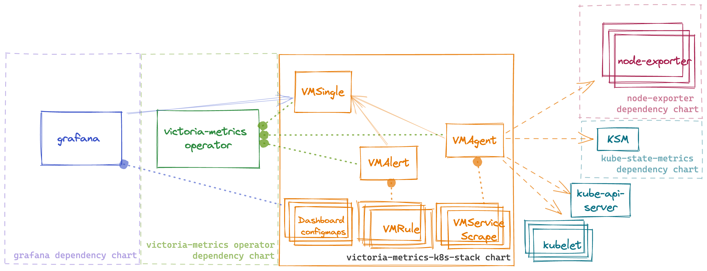

# Helm Chart For Victoria Metrics kubernetes monitoring stack.

  
[](https://artifacthub.io/packages/helm/victoriametrics/victoria-metrics-k8s-stack)

Kubernetes monitoring on VictoriaMetrics stack. Includes VictoriaMetrics Operator, Grafana dashboards, ServiceScrapes and VMRules

* [Overview](#Overview)
* [Configuration](#Configuration)
* [Prerequisites](#Prerequisites)
* [Dependencies](#Dependencies)
* [Quick Start](#How-to-install)
* [Uninstall](#How-to-uninstall)
* [Version Upgrade](#Upgrade-guide)
* [Troubleshooting](#Troubleshooting)
* [Values](#Parameters)

## Overview
This chart is an All-in-one solution to start monitoring kubernetes cluster.
It installs multiple dependency charts like [grafana](https://github.com/grafana/helm-charts/tree/main/charts/grafana), [node-exporter](https://github.com/prometheus-community/helm-charts/tree/main/charts/prometheus-node-exporter), [kube-state-metrics](https://github.com/prometheus-community/helm-charts/tree/main/charts/kube-state-metrics) and [victoria-metrics-operator](https://github.com/VictoriaMetrics/helm-charts/tree/master/charts/victoria-metrics-operator).
Also it installs Custom Resources like [VMSingle](https://docs.victoriametrics.com/operator/quick-start.html#vmsingle), [VMCluster](https://docs.victoriametrics.com/operator/quick-start.html#vmcluster), [VMAgent](https://docs.victoriametrics.com/operator/quick-start.html#vmagent), [VMAlert](https://docs.victoriametrics.com/operator/quick-start.html#vmalert).

By default, the operator [converts all existing prometheus-operator API objects](https://docs.victoriametrics.com/operator/quick-start.html#migration-from-prometheus-operator-objects) into corresponding VictoriaMetrics Operator objects.

To enable metrics collection for kubernetes this chart installs multiple scrape configurations for kuberenetes components like kubelet and kube-proxy, etc. Metrics collection is done by [VMAgent](https://docs.victoriametrics.com/operator/quick-start.html#vmagent). So if want to ship metrics to external VictoriaMetrics database you can disable VMSingle installation by setting `vmsingle.enabled` to `false` and setting `vmagent.vmagentSpec.remoteWrite.url` to your external VictoriaMetrics database.

This chart also installs bunch of dashboards and recording rules from [kube-prometheus](https://github.com/prometheus-operator/kube-prometheus) project.



## Configuration

Configuration of this chart is done through helm values.

### Dependencies

Dependencies can be enabled or disabled by setting `enabled` to `true` or `false` in `values.yaml` file.

**!Important:** for dependency charts anything that you can find in values.yaml of dependency chart can be configured in this chart under key for that dependency. For example if you want to configure `grafana` you can find all possible configuration options in [values.yaml](https://github.com/grafana/helm-charts/blob/main/charts/grafana/values.yaml) and you should set them in values for this chart under grafana: key. For example if you want to configure `grafana.persistence.enabled` you should set it in values.yaml like this:
```yaml
#################################################
###              dependencies               #####
#################################################
# Grafana dependency chart configuration. For possible values refer to https://github.com/grafana/helm-charts/tree/main/charts/grafana#configuration
grafana:
  enabled: true
  persistence:
    type: pvc
    enabled: false
```

### VictoriaMetrics components

This chart installs multiple VictoriaMetrics components using Custom Resources that are managed by [victoria-metrics-operator](https://docs.victoriametrics.com/operator/design.html)
Each resource can be configured using `spec` of that resource from API docs of [victoria-metrics-operator](https://docs.victoriametrics.com/operator/api.html). For example if you want to configure `VMAgent` you can find all possible configuration options in [API docs](https://docs.victoriametrics.com/operator/api.html#vmagent) and you should set them in values for this chart under `vmagent.spec` key. For example if you want to configure `remoteWrite.url` you should set it in values.yaml like this:
```yaml
vmagent:
  spec:
    remoteWrite:
      - url: "https://insert.vmcluster.domain.com/insert/0/prometheus/api/v1/write"
```

### ArgoCD issues

When deploying K8s stack using ArgoCD without Cert Manager (`.Values.victoria-metrics-operator.admissionWebhooks.certManager.enabled: false`)
it will rerender operator's webhook certificates on each sync since Helm `lookup` function is not respected by ArgoCD.
To prevent this please update you K8s stack Application `spec.syncPolicy` and `spec.ignoreDifferences` with a following:

```yaml
apiVersion: argoproj.io/v1alpha1
kind: Application
...
spec:
  ...
  syncPolicy:
    syncOptions:
    # https://argo-cd.readthedocs.io/en/stable/user-guide/sync-options/#respect-ignore-difference-configs
    # argocd must also ignore difference during apply stage
    # otherwise it ll silently override changes and cause a problem
    - RespectIgnoreDifferences=true
  ignoreDifferences:
    - group: ""
      kind: Secret
      name: <fullname>-validation
      namespace: kube-system
      jsonPointers:
        - /data
    - group: admissionregistration.k8s.io
      kind: ValidatingWebhookConfiguration
      name: <fullname>-admission
      jqPathExpressions:
      - '.webhooks[]?.clientConfig.caBundle'
```
where `<fullname>` is output of `{{ include "vm-operator.fullname" }}` for your setup

### Rules and dashboards

This chart by default install multiple dashboards and recording rules from [kube-prometheus](https://github.com/prometheus-operator/kube-prometheus)
you can disable dashboards with `defaultDashboardsEnabled: false` and `experimentalDashboardsEnabled: false`
and rules can be configured under `defaultRules`

### Prometheus scrape configs
This chart installs multiple scrape configurations for kubernetes monitoring. They are configured under `#ServiceMonitors` section in `values.yaml` file. For example if you want to configure scrape config for `kubelet` you should set it in values.yaml like this:
```yaml
kubelet:
  enabled: true

  # -- Enable scraping /metrics/cadvisor from kubelet's service
  cadvisor: true
  # -- Enable scraping /metrics/probes from kubelet's service
  probes: true
  # spec for VMNodeScrape crd
  # https://docs.victoriametrics.com/operator/api.html#vmnodescrapespec
  spec:
    interval: "30s"
```

## Prerequisites

* Install the follow packages: ``git``, ``kubectl``, ``helm``, ``helm-docs``. See this [tutorial](../../REQUIREMENTS.md).

* Add dependency chart repositories

```console
helm repo add grafana https://grafana.github.io/helm-charts
helm repo add prometheus-community https://prometheus-community.github.io/helm-charts
helm repo update
```

* PV support on underlying infrastructure.

## How to install

Access a Kubernetes cluster.

Add a chart helm repository with follow commands:

```console
helm repo add vm https://victoriametrics.github.io/helm-charts/

helm repo update
```

List versions of ``vm/victoria-metrics-k8s-stack`` chart available to installation:

```console
helm search repo vm/victoria-metrics-k8s-stack -l
```

Export default values of ``victoria-metrics-k8s-stack`` chart to file ``values.yaml``:

```console
helm show values vm/victoria-metrics-k8s-stack > values.yaml
```

Change the values according to the need of the environment in ``values.yaml`` file.

Test the installation with command:

```console
helm install [RELEASE_NAME] vm/victoria-metrics-k8s-stack -f values.yaml -n NAMESPACE --debug --dry-run
```

Install chart with command:

```console
helm install [RELEASE_NAME] vm/victoria-metrics-k8s-stack -f values.yaml -n NAMESPACE
```

Get the pods lists by running this commands:

```console
kubectl get pods -A | grep 'victoria-metrics'
```

### Install locally (Minikube)

To run VictoriaMetrics stack locally it's possible to use [Minikube](https://github.com/kubernetes/minikube). To avoid dashboards and alert rules issues please follow the steps below:

Run Minikube cluster

```
minikube start --container-runtime=containerd --extra-config=scheduler.bind-address=0.0.0.0 --extra-config=controller-manager.bind-address=0.0.0.0
```

Install helm chart

```
helm install [RELEASE_NAME] vm/victoria-metrics-k8s-stack -f values.yaml -f values.minikube.yaml -n NAMESPACE --debug --dry-run
```

## How to uninstall

Remove application with command.

```console
helm uninstall [RELEASE_NAME] -n NAMESPACE
```
This removes all the Kubernetes components associated with the chart and deletes the release.

_See [helm uninstall](https://helm.sh/docs/helm/helm_uninstall/) for command documentation._

CRDs created by this chart are not removed by default and should be manually cleaned up:

```console
kubectl get crd | grep victoriametrics.com | awk '{print $1 }' | xargs -i kubectl delete crd {}
```

## Troubleshooting

- If you cannot install helm chart with error `configmap already exist`. It could happen because of name collisions, if you set too long release name.
  Kubernetes by default, allows only 63 symbols at resource names and all resource names are trimmed by helm to 63 symbols.
  To mitigate it, use shorter name for helm chart release name, like:
```bash
# stack - is short enough
helm upgrade -i stack vm/victoria-metrics-k8s-stack
```
  Or use override for helm chart release name:
```bash
helm upgrade -i some-very-long-name vm/victoria-metrics-k8s-stack --set fullnameOverride=stack
```

## Upgrade guide

Usually, helm upgrade doesn't requires manual actions. Just execute command:

```console
$ helm upgrade [RELEASE_NAME] vm/victoria-metrics-k8s-stack
```

But release with CRD update can only be patched manually with kubectl.
Since helm does not perform a CRD update, we recommend that you always perform this when updating the helm-charts version:

```console
# 1. check the changes in CRD
$ helm show crds vm/victoria-metrics-k8s-stack --version [YOUR_CHART_VERSION] | kubectl diff -f -

# 2. apply the changes (update CRD)
$ helm show crds vm/victoria-metrics-k8s-stack --version [YOUR_CHART_VERSION] | kubectl apply -f - --server-side
```

All other manual actions upgrades listed below:

### Upgrade to 0.13.0

- node-exporter starting from version 4.0.0 is using the Kubernetes recommended labels. Therefore you have to delete the daemonset before you upgrade.

```bash
kubectl delete daemonset -l app=prometheus-node-exporter
```
- scrape configuration for kubernetes components was moved from `vmServiceScrape.spec` section to `spec` section. If you previously modified scrape configuration you need to update your `values.yaml`

- `grafana.defaultDashboardsEnabled` was renamed to `defaultDashboardsEnabled` (moved to top level). You may need to update it in your `values.yaml`

### Upgrade to 0.6.0

 All `CRD` must be update to the lastest version with command:

```bash
kubectl apply -f https://raw.githubusercontent.com/VictoriaMetrics/helm-charts/master/charts/victoria-metrics-k8s-stack/crds/crd.yaml

```

### Upgrade to 0.4.0

 All `CRD` must be update to `v1` version with command:

```bash
kubectl apply -f https://raw.githubusercontent.com/VictoriaMetrics/helm-charts/master/charts/victoria-metrics-k8s-stack/crds/crd.yaml

```

### Upgrade from 0.2.8 to 0.2.9

 Update `VMAgent` crd

command:
```bash
kubectl apply -f https://raw.githubusercontent.com/VictoriaMetrics/operator/v0.16.0/config/crd/bases/operator.victoriametrics.com_vmagents.yaml
```

 ### Upgrade from 0.2.5 to 0.2.6

New CRD added to operator - `VMUser` and `VMAuth`, new fields added to exist crd.
Manual commands:
```bash
kubectl apply -f https://raw.githubusercontent.com/VictoriaMetrics/operator/v0.15.0/config/crd/bases/operator.victoriametrics.com_vmusers.yaml
kubectl apply -f https://raw.githubusercontent.com/VictoriaMetrics/operator/v0.15.0/config/crd/bases/operator.victoriametrics.com_vmauths.yaml
kubectl apply -f https://raw.githubusercontent.com/VictoriaMetrics/operator/v0.15.0/config/crd/bases/operator.victoriametrics.com_vmalerts.yaml
kubectl apply -f https://raw.githubusercontent.com/VictoriaMetrics/operator/v0.15.0/config/crd/bases/operator.victoriametrics.com_vmagents.yaml
kubectl apply -f https://raw.githubusercontent.com/VictoriaMetrics/operator/v0.15.0/config/crd/bases/operator.victoriametrics.com_vmsingles.yaml
kubectl apply -f https://raw.githubusercontent.com/VictoriaMetrics/operator/v0.15.0/config/crd/bases/operator.victoriametrics.com_vmclusters.yaml
```

## Documentation of Helm Chart

Install ``helm-docs`` following the instructions on this [tutorial](../../REQUIREMENTS.md).

Generate docs with ``helm-docs`` command.

```bash
cd charts/victoria-metrics-k8s-stack

helm-docs
```

The markdown generation is entirely go template driven. The tool parses metadata from charts and generates a number of sub-templates that can be referenced in a template file (by default ``README.md.gotmpl``). If no template file is provided, the tool has a default internal template that will generate a reasonably formatted README.

## Parameters

The following tables lists the configurable parameters of the chart and their default values.

Change the values according to the need of the environment in ``victoria-metrics-k8s-stack/values.yaml`` file.

| Key | Type | Default | Description |
|-----|------|---------|-------------|
| additionalVictoriaMetricsMap | string | `nil` |  |
| alertmanager.annotations | object | `{}` |  |
| alertmanager.config.receivers[0].name | string | `"blackhole"` |  |
| alertmanager.config.route.receiver | string | `"blackhole"` |  |
| alertmanager.config.templates[0] | string | `"/etc/vm/configs/**/*.tmpl"` |  |
| alertmanager.enabled | bool | `true` |  |
| alertmanager.ingress.annotations | object | `{}` |  |
| alertmanager.ingress.enabled | bool | `false` |  |
| alertmanager.ingress.extraPaths | list | `[]` |  |
| alertmanager.ingress.hosts[0] | string | `"alertmanager.domain.com"` |  |
| alertmanager.ingress.labels | object | `{}` |  |
| alertmanager.ingress.path | string | `"/"` |  |
| alertmanager.ingress.pathType | string | `"Prefix"` |  |
| alertmanager.ingress.tls | list | `[]` |  |
| alertmanager.monzoTemplate.enabled | bool | `true` |  |
| alertmanager.spec.externalURL | string | `""` |  |
| alertmanager.spec.image.tag | string | `"v0.25.0"` |  |
| alertmanager.spec.routePrefix | string | `"/"` |  |
| alertmanager.spec.selectAllByDefault | bool | `true` |  |
| alertmanager.templateFiles | object | `{}` |  |
| argocdReleaseOverride | string | `""` | For correct working need set value 'argocdReleaseOverride=$ARGOCD_APP_NAME' |
| coreDns | object | `{"enabled":true,"service":{"enabled":true,"port":9153,"selector":{"k8s-app":"kube-dns"},"targetPort":9153},"spec":{"endpoints":[{"bearerTokenFile":"/var/run/secrets/kubernetes.io/serviceaccount/token","port":"http-metrics"}],"jobLabel":"jobLabel"}}` | Component scraping coreDns. Use either this or kubeDns |
| crds.enabled | bool | `true` |  |
| defaultDashboardsEnabled | bool | `true` |  |
| defaultRules.alerting | object | `{"spec":{"annotations":{},"labels":{}}}` | Common properties for VMRules alerts |
| defaultRules.alerting.spec.annotations | object | `{}` | Additional annotations for VMRule alerts |
| defaultRules.alerting.spec.labels | object | `{}` | Additional labels for VMRule alerts |
| defaultRules.annotations | object | `{}` | Annotations for default rules |
| defaultRules.create | bool | `true` |  |
| defaultRules.group | object | `{"spec":{"params":{}}}` | Common properties for VMRule groups |
| defaultRules.group.spec.params | object | `{}` | Optional HTTP URL parameters added to each rule request |
| defaultRules.groups.alertmanager.create | bool | `true` |  |
| defaultRules.groups.alertmanager.rules | object | `{}` |  |
| defaultRules.groups.etcd.create | bool | `true` |  |
| defaultRules.groups.etcd.rules | object | `{}` | Common properties for all rules in a group |
| defaultRules.groups.general.create | bool | `true` |  |
| defaultRules.groups.general.rules | object | `{}` |  |
| defaultRules.groups.k8sContainerCpuUsageSecondsTotal.create | bool | `true` |  |
| defaultRules.groups.k8sContainerCpuUsageSecondsTotal.rules | object | `{}` |  |
| defaultRules.groups.k8sContainerMemoryCache.create | bool | `true` |  |
| defaultRules.groups.k8sContainerMemoryCache.rules | object | `{}` |  |
| defaultRules.groups.k8sContainerMemoryRss.create | bool | `true` |  |
| defaultRules.groups.k8sContainerMemoryRss.rules | object | `{}` |  |
| defaultRules.groups.k8sContainerMemorySwap.create | bool | `true` |  |
| defaultRules.groups.k8sContainerMemorySwap.rules | object | `{}` |  |
| defaultRules.groups.k8sContainerMemoryWorkingSetBytes.create | bool | `true` |  |
| defaultRules.groups.k8sContainerMemoryWorkingSetBytes.rules | object | `{}` |  |
| defaultRules.groups.k8sContainerResource.create | bool | `true` |  |
| defaultRules.groups.k8sContainerResource.rules | object | `{}` |  |
| defaultRules.groups.k8sPodOwner.create | bool | `true` |  |
| defaultRules.groups.k8sPodOwner.rules | object | `{}` |  |
| defaultRules.groups.kubeApiserver.create | bool | `true` |  |
| defaultRules.groups.kubeApiserver.rules | object | `{}` |  |
| defaultRules.groups.kubeApiserverAvailability.create | bool | `true` |  |
| defaultRules.groups.kubeApiserverAvailability.rules | object | `{}` |  |
| defaultRules.groups.kubeApiserverBurnrate.create | bool | `true` |  |
| defaultRules.groups.kubeApiserverBurnrate.rules | object | `{}` |  |
| defaultRules.groups.kubeApiserverHistogram.create | bool | `true` |  |
| defaultRules.groups.kubeApiserverHistogram.rules | object | `{}` |  |
| defaultRules.groups.kubeApiserverSlos.create | bool | `true` |  |
| defaultRules.groups.kubeApiserverSlos.rules | object | `{}` |  |
| defaultRules.groups.kubePrometheusGeneral.create | bool | `true` |  |
| defaultRules.groups.kubePrometheusGeneral.rules | object | `{}` |  |
| defaultRules.groups.kubePrometheusNodeRecording.create | bool | `true` |  |
| defaultRules.groups.kubePrometheusNodeRecording.rules | object | `{}` |  |
| defaultRules.groups.kubeScheduler.create | bool | `true` |  |
| defaultRules.groups.kubeScheduler.rules | object | `{}` |  |
| defaultRules.groups.kubeStateMetrics.create | bool | `true` |  |
| defaultRules.groups.kubeStateMetrics.rules | object | `{}` |  |
| defaultRules.groups.kubelet.create | bool | `true` |  |
| defaultRules.groups.kubelet.rules | object | `{}` |  |
| defaultRules.groups.kubernetesApps.create | bool | `true` |  |
| defaultRules.groups.kubernetesApps.rules | object | `{}` |  |
| defaultRules.groups.kubernetesApps.targetNamespace | string | `".*"` |  |
| defaultRules.groups.kubernetesResources.create | bool | `true` |  |
| defaultRules.groups.kubernetesResources.rules | object | `{}` |  |
| defaultRules.groups.kubernetesStorage.create | bool | `true` |  |
| defaultRules.groups.kubernetesStorage.rules | object | `{}` |  |
| defaultRules.groups.kubernetesStorage.targetNamespace | string | `".*"` |  |
| defaultRules.groups.kubernetesSystem.create | bool | `true` |  |
| defaultRules.groups.kubernetesSystem.rules | object | `{}` |  |
| defaultRules.groups.kubernetesSystemApiserver.create | bool | `true` |  |
| defaultRules.groups.kubernetesSystemApiserver.rules | object | `{}` |  |
| defaultRules.groups.kubernetesSystemControllerManager.create | bool | `true` |  |
| defaultRules.groups.kubernetesSystemControllerManager.rules | object | `{}` |  |
| defaultRules.groups.kubernetesSystemKubelet.create | bool | `true` |  |
| defaultRules.groups.kubernetesSystemKubelet.rules | object | `{}` |  |
| defaultRules.groups.kubernetesSystemScheduler.create | bool | `true` |  |
| defaultRules.groups.kubernetesSystemScheduler.rules | object | `{}` |  |
| defaultRules.groups.node.create | bool | `true` |  |
| defaultRules.groups.node.rules | object | `{}` |  |
| defaultRules.groups.nodeNetwork.create | bool | `true` |  |
| defaultRules.groups.nodeNetwork.rules | object | `{}` |  |
| defaultRules.groups.vmHealth.create | bool | `true` |  |
| defaultRules.groups.vmHealth.rules | object | `{}` |  |
| defaultRules.groups.vmagent.create | bool | `true` |  |
| defaultRules.groups.vmagent.rules | object | `{}` |  |
| defaultRules.groups.vmcluster.create | bool | `true` |  |
| defaultRules.groups.vmcluster.rules | object | `{}` |  |
| defaultRules.groups.vmoperator.create | bool | `true` |  |
| defaultRules.groups.vmoperator.rules | object | `{}` |  |
| defaultRules.groups.vmsingle.create | bool | `true` |  |
| defaultRules.groups.vmsingle.rules | object | `{}` |  |
| defaultRules.labels | object | `{}` | Labels for default rules |
| defaultRules.recording | object | `{"spec":{"annotations":{},"labels":{}}}` | Common properties for VMRules recording rules |
| defaultRules.recording.spec.annotations | object | `{}` | Additional annotations for VMRule recording rules |
| defaultRules.recording.spec.labels | object | `{}` | Additional labels for VMRule recording rules |
| defaultRules.rule | object | `{"spec":{"annotations":{},"labels":{}}}` | Common properties for all VMRules |
| defaultRules.rule.spec.annotations | object | `{}` | Additional annotations for all VMRules |
| defaultRules.rule.spec.labels | object | `{}` | Additional labels for all VMRules |
| defaultRules.rules | object | `{}` | Per rule properties |
| defaultRules.runbookUrl | string | `"https://runbooks.prometheus-operator.dev/runbooks"` | Runbook url prefix for default rules |
| experimentalDashboardsEnabled | bool | `true` |  |
| externalVM.read.url | string | `""` |  |
| externalVM.write.url | string | `""` |  |
| extraObjects | list | `[]` | Add extra objects dynamically to this chart |
| fullnameOverride | string | `""` |  |
| global.license.key | string | `""` |  |
| global.license.keyRef | object | `{}` |  |
| grafana.additionalDataSources | list | `[]` |  |
| grafana.dashboardProviders."dashboardproviders.yaml".apiVersion | int | `1` |  |
| grafana.dashboardProviders."dashboardproviders.yaml".providers[0].disableDeletion | bool | `false` |  |
| grafana.dashboardProviders."dashboardproviders.yaml".providers[0].editable | bool | `true` |  |
| grafana.dashboardProviders."dashboardproviders.yaml".providers[0].folder | string | `""` |  |
| grafana.dashboardProviders."dashboardproviders.yaml".providers[0].name | string | `"default"` |  |
| grafana.dashboardProviders."dashboardproviders.yaml".providers[0].options.path | string | `"/var/lib/grafana/dashboards/default"` |  |
| grafana.dashboardProviders."dashboardproviders.yaml".providers[0].orgId | int | `1` |  |
| grafana.dashboardProviders."dashboardproviders.yaml".providers[0].type | string | `"file"` |  |
| grafana.dashboards.default.nodeexporter.datasource | string | `"VictoriaMetrics"` |  |
| grafana.dashboards.default.nodeexporter.gnetId | int | `1860` |  |
| grafana.dashboards.default.nodeexporter.revision | int | `22` |  |
| grafana.defaultDashboardsTimezone | string | `"utc"` |  |
| grafana.defaultDatasourceType | string | `"prometheus"` |  |
| grafana.enabled | bool | `true` |  |
| grafana.forceDeployDatasource | bool | `false` |  |
| grafana.ingress.annotations | object | `{}` |  |
| grafana.ingress.enabled | bool | `false` |  |
| grafana.ingress.extraPaths | list | `[]` |  |
| grafana.ingress.hosts[0] | string | `"grafana.domain.com"` |  |
| grafana.ingress.labels | object | `{}` |  |
| grafana.ingress.path | string | `"/"` |  |
| grafana.ingress.pathType | string | `"Prefix"` |  |
| grafana.ingress.tls | list | `[]` |  |
| grafana.provisionDefaultDatasource | bool | `true` |  |
| grafana.sidecar.dashboards.additionalDashboardAnnotations | object | `{}` |  |
| grafana.sidecar.dashboards.additionalDashboardLabels | object | `{}` |  |
| grafana.sidecar.dashboards.enabled | bool | `true` |  |
| grafana.sidecar.dashboards.multicluster | bool | `false` |  |
| grafana.sidecar.datasources.createVMReplicasDatasources | bool | `false` |  |
| grafana.sidecar.datasources.enabled | bool | `true` |  |
| grafana.sidecar.datasources.initDatasources | bool | `true` |  |
| grafana.sidecar.datasources.jsonData | object | `{}` |  |
| grafana.vmServiceScrape.enabled | bool | `true` |  |
| grafana.vmServiceScrape.spec | object | `{}` |  |
| grafanaOperatorDashboardsFormat.allowCrossNamespaceImport | bool | `false` |  |
| grafanaOperatorDashboardsFormat.enabled | bool | `false` |  |
| grafanaOperatorDashboardsFormat.instanceSelector.matchLabels.dashboards | string | `"grafana"` |  |
| kube-state-metrics.enabled | bool | `true` |  |
| kube-state-metrics.vmServiceScrape.spec | object | `{}` |  |
| kubeApiServer | object | `{"enabled":true,"spec":{"endpoints":[{"bearerTokenFile":"/var/run/secrets/kubernetes.io/serviceaccount/token","port":"https","scheme":"https","tlsConfig":{"caFile":"/var/run/secrets/kubernetes.io/serviceaccount/ca.crt","serverName":"kubernetes"}}],"jobLabel":"component","namespaceSelector":{"matchNames":["default"]},"selector":{"matchLabels":{"component":"apiserver","provider":"kubernetes"}}}}` | Component scraping the kube api server |
| kubeControllerManager | object | `{"enabled":true,"endpoints":[],"service":{"enabled":true,"port":10257,"selector":{"component":"kube-controller-manager"},"targetPort":10257},"spec":{"endpoints":[{"bearerTokenFile":"/var/run/secrets/kubernetes.io/serviceaccount/token","port":"http-metrics","scheme":"https","tlsConfig":{"caFile":"/var/run/secrets/kubernetes.io/serviceaccount/ca.crt","serverName":"kubernetes"}}],"jobLabel":"jobLabel"}}` | Component scraping the kube controller manager |
| kubeDns.enabled | bool | `false` |  |
| kubeDns.service.dnsmasq.port | int | `10054` |  |
| kubeDns.service.dnsmasq.targetPort | int | `10054` |  |
| kubeDns.service.enabled | bool | `false` |  |
| kubeDns.service.selector.k8s-app | string | `"kube-dns"` |  |
| kubeDns.service.skydns.port | int | `10055` |  |
| kubeDns.service.skydns.targetPort | int | `10055` |  |
| kubeDns.spec.endpoints[0].bearerTokenFile | string | `"/var/run/secrets/kubernetes.io/serviceaccount/token"` |  |
| kubeDns.spec.endpoints[0].port | string | `"http-metrics-dnsmasq"` |  |
| kubeDns.spec.endpoints[1].bearerTokenFile | string | `"/var/run/secrets/kubernetes.io/serviceaccount/token"` |  |
| kubeDns.spec.endpoints[1].port | string | `"http-metrics-skydns"` |  |
| kubeEtcd.enabled | bool | `true` |  |
| kubeEtcd.endpoints | list | `[]` |  |
| kubeEtcd.service.enabled | bool | `true` |  |
| kubeEtcd.service.port | int | `2379` |  |
| kubeEtcd.service.selector.component | string | `"etcd"` |  |
| kubeEtcd.service.targetPort | int | `2379` |  |
| kubeEtcd.spec.endpoints[0].bearerTokenFile | string | `"/var/run/secrets/kubernetes.io/serviceaccount/token"` |  |
| kubeEtcd.spec.endpoints[0].port | string | `"http-metrics"` |  |
| kubeEtcd.spec.endpoints[0].scheme | string | `"https"` |  |
| kubeEtcd.spec.endpoints[0].tlsConfig.caFile | string | `"/var/run/secrets/kubernetes.io/serviceaccount/ca.crt"` |  |
| kubeEtcd.spec.jobLabel | string | `"jobLabel"` |  |
| kubeProxy.enabled | bool | `false` |  |
| kubeProxy.endpoints | list | `[]` |  |
| kubeProxy.service.enabled | bool | `true` |  |
| kubeProxy.service.port | int | `10249` |  |
| kubeProxy.service.selector.k8s-app | string | `"kube-proxy"` |  |
| kubeProxy.service.targetPort | int | `10249` |  |
| kubeProxy.spec.endpoints[0].bearerTokenFile | string | `"/var/run/secrets/kubernetes.io/serviceaccount/token"` |  |
| kubeProxy.spec.endpoints[0].port | string | `"http-metrics"` |  |
| kubeProxy.spec.endpoints[0].scheme | string | `"https"` |  |
| kubeProxy.spec.endpoints[0].tlsConfig.caFile | string | `"/var/run/secrets/kubernetes.io/serviceaccount/ca.crt"` |  |
| kubeProxy.spec.jobLabel | string | `"jobLabel"` |  |
| kubeScheduler.enabled | bool | `true` |  |
| kubeScheduler.endpoints | list | `[]` |  |
| kubeScheduler.service.enabled | bool | `true` |  |
| kubeScheduler.service.port | int | `10259` |  |
| kubeScheduler.service.selector.component | string | `"kube-scheduler"` |  |
| kubeScheduler.service.targetPort | int | `10259` |  |
| kubeScheduler.spec.endpoints[0].bearerTokenFile | string | `"/var/run/secrets/kubernetes.io/serviceaccount/token"` |  |
| kubeScheduler.spec.endpoints[0].port | string | `"http-metrics"` |  |
| kubeScheduler.spec.endpoints[0].scheme | string | `"https"` |  |
| kubeScheduler.spec.endpoints[0].tlsConfig.caFile | string | `"/var/run/secrets/kubernetes.io/serviceaccount/ca.crt"` |  |
| kubeScheduler.spec.jobLabel | string | `"jobLabel"` |  |
| kubelet.cadvisor | bool | `true` | Enable scraping /metrics/cadvisor from kubelet's service |
| kubelet.enabled | bool | `true` |  |
| kubelet.probes | bool | `true` | Enable scraping /metrics/probes from kubelet's service |
| kubelet.spec.bearerTokenFile | string | `"/var/run/secrets/kubernetes.io/serviceaccount/token"` |  |
| kubelet.spec.honorLabels | bool | `true` |  |
| kubelet.spec.honorTimestamps | bool | `false` |  |
| kubelet.spec.interval | string | `"30s"` |  |
| kubelet.spec.metricRelabelConfigs[0].action | string | `"labeldrop"` |  |
| kubelet.spec.metricRelabelConfigs[0].regex | string | `"(uid)"` |  |
| kubelet.spec.metricRelabelConfigs[1].action | string | `"labeldrop"` |  |
| kubelet.spec.metricRelabelConfigs[1].regex | string | `"(id|name)"` |  |
| kubelet.spec.metricRelabelConfigs[2].action | string | `"drop"` |  |
| kubelet.spec.metricRelabelConfigs[2].regex | string | `"(rest_client_request_duration_seconds_bucket|rest_client_request_duration_seconds_sum|rest_client_request_duration_seconds_count)"` |  |
| kubelet.spec.metricRelabelConfigs[2].source_labels[0] | string | `"__name__"` |  |
| kubelet.spec.relabelConfigs[0].action | string | `"labelmap"` |  |
| kubelet.spec.relabelConfigs[0].regex | string | `"__meta_kubernetes_node_label_(.+)"` |  |
| kubelet.spec.relabelConfigs[1].sourceLabels[0] | string | `"__metrics_path__"` |  |
| kubelet.spec.relabelConfigs[1].targetLabel | string | `"metrics_path"` |  |
| kubelet.spec.relabelConfigs[2].replacement | string | `"kubelet"` |  |
| kubelet.spec.relabelConfigs[2].targetLabel | string | `"job"` |  |
| kubelet.spec.scheme | string | `"https"` |  |
| kubelet.spec.scrapeTimeout | string | `"5s"` |  |
| kubelet.spec.tlsConfig.caFile | string | `"/var/run/secrets/kubernetes.io/serviceaccount/ca.crt"` |  |
| kubelet.spec.tlsConfig.insecureSkipVerify | bool | `true` |  |
| nameOverride | string | `""` |  |
| prometheus-node-exporter.enabled | bool | `true` |  |
| prometheus-node-exporter.extraArgs[0] | string | `"--collector.filesystem.ignored-mount-points=^/(dev|proc|sys|var/lib/docker/.+|var/lib/kubelet/.+)($|/)"` |  |
| prometheus-node-exporter.extraArgs[1] | string | `"--collector.filesystem.ignored-fs-types=^(autofs|binfmt_misc|bpf|cgroup2?|configfs|debugfs|devpts|devtmpfs|fusectl|hugetlbfs|iso9660|mqueue|nsfs|overlay|proc|procfs|pstore|rpc_pipefs|securityfs|selinuxfs|squashfs|sysfs|tracefs)$"` |  |
| prometheus-node-exporter.podLabels.jobLabel | string | `"node-exporter"` |  |
| prometheus-node-exporter.vmServiceScrape.enabled | bool | `true` |  |
| prometheus-node-exporter.vmServiceScrape.spec.endpoints[0].metricRelabelConfigs[0].action | string | `"drop"` |  |
| prometheus-node-exporter.vmServiceScrape.spec.endpoints[0].metricRelabelConfigs[0].regex | string | `"/var/lib/kubelet/pods.+"` |  |
| prometheus-node-exporter.vmServiceScrape.spec.endpoints[0].metricRelabelConfigs[0].source_labels[0] | string | `"mountpoint"` |  |
| prometheus-node-exporter.vmServiceScrape.spec.endpoints[0].port | string | `"metrics"` |  |
| prometheus-node-exporter.vmServiceScrape.spec.jobLabel | string | `"jobLabel"` |  |
| prometheus-operator-crds.enabled | bool | `false` |  |
| serviceAccount.annotations | object | `{}` | Annotations to add to the service account |
| serviceAccount.create | bool | `true` | Specifies whether a service account should be created |
| serviceAccount.name | string | `""` | If not set and create is true, a name is generated using the fullname template |
| tenant | string | `"0"` |  |
| victoria-metrics-operator | object | `{"cleanupCRD":true,"cleanupImage":{"pullPolicy":"IfNotPresent","repository":"bitnami/kubectl"},"createCRD":false,"enabled":true,"operator":{"disable_prometheus_converter":false}}` | also checkout here possible ENV variables to configure operator behaviour https://docs.victoriametrics.com/operator/vars.html |
| victoria-metrics-operator.cleanupCRD | bool | `true` | Tells helm to clean up vm cr resources when uninstalling |
| victoria-metrics-operator.operator.disable_prometheus_converter | bool | `false` | By default, operator converts prometheus-operator objects. |
| vmagent.additionalRemoteWrites | list | `[]` |  |
| vmagent.annotations | object | `{}` |  |
| vmagent.enabled | bool | `true` |  |
| vmagent.ingress.annotations | object | `{}` |  |
| vmagent.ingress.enabled | bool | `false` |  |
| vmagent.ingress.extraPaths | list | `[]` |  |
| vmagent.ingress.hosts[0] | string | `"vmagent.domain.com"` |  |
| vmagent.ingress.labels | object | `{}` |  |
| vmagent.ingress.path | string | `"/"` |  |
| vmagent.ingress.pathType | string | `"Prefix"` |  |
| vmagent.ingress.tls | list | `[]` |  |
| vmagent.spec.externalLabels | object | `{}` |  |
| vmagent.spec.extraArgs."promscrape.dropOriginalLabels" | string | `"true"` |  |
| vmagent.spec.extraArgs."promscrape.streamParse" | string | `"true"` |  |
| vmagent.spec.image.tag | string | `"v1.102.1"` |  |
| vmagent.spec.scrapeInterval | string | `"20s"` |  |
| vmagent.spec.selectAllByDefault | bool | `true` |  |
| vmalert.additionalNotifierConfigs | object | `{}` |  |
| vmalert.annotations | object | `{}` |  |
| vmalert.enabled | bool | `true` |  |
| vmalert.ingress.annotations | object | `{}` |  |
| vmalert.ingress.enabled | bool | `false` |  |
| vmalert.ingress.extraPaths | list | `[]` |  |
| vmalert.ingress.hosts[0] | string | `"vmalert.domain.com"` |  |
| vmalert.ingress.labels | object | `{}` |  |
| vmalert.ingress.path | string | `"/"` |  |
| vmalert.ingress.pathType | string | `"Prefix"` |  |
| vmalert.ingress.tls | list | `[]` |  |
| vmalert.remoteWriteVMAgent | bool | `false` |  |
| vmalert.spec.evaluationInterval | string | `"15s"` |  |
| vmalert.spec.externalLabels | object | `{}` |  |
| vmalert.spec.image.tag | string | `"v1.102.1"` |  |
| vmalert.spec.selectAllByDefault | bool | `true` |  |
| vmalert.templateFiles | object | `{}` |  |
| vmcluster.annotations | object | `{}` |  |
| vmcluster.enabled | bool | `false` |  |
| vmcluster.ingress.insert.annotations | object | `{}` |  |
| vmcluster.ingress.insert.enabled | bool | `false` |  |
| vmcluster.ingress.insert.extraPaths | list | `[]` |  |
| vmcluster.ingress.insert.hosts[0] | string | `"vminsert.domain.com"` |  |
| vmcluster.ingress.insert.labels | object | `{}` |  |
| vmcluster.ingress.insert.path | string | `"/"` |  |
| vmcluster.ingress.insert.pathType | string | `"Prefix"` |  |
| vmcluster.ingress.insert.tls | list | `[]` |  |
| vmcluster.ingress.select.annotations | object | `{}` |  |
| vmcluster.ingress.select.enabled | bool | `false` |  |
| vmcluster.ingress.select.extraPaths | list | `[]` |  |
| vmcluster.ingress.select.hosts[0] | string | `"vmselect.domain.com"` |  |
| vmcluster.ingress.select.labels | object | `{}` |  |
| vmcluster.ingress.select.path | string | `"/"` |  |
| vmcluster.ingress.select.pathType | string | `"Prefix"` |  |
| vmcluster.ingress.select.tls | list | `[]` |  |
| vmcluster.ingress.storage.annotations | object | `{}` |  |
| vmcluster.ingress.storage.enabled | bool | `false` |  |
| vmcluster.ingress.storage.extraPaths | list | `[]` |  |
| vmcluster.ingress.storage.hosts[0] | string | `"vmstorage.domain.com"` |  |
| vmcluster.ingress.storage.labels | object | `{}` |  |
| vmcluster.ingress.storage.path | string | `"/"` |  |
| vmcluster.ingress.storage.pathType | string | `"Prefix"` |  |
| vmcluster.ingress.storage.tls | list | `[]` |  |
| vmcluster.spec.replicationFactor | int | `2` |  |
| vmcluster.spec.retentionPeriod | string | `"1"` | Data retention period. Possible units character: h(ours), d(ays), w(eeks), y(ears), if no unit character specified - month. The minimum retention period is 24h. See these [docs](https://docs.victoriametrics.com/single-server-victoriametrics/#retention) |
| vmcluster.spec.vminsert.extraArgs | object | `{}` |  |
| vmcluster.spec.vminsert.image.tag | string | `"v1.102.1-cluster"` |  |
| vmcluster.spec.vminsert.replicaCount | int | `2` |  |
| vmcluster.spec.vminsert.resources | object | `{}` |  |
| vmcluster.spec.vmselect.cacheMountPath | string | `"/select-cache"` |  |
| vmcluster.spec.vmselect.extraArgs | object | `{}` |  |
| vmcluster.spec.vmselect.image.tag | string | `"v1.102.1-cluster"` |  |
| vmcluster.spec.vmselect.replicaCount | int | `2` |  |
| vmcluster.spec.vmselect.resources | object | `{}` |  |
| vmcluster.spec.vmselect.storage.volumeClaimTemplate.spec.resources.requests.storage | string | `"2Gi"` |  |
| vmcluster.spec.vmstorage.image.tag | string | `"v1.102.1-cluster"` |  |
| vmcluster.spec.vmstorage.replicaCount | int | `2` |  |
| vmcluster.spec.vmstorage.resources | object | `{}` |  |
| vmcluster.spec.vmstorage.storage.volumeClaimTemplate.spec.resources.requests.storage | string | `"10Gi"` |  |
| vmcluster.spec.vmstorage.storageDataPath | string | `"/vm-data"` |  |
| vmsingle | object | `{"annotations":{},"enabled":true,"ingress":{"annotations":{},"enabled":false,"extraPaths":[],"hosts":["vmsingle.domain.com"],"labels":{},"path":"/","pathType":"Prefix","tls":[]},"spec":{"extraArgs":{},"image":{"tag":"v1.102.1"},"replicaCount":1,"retentionPeriod":"1","storage":{"accessModes":["ReadWriteOnce"],"resources":{"requests":{"storage":"20Gi"}}}}}` | Configures vmsingle params |
| vmsingle.spec.retentionPeriod | string | `"1"` | Data retention period. Possible units character: h(ours), d(ays), w(eeks), y(ears), if no unit character specified - month. The minimum retention period is 24h. See these [docs](https://docs.victoriametrics.com/single-server-victoriametrics/#retention) |
