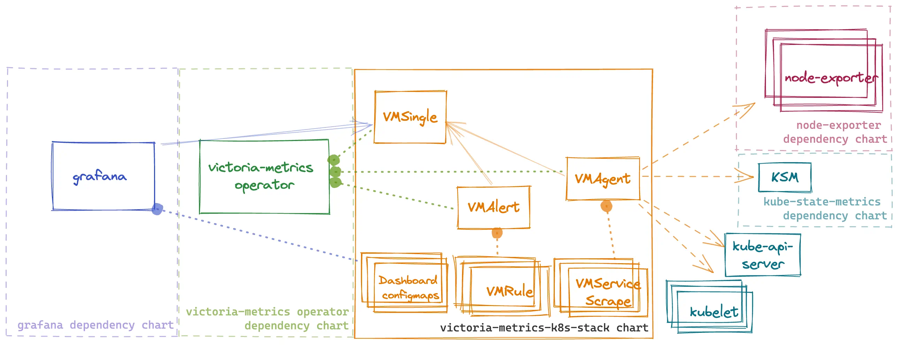

Kubernetes monitoring on VictoriaMetrics stack. Includes VictoriaMetrics Operator, Grafana dashboards, ServiceScrapes and VMRules

* [Overview](#Overview)
* [Configuration](#Configuration)
* [Prerequisites](#Prerequisites)
* [Dependencies](#Dependencies)
* [Quick Start](#How-to-install)
* [Uninstall](#How-to-uninstall)
* [Version Upgrade](#Upgrade-guide)
* [Troubleshooting](#Troubleshooting)
* [Values](#Parameters)

## Overview
This chart is an All-in-one solution to start monitoring kubernetes cluster.
It installs multiple dependency charts like [grafana](https://github.com/grafana/helm-charts/tree/main/charts/grafana), [node-exporter](https://github.com/prometheus-community/helm-charts/tree/main/charts/prometheus-node-exporter), [kube-state-metrics](https://github.com/prometheus-community/helm-charts/tree/main/charts/kube-state-metrics) and [victoria-metrics-operator](https://github.com/VictoriaMetrics/helm-charts/tree/master/charts/victoria-metrics-operator).
Also it installs Custom Resources like [VMSingle](https://docs.victoriametrics.com/operator/quick-start#vmsingle), [VMCluster](https://docs.victoriametrics.com/operator/quick-start#vmcluster), [VMAgent](https://docs.victoriametrics.com/operator/quick-start#vmagent), [VMAlert](https://docs.victoriametrics.com/operator/quick-start#vmalert).

By default, the operator [converts all existing prometheus-operator API objects](https://docs.victoriametrics.com/operator/quick-start#migration-from-prometheus-operator-objects) into corresponding VictoriaMetrics Operator objects.

To enable metrics collection for kubernetes this chart installs multiple scrape configurations for kubernetes components like kubelet and kube-proxy, etc. Metrics collection is done by [VMAgent](https://docs.victoriametrics.com/operator/quick-start#vmagent). So if want to ship metrics to external VictoriaMetrics database you can disable VMSingle installation by setting `vmsingle.enabled` to `false` and setting `vmagent.vmagentSpec.remoteWrite.url` to your external VictoriaMetrics database.

This chart also installs bunch of dashboards and recording rules from [kube-prometheus](https://github.com/prometheus-operator/kube-prometheus) project.



## Configuration

Configuration of this chart is done through helm values.

### Dependencies

Dependencies can be enabled or disabled by setting `enabled` to `true` or `false` in `values.yaml` file.

**!Important:** for dependency charts anything that you can find in values.yaml of dependency chart can be configured in this chart under key for that dependency. For example if you want to configure `grafana` you can find all possible configuration options in [values.yaml](https://github.com/grafana/helm-charts/blob/main/charts/grafana/values.yaml) and you should set them in values for this chart under grafana: key. For example if you want to configure `grafana.persistence.enabled` you should set it in values.yaml like this:
```yaml
#################################################
###              dependencies               #####
#################################################
# Grafana dependency chart configuration. For possible values refer to https://github.com/grafana/helm-charts/tree/main/charts/grafana#configuration
grafana:
  enabled: true
  persistence:
    type: pvc
    enabled: false
```

### VictoriaMetrics components

This chart installs multiple VictoriaMetrics components using Custom Resources that are managed by [victoria-metrics-operator](https://docs.victoriametrics.com/operator/design)
Each resource can be configured using `spec` of that resource from API docs of [victoria-metrics-operator](https://docs.victoriametrics.com/operator/api). For example if you want to configure `VMAgent` you can find all possible configuration options in [API docs](https://docs.victoriametrics.com/operator/api#vmagent) and you should set them in values for this chart under `vmagent.spec` key. For example if you want to configure `remoteWrite.url` you should set it in values.yaml like this:
```yaml
vmagent:
  spec:
    remoteWrite:
      - url: "https://insert.vmcluster.domain.com/insert/0/prometheus/api/v1/write"
```

### ArgoCD issues

#### Operator self signed certificates
When deploying K8s stack using ArgoCD without Cert Manager (`.Values.victoria-metrics-operator.admissionWebhooks.certManager.enabled: false`)
it will rerender operator's webhook certificates on each sync since Helm `lookup` function is not respected by ArgoCD.
To prevent this please update you K8s stack Application `spec.syncPolicy` and `spec.ignoreDifferences` with a following:

```yaml
apiVersion: argoproj.io/v1alpha1
kind: Application
...
spec:
  ...
  destination:
    ...
    namespace: <k8s-stack-namespace>
  ...
  syncPolicy:
    syncOptions:
    # https://argo-cd.readthedocs.io/en/stable/user-guide/sync-options/#respect-ignore-difference-configs
    # argocd must also ignore difference during apply stage
    # otherwise it ll silently override changes and cause a problem
    - RespectIgnoreDifferences=true
  ignoreDifferences:
    - group: ""
      kind: Secret
      name: <fullname>-validation
      namespace: <k8s-stack-namespace>
      jsonPointers:
        - /data
    - group: admissionregistration.k8s.io
      kind: ValidatingWebhookConfiguration
      name: <fullname>-admission
      jqPathExpressions:
      - '.webhooks[]?.clientConfig.caBundle'
```
where `<fullname>` is output of `{{ include "vm-operator.fullname" }}` for your setup

#### `metadata.annotations: Too long: must have at most 262144 bytes` on dashboards

If one of dashboards ConfigMap is failing with error `Too long: must have at most 262144 bytes`, please make sure you've added `argocd.argoproj.io/sync-options: ServerSideApply=true` annotation to your dashboards:

```yaml
defaultDashboards:
  annotations:
    argocd.argoproj.io/sync-options: ServerSideApply=true
```

argocd.argoproj.io/sync-options: ServerSideApply=true

#### Resources are not completely removed after chart uninstallation

This chart uses `pre-delete` Helm hook to cleanup resources managed by operator, but it's not supported in ArgoCD and this hook is ignored.
To have a control over resources removal please consider using either [ArgoCD sync phases and waves](https://argo-cd.readthedocs.io/en/stable/user-guide/sync-waves/) or [installing operator chart separately](#install-operator-separately)

### Rules and dashboards

This chart by default install multiple dashboards and recording rules from [kube-prometheus](https://github.com/prometheus-operator/kube-prometheus)
you can disable dashboards with `defaultDashboards.enabled: false` and `experimentalDashboardsEnabled: false`
and rules can be configured under `defaultRules`

### Adding external dashboards

By default, this chart uses sidecar in order to provision default dashboards. If you want to add you own dashboards there are two ways to do it:

- Add dashboards by creating a ConfigMap. An example ConfigMap:
```yaml
apiVersion: v1
kind: ConfigMap
metadata:
  labels:
    grafana_dashboard: "1"
  name: grafana-dashboard
data:
  dashboard.json: |-
      {...}
```

- Use init container provisioning. Note that this option requires disabling sidecar and will remove all default dashboards provided with this chart. An example configuration:
```yaml
grafana:
  sidecar:
    dashboards:
      enabled: false
  dashboards:
    vmcluster:
      gnetId: 11176
      revision: 38
      datasource: VictoriaMetrics
```
When using this approach, you can find dashboards for VictoriaMetrics components published [here](https://grafana.com/orgs/victoriametrics).

### Prometheus scrape configs
This chart installs multiple scrape configurations for kubernetes monitoring. They are configured under `#ServiceMonitors` section in `values.yaml` file. For example if you want to configure scrape config for `kubelet` you should set it in values.yaml like this:
```yaml
kubelet:
  enabled: true
  # spec for VMNodeScrape crd
  # https://docs.victoriametrics.com/operator/api#vmnodescrapespec
  spec:
    interval: "30s"
```

### Using externally managed Grafana

If you want to use an externally managed Grafana instance but still want to use the dashboards provided by this chart you can set
 `grafana.enabled` to `false` and set `defaultDashboards.enabled` to `true`. This will install the dashboards
 but will not install Grafana.

For example:
```yaml
defaultDashboards:
  enabled: true

grafana:
  enabled: false
```

This will create ConfigMaps with dashboards to be imported into Grafana.

If additional configuration for labels or annotations is needed in order to import dashboard to an existing Grafana you can
set `.grafana.sidecar.dashboards.additionalDashboardLabels` or `.grafana.sidecar.dashboards.additionalDashboardAnnotations` in `values.yaml`:

For example:
```yaml
defaultDashboards:
  enabled: true
  labels:
    key: value
  annotations:
    key: value
```

## Prerequisites

* Install the follow packages: ``git``, ``kubectl``, ``helm``, ``helm-docs``. See this [tutorial](https://docs.victoriametrics.com/helm/requirements/).

* Add dependency chart repositories

```shell
helm repo add grafana https://grafana.github.io/helm-charts
helm repo add prometheus-community https://prometheus-community.github.io/helm-charts
helm repo update
```

* PV support on underlying infrastructure.

## How to install

Access a Kubernetes cluster.

### Setup chart repository (can be omitted for OCI repositories)

Add a chart helm repository with follow commands:

```console
helm repo add vm https://victoriametrics.github.io/helm-charts/

helm repo update
```
List versions of `vm/victoria-metrics-k8s-stack` chart available to installation:

```console
helm search repo vm/victoria-metrics-k8s-stack -l
```

### Install `victoria-metrics-k8s-stack` chart

Export default values of `victoria-metrics-k8s-stack` chart to file `values.yaml`:

  - For HTTPS repository

    ```console
    helm show values vm/victoria-metrics-k8s-stack > values.yaml
    ```
  - For OCI repository

    ```console
    helm show values oci://ghcr.io/victoriametrics/helm-charts/victoria-metrics-k8s-stack > values.yaml
    ```

Change the values according to the need of the environment in ``values.yaml`` file.

Test the installation with command:

  - For HTTPS repository

    ```console
    helm install vmks vm/victoria-metrics-k8s-stack -f values.yaml -n NAMESPACE --debug --dry-run
    ```

  - For OCI repository

    ```console
    helm install vmks oci://ghcr.io/victoriametrics/helm-charts/victoria-metrics-k8s-stack -f values.yaml -n NAMESPACE --debug --dry-run
    ```

Install chart with command:

  - For HTTPS repository

    ```console
    helm install vmks vm/victoria-metrics-k8s-stack -f values.yaml -n NAMESPACE
    ```

  - For OCI repository

    ```console
    helm install vmks oci://ghcr.io/victoriametrics/helm-charts/victoria-metrics-k8s-stack -f values.yaml -n NAMESPACE
    ```

Get the pods lists by running this commands:

```console
kubectl get pods -A | grep 'vmks'
```

Get the application by running this command:

```console
helm list -f vmks -n NAMESPACE
```

See the history of versions of `vmks` application with command.

```console
helm history vmks -n NAMESPACE
```

### Install operator separately

To have control over an order of managed resources removal or to be able to remove a whole namespace with managed resources it's recommended to disable operator in k8s-stack chart (`victoria-metrics-operator.enabled: false`) and [install it](https://docs.victoriametrics.com/helm/victoriametrics-operator/) separately. To move operator from existing k8s-stack release to a separate one please follow the steps below:

- disable cleanup webhook (`victoria-metrics-operator.crds.cleanup.enabled: false`) and apply changes
- disable operator (`victoria-metrics-operator.enabled: false`) and apply changes
- [deploy operator](https://docs.victoriametrics.com/helm/victoriametrics-operator/) separately with `crds.plain: true`

If you're planning to delete k8s-stack by a whole namespace removal please consider deploying operator in a separate namespace as due to uncontrollable removal order process can hang if operator is removed before at least one resource it manages.

### Install locally (Minikube)

To run VictoriaMetrics stack locally it's possible to use [Minikube](https://github.com/kubernetes/minikube). To avoid dashboards and alert rules issues please follow the steps below:

Run Minikube cluster

```shell
minikube start --container-runtime=containerd --extra-config=scheduler.bind-address=0.0.0.0 --extra-config=controller-manager.bind-address=0.0.0.0 --extra-config=etcd.listen-metrics-urls=http://0.0.0.0:2381
```

Install helm chart

```shell
helm install [RELEASE_NAME] vm/victoria-metrics-k8s-stack -f values.yaml -f values.minikube.yaml -n NAMESPACE --debug --dry-run
```

## How to uninstall

Remove application with command.

```console
helm uninstall vmks -n NAMESPACE
```

CRDs created by this chart are not removed by default and should be manually cleaned up:

```shell
kubectl get crd | grep victoriametrics.com | awk '{print $1 }' | xargs -i kubectl delete crd {}
```

## Troubleshooting

- If you cannot install helm chart with error `configmap already exist`. It could happen because of name collisions, if you set too long release name.
  Kubernetes by default, allows only 63 symbols at resource names and all resource names are trimmed by helm to 63 symbols.
  To mitigate it, use shorter name for helm chart release name, like:
```shell
# stack - is short enough
helm upgrade -i stack vm/victoria-metrics-k8s-stack
```
  Or use override for helm chart release name:
```shell
helm upgrade -i some-very-long-name vm/victoria-metrics-k8s-stack --set fullnameOverride=stack
```

## Upgrade guide

Usually, helm upgrade doesn't requires manual actions. Just execute command:

```shell
$ helm upgrade [RELEASE_NAME] vm/victoria-metrics-k8s-stack
```

But release with CRD update can only be patched manually with kubectl.
Since helm does not perform a CRD update, we recommend that you always perform this when updating the helm-charts version:

```shell
# 1. check the changes in CRD
$ helm show crds vm/victoria-metrics-k8s-stack --version [YOUR_CHART_VERSION] | kubectl diff -f -

# 2. apply the changes (update CRD)
$ helm show crds vm/victoria-metrics-k8s-stack --version [YOUR_CHART_VERSION] | kubectl apply -f - --server-side
```

All other manual actions upgrades listed below:

### Upgrade to 0.29.0

To provide more flexibility for VMAuth configuration all `<component>.vmauth` params were moved to `vmauth.spec`.
Also `.vm.write` and `.vm.read` variables are available in `vmauth.spec`, which represent `vmsingle`, `vminsert`, `externalVM.write` and `vmsingle`, `vmselect`, `externalVM.read` parsed URLs respectively.

If your configuration in version < 0.29.0 looked like below:

```yaml
vmcluster:
  vmauth:
    vmselect:
      - src_paths:
          - /select/.*
        url_prefix:
          - /
    vminsert:
      - src_paths:
          - /insert/.*
        url_prefix:
          - /
```

In 0.29.0 it should look like:

```yaml
vmauth:
  spec:
    unauthorizedAccessConfig:
      - src_paths:
          - '{{ .vm.read.path }}/.*'
        url_prefix:
          - '{{ urlJoin (omit .vm.read "path") }}/'
      - src_paths:
          - '{{ .vm.write.path }}/.*'
        url_prefix:
          - '{{ urlJoin (omit .vm.write "path") }}/'
```

### Upgrade to 0.13.0

- node-exporter starting from version 4.0.0 is using the Kubernetes recommended labels. Therefore you have to delete the daemonset before you upgrade.

```shell
kubectl delete daemonset -l app=prometheus-node-exporter
```
- scrape configuration for kubernetes components was moved from `vmServiceScrape.spec` section to `spec` section. If you previously modified scrape configuration you need to update your `values.yaml`

- `grafana.defaultDashboardsEnabled` was renamed to `defaultDashboardsEnabled` (moved to top level). You may need to update it in your `values.yaml`

### Upgrade to 0.6.0

 All `CRD` must be update to the lastest version with command:

```shell
kubectl apply -f https://raw.githubusercontent.com/VictoriaMetrics/helm-charts/master/charts/victoria-metrics-k8s-stack/crds/crd.yaml

```

### Upgrade to 0.4.0

 All `CRD` must be update to `v1` version with command:

```shell
kubectl apply -f https://raw.githubusercontent.com/VictoriaMetrics/helm-charts/master/charts/victoria-metrics-k8s-stack/crds/crd.yaml

```

### Upgrade from 0.2.8 to 0.2.9

 Update `VMAgent` crd

command:
```shell
kubectl apply -f https://raw.githubusercontent.com/VictoriaMetrics/operator/v0.16.0/config/crd/bases/operator.victoriametrics.com_vmagents.yaml
```

 ### Upgrade from 0.2.5 to 0.2.6

New CRD added to operator - `VMUser` and `VMAuth`, new fields added to exist crd.
Manual commands:
```shell
kubectl apply -f https://raw.githubusercontent.com/VictoriaMetrics/operator/v0.15.0/config/crd/bases/operator.victoriametrics.com_vmusers.yaml
kubectl apply -f https://raw.githubusercontent.com/VictoriaMetrics/operator/v0.15.0/config/crd/bases/operator.victoriametrics.com_vmauths.yaml
kubectl apply -f https://raw.githubusercontent.com/VictoriaMetrics/operator/v0.15.0/config/crd/bases/operator.victoriametrics.com_vmalerts.yaml
kubectl apply -f https://raw.githubusercontent.com/VictoriaMetrics/operator/v0.15.0/config/crd/bases/operator.victoriametrics.com_vmagents.yaml
kubectl apply -f https://raw.githubusercontent.com/VictoriaMetrics/operator/v0.15.0/config/crd/bases/operator.victoriametrics.com_vmsingles.yaml
kubectl apply -f https://raw.githubusercontent.com/VictoriaMetrics/operator/v0.15.0/config/crd/bases/operator.victoriametrics.com_vmclusters.yaml
```

## Documentation of Helm Chart

Install ``helm-docs`` following the instructions on this [tutorial](https://docs.victoriametrics.com/helm/requirements/).

Generate docs with ``helm-docs`` command.

```bash
cd charts/victoria-metrics-k8s-stack

helm-docs
```

The markdown generation is entirely go template driven. The tool parses metadata from charts and generates a number of sub-templates that can be referenced in a template file (by default ``README.md.gotmpl``). If no template file is provided, the tool has a default internal template that will generate a reasonably formatted README.

## Parameters

The following tables lists the configurable parameters of the chart and their default values.

Change the values according to the need of the environment in ``victoria-metrics-k8s-stack/values.yaml`` file.

<a id="helm-value-additionalvictoriametricsmap" href="#helm-value-additionalvictoriametricsmap" aria-hidden="true" tabindex="-1"></a>
[`additionalVictoriaMetricsMap`](#helm-value-additionalvictoriametricsmap)`(string)`: Provide custom recording or alerting rules to be deployed into the cluster.
  ```helm-default
  null
  ```
   
<a id="helm-value-alertmanager-annotations" href="#helm-value-alertmanager-annotations" aria-hidden="true" tabindex="-1"></a>
[`alertmanager.annotations`](#helm-value-alertmanager-annotations)`(object)`: Alertmanager annotations
  ```helm-default
  {}
  ```
   
<a id="helm-value-alertmanager-config" href="#helm-value-alertmanager-config" aria-hidden="true" tabindex="-1"></a>
[`alertmanager.config`](#helm-value-alertmanager-config)`(object)`: Alertmanager configuration
  ```helm-default
  receivers:
      - name: blackhole
  route:
      receiver: blackhole
  ```
   
<a id="helm-value-alertmanager-enabled" href="#helm-value-alertmanager-enabled" aria-hidden="true" tabindex="-1"></a>
[`alertmanager.enabled`](#helm-value-alertmanager-enabled)`(bool)`: Create VMAlertmanager CR
  ```helm-default
  true
  ```
   
<a id="helm-value-alertmanager-ingress" href="#helm-value-alertmanager-ingress" aria-hidden="true" tabindex="-1"></a>
[`alertmanager.ingress`](#helm-value-alertmanager-ingress)`(object)`: Alertmanager ingress configuration
  ```helm-default
  annotations: {}
  enabled: false
  extraPaths: []
  hosts:
      - alertmanager.domain.com
  labels: {}
  path: '{{ .Values.alertmanager.spec.routePrefix | default "/" }}'
  pathType: Prefix
  tls: []
  ```
   
<a id="helm-value-alertmanager-ingress-extrapaths" href="#helm-value-alertmanager-ingress-extrapaths" aria-hidden="true" tabindex="-1"></a>
[`alertmanager.ingress.extraPaths`](#helm-value-alertmanager-ingress-extrapaths)`(list)`: Extra paths to prepend to every host configuration. This is useful when working with annotation based services.
  ```helm-default
  []
  ```
   
<a id="helm-value-alertmanager-monzotemplate" href="#helm-value-alertmanager-monzotemplate" aria-hidden="true" tabindex="-1"></a>
[`alertmanager.monzoTemplate`](#helm-value-alertmanager-monzotemplate)`(object)`: Better alert templates for [slack source](https://gist.github.com/milesbxf/e2744fc90e9c41b47aa47925f8ff6512)
  ```helm-default
  enabled: true
  ```
   
<a id="helm-value-alertmanager-spec" href="#helm-value-alertmanager-spec" aria-hidden="true" tabindex="-1"></a>
[`alertmanager.spec`](#helm-value-alertmanager-spec)`(object)`: Full spec for VMAlertmanager CRD. Allowed values described [here](https://docs.victoriametrics.com/operator/api#vmalertmanagerspec)
  ```helm-default
  configSecret: ""
  externalURL: ""
  image:
      tag: v0.27.0
  port: "9093"
  replicaCount: 1
  routePrefix: /
  selectAllByDefault: true
  ```
   
<a id="helm-value-alertmanager-spec-configsecret" href="#helm-value-alertmanager-spec-configsecret" aria-hidden="true" tabindex="-1"></a>
[`alertmanager.spec.configSecret`](#helm-value-alertmanager-spec-configsecret)`(string)`: If this one defined, it will be used for alertmanager configuration and config parameter will be ignored
  ```helm-default
  ""
  ```
   
<a id="helm-value-alertmanager-templatefiles" href="#helm-value-alertmanager-templatefiles" aria-hidden="true" tabindex="-1"></a>
[`alertmanager.templateFiles`](#helm-value-alertmanager-templatefiles)`(object)`: Extra alert templates
  ```helm-default
  {}
  ```
   
<a id="helm-value-alertmanager-usemanagedconfig" href="#helm-value-alertmanager-usemanagedconfig" aria-hidden="true" tabindex="-1"></a>
[`alertmanager.useManagedConfig`](#helm-value-alertmanager-usemanagedconfig)`(bool)`:
enable storing .Values.alertmanager.config in VMAlertmanagerConfig instead of k8s Secret.
Note: VMAlertmanagerConfig and plain Alertmanager config structures are not equal.
If you're migrating existing config, please make sure that `.Values.alertmanager.config`:
- with `useManagedConfig: false` has structure described [here](https://prometheus.io/docs/alerting/latest/configuration/).
- with `useManagedConfig: true` has structure described [here](https://docs.victoriametrics.com/operator/api/#vmalertmanagerconfig).
  ```helm-default
  false
  ```
   
<a id="helm-value-argocdreleaseoverride" href="#helm-value-argocdreleaseoverride" aria-hidden="true" tabindex="-1"></a>
[`argocdReleaseOverride`](#helm-value-argocdreleaseoverride)`(string)`: If this chart is used in "Argocd" with "releaseName" field then VMServiceScrapes couldn't select the proper services. For correct working need set value 'argocdReleaseOverride=$ARGOCD_APP_NAME'
  ```helm-default
  ""
  ```
   
<a id="helm-value-coredns-enabled" href="#helm-value-coredns-enabled" aria-hidden="true" tabindex="-1"></a>
[`coreDns.enabled`](#helm-value-coredns-enabled)`(bool)`: Enabled CoreDNS metrics scraping
  ```helm-default
  true
  ```
   
<a id="helm-value-coredns-service-enabled" href="#helm-value-coredns-service-enabled" aria-hidden="true" tabindex="-1"></a>
[`coreDns.service.enabled`](#helm-value-coredns-service-enabled)`(bool)`: Create service for CoreDNS metrics
  ```helm-default
  true
  ```
   
<a id="helm-value-coredns-service-port" href="#helm-value-coredns-service-port" aria-hidden="true" tabindex="-1"></a>
[`coreDns.service.port`](#helm-value-coredns-service-port)`(int)`: CoreDNS service port
  ```helm-default
  9153
  ```
   
<a id="helm-value-coredns-service-selector" href="#helm-value-coredns-service-selector" aria-hidden="true" tabindex="-1"></a>
[`coreDns.service.selector`](#helm-value-coredns-service-selector)`(object)`: CoreDNS service pod selector
  ```helm-default
  k8s-app: kube-dns
  ```
   
<a id="helm-value-coredns-service-targetport" href="#helm-value-coredns-service-targetport" aria-hidden="true" tabindex="-1"></a>
[`coreDns.service.targetPort`](#helm-value-coredns-service-targetport)`(int)`: CoreDNS service target port
  ```helm-default
  9153
  ```
   
<a id="helm-value-coredns-vmscrape" href="#helm-value-coredns-vmscrape" aria-hidden="true" tabindex="-1"></a>
[`coreDns.vmScrape`](#helm-value-coredns-vmscrape)`(object)`: Spec for VMServiceScrape CRD is [here](https://docs.victoriametrics.com/operator/api.html#vmservicescrapespec)
  ```helm-default
  spec:
      endpoints:
          - bearerTokenFile: /var/run/secrets/kubernetes.io/serviceaccount/token
            port: http-metrics
      jobLabel: jobLabel
      namespaceSelector:
          matchNames:
              - kube-system
  ```
   
<a id="helm-value-defaultdashboards-annotations" href="#helm-value-defaultdashboards-annotations" aria-hidden="true" tabindex="-1"></a>
[`defaultDashboards.annotations`](#helm-value-defaultdashboards-annotations)`(object)`:
  ```helm-default
  {}
  ```
   
<a id="helm-value-defaultdashboards-dashboards" href="#helm-value-defaultdashboards-dashboards" aria-hidden="true" tabindex="-1"></a>
[`defaultDashboards.dashboards`](#helm-value-defaultdashboards-dashboards)`(object)`: Create dashboards as ConfigMap despite dependency it requires is not installed
  ```helm-default
  node-exporter-full:
      enabled: true
  victoriametrics-operator:
      enabled: true
  victoriametrics-vmalert:
      enabled: true
  ```
   
<a id="helm-value-defaultdashboards-dashboards-node-exporter-full" href="#helm-value-defaultdashboards-dashboards-node-exporter-full" aria-hidden="true" tabindex="-1"></a>
[`defaultDashboards.dashboards.node-exporter-full`](#helm-value-defaultdashboards-dashboards-node-exporter-full)`(object)`: In ArgoCD using client-side apply this dashboard reaches annotations size limit and causes k8s issues without server side apply See [this issue](https://github.com/VictoriaMetrics/helm-charts/tree/disable-node-exporter-dashboard-by-default/charts/victoria-metrics-k8s-stack#metadataannotations-too-long-must-have-at-most-262144-bytes-on-dashboards)
  ```helm-default
  enabled: true
  ```
   
<a id="helm-value-defaultdashboards-defaulttimezone" href="#helm-value-defaultdashboards-defaulttimezone" aria-hidden="true" tabindex="-1"></a>
[`defaultDashboards.defaultTimezone`](#helm-value-defaultdashboards-defaulttimezone)`(string)`:
  ```helm-default
  utc
  ```
   
<a id="helm-value-defaultdashboards-enabled" href="#helm-value-defaultdashboards-enabled" aria-hidden="true" tabindex="-1"></a>
[`defaultDashboards.enabled`](#helm-value-defaultdashboards-enabled)`(bool)`: Enable custom dashboards installation
  ```helm-default
  true
  ```
   
<a id="helm-value-defaultdashboards-grafanaoperator-enabled" href="#helm-value-defaultdashboards-grafanaoperator-enabled" aria-hidden="true" tabindex="-1"></a>
[`defaultDashboards.grafanaOperator.enabled`](#helm-value-defaultdashboards-grafanaoperator-enabled)`(bool)`: Create dashboards as CRDs (requires grafana-operator to be installed)
  ```helm-default
  false
  ```
   
<a id="helm-value-defaultdashboards-grafanaoperator-spec-allowcrossnamespaceimport" href="#helm-value-defaultdashboards-grafanaoperator-spec-allowcrossnamespaceimport" aria-hidden="true" tabindex="-1"></a>
[`defaultDashboards.grafanaOperator.spec.allowCrossNamespaceImport`](#helm-value-defaultdashboards-grafanaoperator-spec-allowcrossnamespaceimport)`(bool)`:
  ```helm-default
  false
  ```
   
<a id="helm-value-defaultdashboards-grafanaoperator-spec-instanceselector-matchlabels-dashboards" href="#helm-value-defaultdashboards-grafanaoperator-spec-instanceselector-matchlabels-dashboards" aria-hidden="true" tabindex="-1"></a>
[`defaultDashboards.grafanaOperator.spec.instanceSelector.matchLabels.dashboards`](#helm-value-defaultdashboards-grafanaoperator-spec-instanceselector-matchlabels-dashboards)`(string)`:
  ```helm-default
  grafana
  ```
   
<a id="helm-value-defaultdashboards-labels" href="#helm-value-defaultdashboards-labels" aria-hidden="true" tabindex="-1"></a>
[`defaultDashboards.labels`](#helm-value-defaultdashboards-labels)`(object)`:
  ```helm-default
  {}
  ```
   
<a id="helm-value-defaultdatasources-alertmanager" href="#helm-value-defaultdatasources-alertmanager" aria-hidden="true" tabindex="-1"></a>
[`defaultDatasources.alertmanager`](#helm-value-defaultdatasources-alertmanager)`(object)`: List of alertmanager datasources. Alertmanager generated `url` will be added to each datasource in template if alertmanager is enabled
  ```helm-default
  datasources:
      - access: proxy
        jsonData:
          implementation: prometheus
        name: Alertmanager
  perReplica: false
  ```
   
<a id="helm-value-defaultdatasources-alertmanager-perreplica" href="#helm-value-defaultdatasources-alertmanager-perreplica" aria-hidden="true" tabindex="-1"></a>
[`defaultDatasources.alertmanager.perReplica`](#helm-value-defaultdatasources-alertmanager-perreplica)`(bool)`: Create per replica alertmanager compatible datasource
  ```helm-default
  false
  ```
   
<a id="helm-value-defaultdatasources-extra" href="#helm-value-defaultdatasources-extra" aria-hidden="true" tabindex="-1"></a>
[`defaultDatasources.extra`](#helm-value-defaultdatasources-extra)`(list)`: Configure additional grafana datasources (passed through tpl). Check [here](http://docs.grafana.org/administration/provisioning/#datasources) for details
  ```helm-default
  []
  ```
   
<a id="helm-value-defaultdatasources-grafanaoperator-annotations" href="#helm-value-defaultdatasources-grafanaoperator-annotations" aria-hidden="true" tabindex="-1"></a>
[`defaultDatasources.grafanaOperator.annotations`](#helm-value-defaultdatasources-grafanaoperator-annotations)`(object)`:
  ```helm-default
  {}
  ```
   
<a id="helm-value-defaultdatasources-grafanaoperator-enabled" href="#helm-value-defaultdatasources-grafanaoperator-enabled" aria-hidden="true" tabindex="-1"></a>
[`defaultDatasources.grafanaOperator.enabled`](#helm-value-defaultdatasources-grafanaoperator-enabled)`(bool)`: Create datasources as CRDs (requires grafana-operator to be installed)
  ```helm-default
  false
  ```
   
<a id="helm-value-defaultdatasources-grafanaoperator-spec-allowcrossnamespaceimport" href="#helm-value-defaultdatasources-grafanaoperator-spec-allowcrossnamespaceimport" aria-hidden="true" tabindex="-1"></a>
[`defaultDatasources.grafanaOperator.spec.allowCrossNamespaceImport`](#helm-value-defaultdatasources-grafanaoperator-spec-allowcrossnamespaceimport)`(bool)`:
  ```helm-default
  false
  ```
   
<a id="helm-value-defaultdatasources-grafanaoperator-spec-instanceselector-matchlabels-dashboards" href="#helm-value-defaultdatasources-grafanaoperator-spec-instanceselector-matchlabels-dashboards" aria-hidden="true" tabindex="-1"></a>
[`defaultDatasources.grafanaOperator.spec.instanceSelector.matchLabels.dashboards`](#helm-value-defaultdatasources-grafanaoperator-spec-instanceselector-matchlabels-dashboards)`(string)`:
  ```helm-default
  grafana
  ```
   
<a id="helm-value-defaultdatasources-victoriametrics-datasources" href="#helm-value-defaultdatasources-victoriametrics-datasources" aria-hidden="true" tabindex="-1"></a>
[`defaultDatasources.victoriametrics.datasources`](#helm-value-defaultdatasources-victoriametrics-datasources)`(list)`: List of prometheus compatible datasource configurations. VM `url` will be added to each of them in templates.
  ```helm-default
  - access: proxy
    isDefault: true
    name: VictoriaMetrics
    type: prometheus
  - access: proxy
    isDefault: false
    name: VictoriaMetrics (DS)
    type: victoriametrics-metrics-datasource
  ```
   
<a id="helm-value-defaultdatasources-victoriametrics-perreplica" href="#helm-value-defaultdatasources-victoriametrics-perreplica" aria-hidden="true" tabindex="-1"></a>
[`defaultDatasources.victoriametrics.perReplica`](#helm-value-defaultdatasources-victoriametrics-perreplica)`(bool)`: Create per replica prometheus compatible datasource
  ```helm-default
  false
  ```
   
<a id="helm-value-defaultrules" href="#helm-value-defaultrules" aria-hidden="true" tabindex="-1"></a>
[`defaultRules`](#helm-value-defaultrules)`(object)`: Create default rules for monitoring the cluster
  ```helm-default
  additionalGroupByLabels: []
  alerting:
      spec:
          annotations: {}
          labels: {}
  annotations: {}
  create: true
  group:
      spec:
          params: {}
  groups:
      alertmanager:
          create: true
          rules: {}
      etcd:
          create: true
          rules: {}
      general:
          create: true
          rules: {}
      k8sContainerCpuLimits:
          create: true
          rules: {}
      k8sContainerCpuRequests:
          create: true
          rules: {}
      k8sContainerCpuUsageSecondsTotal:
          create: true
          rules: {}
      k8sContainerMemoryCache:
          create: true
          rules: {}
      k8sContainerMemoryLimits:
          create: true
          rules: {}
      k8sContainerMemoryRequests:
          create: true
          rules: {}
      k8sContainerMemoryRss:
          create: true
          rules: {}
      k8sContainerMemorySwap:
          create: true
          rules: {}
      k8sContainerMemoryWorkingSetBytes:
          create: true
          rules: {}
      k8sContainerResource:
          create: true
          rules: {}
      k8sPodOwner:
          create: true
          rules: {}
      kubeApiserver:
          create: true
          rules: {}
      kubeApiserverAvailability:
          create: true
          rules: {}
      kubeApiserverBurnrate:
          create: true
          rules: {}
      kubeApiserverHistogram:
          create: true
          rules: {}
      kubeApiserverSlos:
          create: true
          rules: {}
      kubePrometheusGeneral:
          create: true
          rules: {}
      kubePrometheusNodeRecording:
          create: true
          rules: {}
      kubeScheduler:
          create: true
          rules: {}
      kubeStateMetrics:
          create: true
          rules: {}
      kubelet:
          create: true
          rules: {}
      kubernetesApps:
          create: true
          rules: {}
          targetNamespace: .*
      kubernetesResources:
          create: true
          rules: {}
      kubernetesStorage:
          create: true
          rules: {}
          targetNamespace: .*
      kubernetesSystem:
          create: true
          rules: {}
      kubernetesSystemApiserver:
          create: true
          rules: {}
      kubernetesSystemControllerManager:
          create: true
          rules: {}
      kubernetesSystemKubelet:
          create: true
          rules: {}
      kubernetesSystemScheduler:
          create: true
          rules: {}
      node:
          create: true
          rules: {}
      nodeNetwork:
          create: true
          rules: {}
      vmHealth:
          create: true
          rules: {}
      vmagent:
          create: true
          rules: {}
      vmcluster:
          create: true
          rules: {}
      vmoperator:
          create: true
          rules: {}
      vmsingle:
          create: true
          rules: {}
  labels: {}
  recording:
      spec:
          annotations: {}
          labels: {}
  rule:
      spec:
          annotations: {}
          labels: {}
  rules: {}
  runbookUrl: https://runbooks.prometheus-operator.dev/runbooks
  ```
   
<a id="helm-value-defaultrules-additionalgroupbylabels" href="#helm-value-defaultrules-additionalgroupbylabels" aria-hidden="true" tabindex="-1"></a>
[`defaultRules.additionalGroupByLabels`](#helm-value-defaultrules-additionalgroupbylabels)`(list)`: Labels, which are used for groupping results of the queries. Note that these labels are joined with `.Values.global.clusterLabel`
  ```helm-default
  []
  ```
   
<a id="helm-value-defaultrules-alerting" href="#helm-value-defaultrules-alerting" aria-hidden="true" tabindex="-1"></a>
[`defaultRules.alerting`](#helm-value-defaultrules-alerting)`(object)`: Common properties for VMRules alerts
  ```helm-default
  spec:
      annotations: {}
      labels: {}
  ```
   
<a id="helm-value-defaultrules-alerting-spec-annotations" href="#helm-value-defaultrules-alerting-spec-annotations" aria-hidden="true" tabindex="-1"></a>
[`defaultRules.alerting.spec.annotations`](#helm-value-defaultrules-alerting-spec-annotations)`(object)`: Additional annotations for VMRule alerts
  ```helm-default
  {}
  ```
   
<a id="helm-value-defaultrules-alerting-spec-labels" href="#helm-value-defaultrules-alerting-spec-labels" aria-hidden="true" tabindex="-1"></a>
[`defaultRules.alerting.spec.labels`](#helm-value-defaultrules-alerting-spec-labels)`(object)`: Additional labels for VMRule alerts
  ```helm-default
  {}
  ```
   
<a id="helm-value-defaultrules-annotations" href="#helm-value-defaultrules-annotations" aria-hidden="true" tabindex="-1"></a>
[`defaultRules.annotations`](#helm-value-defaultrules-annotations)`(object)`: Annotations for default rules
  ```helm-default
  {}
  ```
   
<a id="helm-value-defaultrules-group" href="#helm-value-defaultrules-group" aria-hidden="true" tabindex="-1"></a>
[`defaultRules.group`](#helm-value-defaultrules-group)`(object)`: Common properties for VMRule groups
  ```helm-default
  spec:
      params: {}
  ```
   
<a id="helm-value-defaultrules-group-spec-params" href="#helm-value-defaultrules-group-spec-params" aria-hidden="true" tabindex="-1"></a>
[`defaultRules.group.spec.params`](#helm-value-defaultrules-group-spec-params)`(object)`: Optional HTTP URL parameters added to each rule request
  ```helm-default
  {}
  ```
   
<a id="helm-value-defaultrules-groups" href="#helm-value-defaultrules-groups" aria-hidden="true" tabindex="-1"></a>
[`defaultRules.groups`](#helm-value-defaultrules-groups)`(object)`: Rule group properties
  ```helm-default
  alertmanager:
      create: true
      rules: {}
  etcd:
      create: true
      rules: {}
  general:
      create: true
      rules: {}
  k8sContainerCpuLimits:
      create: true
      rules: {}
  k8sContainerCpuRequests:
      create: true
      rules: {}
  k8sContainerCpuUsageSecondsTotal:
      create: true
      rules: {}
  k8sContainerMemoryCache:
      create: true
      rules: {}
  k8sContainerMemoryLimits:
      create: true
      rules: {}
  k8sContainerMemoryRequests:
      create: true
      rules: {}
  k8sContainerMemoryRss:
      create: true
      rules: {}
  k8sContainerMemorySwap:
      create: true
      rules: {}
  k8sContainerMemoryWorkingSetBytes:
      create: true
      rules: {}
  k8sContainerResource:
      create: true
      rules: {}
  k8sPodOwner:
      create: true
      rules: {}
  kubeApiserver:
      create: true
      rules: {}
  kubeApiserverAvailability:
      create: true
      rules: {}
  kubeApiserverBurnrate:
      create: true
      rules: {}
  kubeApiserverHistogram:
      create: true
      rules: {}
  kubeApiserverSlos:
      create: true
      rules: {}
  kubePrometheusGeneral:
      create: true
      rules: {}
  kubePrometheusNodeRecording:
      create: true
      rules: {}
  kubeScheduler:
      create: true
      rules: {}
  kubeStateMetrics:
      create: true
      rules: {}
  kubelet:
      create: true
      rules: {}
  kubernetesApps:
      create: true
      rules: {}
      targetNamespace: .*
  kubernetesResources:
      create: true
      rules: {}
  kubernetesStorage:
      create: true
      rules: {}
      targetNamespace: .*
  kubernetesSystem:
      create: true
      rules: {}
  kubernetesSystemApiserver:
      create: true
      rules: {}
  kubernetesSystemControllerManager:
      create: true
      rules: {}
  kubernetesSystemKubelet:
      create: true
      rules: {}
  kubernetesSystemScheduler:
      create: true
      rules: {}
  node:
      create: true
      rules: {}
  nodeNetwork:
      create: true
      rules: {}
  vmHealth:
      create: true
      rules: {}
  vmagent:
      create: true
      rules: {}
  vmcluster:
      create: true
      rules: {}
  vmoperator:
      create: true
      rules: {}
  vmsingle:
      create: true
      rules: {}
  ```
   
<a id="helm-value-defaultrules-groups-etcd-rules" href="#helm-value-defaultrules-groups-etcd-rules" aria-hidden="true" tabindex="-1"></a>
[`defaultRules.groups.etcd.rules`](#helm-value-defaultrules-groups-etcd-rules)`(object)`: Common properties for all rules in a group
  ```helm-default
  {}
  ```
   
<a id="helm-value-defaultrules-labels" href="#helm-value-defaultrules-labels" aria-hidden="true" tabindex="-1"></a>
[`defaultRules.labels`](#helm-value-defaultrules-labels)`(object)`: Labels for default rules
  ```helm-default
  {}
  ```
   
<a id="helm-value-defaultrules-recording" href="#helm-value-defaultrules-recording" aria-hidden="true" tabindex="-1"></a>
[`defaultRules.recording`](#helm-value-defaultrules-recording)`(object)`: Common properties for VMRules recording rules
  ```helm-default
  spec:
      annotations: {}
      labels: {}
  ```
   
<a id="helm-value-defaultrules-recording-spec-annotations" href="#helm-value-defaultrules-recording-spec-annotations" aria-hidden="true" tabindex="-1"></a>
[`defaultRules.recording.spec.annotations`](#helm-value-defaultrules-recording-spec-annotations)`(object)`: Additional annotations for VMRule recording rules
  ```helm-default
  {}
  ```
   
<a id="helm-value-defaultrules-recording-spec-labels" href="#helm-value-defaultrules-recording-spec-labels" aria-hidden="true" tabindex="-1"></a>
[`defaultRules.recording.spec.labels`](#helm-value-defaultrules-recording-spec-labels)`(object)`: Additional labels for VMRule recording rules
  ```helm-default
  {}
  ```
   
<a id="helm-value-defaultrules-rule" href="#helm-value-defaultrules-rule" aria-hidden="true" tabindex="-1"></a>
[`defaultRules.rule`](#helm-value-defaultrules-rule)`(object)`: Common properties for all VMRules
  ```helm-default
  spec:
      annotations: {}
      labels: {}
  ```
   
<a id="helm-value-defaultrules-rule-spec-annotations" href="#helm-value-defaultrules-rule-spec-annotations" aria-hidden="true" tabindex="-1"></a>
[`defaultRules.rule.spec.annotations`](#helm-value-defaultrules-rule-spec-annotations)`(object)`: Additional annotations for all VMRules
  ```helm-default
  {}
  ```
   
<a id="helm-value-defaultrules-rule-spec-labels" href="#helm-value-defaultrules-rule-spec-labels" aria-hidden="true" tabindex="-1"></a>
[`defaultRules.rule.spec.labels`](#helm-value-defaultrules-rule-spec-labels)`(object)`: Additional labels for all VMRules
  ```helm-default
  {}
  ```
   
<a id="helm-value-defaultrules-rules" href="#helm-value-defaultrules-rules" aria-hidden="true" tabindex="-1"></a>
[`defaultRules.rules`](#helm-value-defaultrules-rules)`(object)`: Per rule properties
  ```helm-default
  {}
  ```
   
<a id="helm-value-defaultrules-runbookurl" href="#helm-value-defaultrules-runbookurl" aria-hidden="true" tabindex="-1"></a>
[`defaultRules.runbookUrl`](#helm-value-defaultrules-runbookurl)`(string)`: Runbook url prefix for default rules
  ```helm-default
  https://runbooks.prometheus-operator.dev/runbooks
  ```
   
<a id="helm-value-external-grafana" href="#helm-value-external-grafana" aria-hidden="true" tabindex="-1"></a>
[`external.grafana`](#helm-value-external-grafana)`(object)`: External Grafana host
  ```helm-default
  host: grafana.external.host
  ```
   
<a id="helm-value-external-vm" href="#helm-value-external-vm" aria-hidden="true" tabindex="-1"></a>
[`external.vm`](#helm-value-external-vm)`(object)`: External VM read and write URLs
  ```helm-default
  read:
      url: ""
  write:
      url: ""
  ```
   
<a id="helm-value-extraobjects" href="#helm-value-extraobjects" aria-hidden="true" tabindex="-1"></a>
[`extraObjects`](#helm-value-extraobjects)`(list)`: Add extra objects dynamically to this chart
  ```helm-default
  []
  ```
   
<a id="helm-value-fullnameoverride" href="#helm-value-fullnameoverride" aria-hidden="true" tabindex="-1"></a>
[`fullnameOverride`](#helm-value-fullnameoverride)`(string)`: Resource full name override
  ```helm-default
  ""
  ```
   
<a id="helm-value-global-cluster-dnsdomain" href="#helm-value-global-cluster-dnsdomain" aria-hidden="true" tabindex="-1"></a>
[`global.cluster.dnsDomain`](#helm-value-global-cluster-dnsdomain)`(string)`: K8s cluster domain suffix, uses for building storage pods' FQDN. Details are [here](https://kubernetes.io/docs/tasks/administer-cluster/dns-custom-nameservers/)
  ```helm-default
  cluster.local.
  ```
   
<a id="helm-value-global-clusterlabel" href="#helm-value-global-clusterlabel" aria-hidden="true" tabindex="-1"></a>
[`global.clusterLabel`](#helm-value-global-clusterlabel)`(string)`: Cluster label to use for dashboards and rules
  ```helm-default
  cluster
  ```
   
<a id="helm-value-global-license" href="#helm-value-global-license" aria-hidden="true" tabindex="-1"></a>
[`global.license`](#helm-value-global-license)`(object)`: Global license configuration
  ```helm-default
  key: ""
  keyRef: {}
  ```
   
<a id="helm-value-grafana" href="#helm-value-grafana" aria-hidden="true" tabindex="-1"></a>
[`grafana`](#helm-value-grafana)`(object)`: Grafana dependency chart configuration. For possible values refer [here](https://github.com/grafana/helm-charts/tree/main/charts/grafana#configuration)
  ```helm-default
  enabled: true
  forceDeployDatasource: false
  ingress:
      annotations: {}
      enabled: false
      extraPaths: []
      hosts:
          - grafana.domain.com
      labels: {}
      path: /
      pathType: Prefix
      tls: []
  sidecar:
      dashboards:
          defaultFolderName: default
          enabled: true
          folder: /var/lib/grafana/dashboards
          multicluster: false
          provider:
              name: default
              orgid: 1
      datasources:
          enabled: true
          initDatasources: true
          label: grafana_datasource
  vmScrape:
      enabled: true
      spec:
          endpoints:
              - port: '{{ .Values.grafana.service.portName }}'
          selector:
              matchLabels:
                  app.kubernetes.io/name: '{{ include "grafana.name" .Subcharts.grafana }}'
  ```
   
<a id="helm-value-grafana-forcedeploydatasource" href="#helm-value-grafana-forcedeploydatasource" aria-hidden="true" tabindex="-1"></a>
[`grafana.forceDeployDatasource`](#helm-value-grafana-forcedeploydatasource)`(bool)`: Create datasource configmap even if grafana deployment has been disabled
  ```helm-default
  false
  ```
   
<a id="helm-value-grafana-ingress-extrapaths" href="#helm-value-grafana-ingress-extrapaths" aria-hidden="true" tabindex="-1"></a>
[`grafana.ingress.extraPaths`](#helm-value-grafana-ingress-extrapaths)`(list)`: Extra paths to prepend to every host configuration. This is useful when working with annotation based services.
  ```helm-default
  []
  ```
   
<a id="helm-value-grafana-vmscrape" href="#helm-value-grafana-vmscrape" aria-hidden="true" tabindex="-1"></a>
[`grafana.vmScrape`](#helm-value-grafana-vmscrape)`(object)`: Grafana VM scrape config
  ```helm-default
  enabled: true
  spec:
      endpoints:
          - port: '{{ .Values.grafana.service.portName }}'
      selector:
          matchLabels:
              app.kubernetes.io/name: '{{ include "grafana.name" .Subcharts.grafana }}'
  ```
   
<a id="helm-value-grafana-vmscrape-spec" href="#helm-value-grafana-vmscrape-spec" aria-hidden="true" tabindex="-1"></a>
[`grafana.vmScrape.spec`](#helm-value-grafana-vmscrape-spec)`(object)`: [Scrape configuration](https://docs.victoriametrics.com/operator/api#vmservicescrapespec) for Grafana
  ```helm-default
  endpoints:
      - port: '{{ .Values.grafana.service.portName }}'
  selector:
      matchLabels:
          app.kubernetes.io/name: '{{ include "grafana.name" .Subcharts.grafana }}'
  ```
   
<a id="helm-value-kube-state-metrics" href="#helm-value-kube-state-metrics" aria-hidden="true" tabindex="-1"></a>
[`kube-state-metrics`](#helm-value-kube-state-metrics)`(object)`: kube-state-metrics dependency chart configuration. For possible values check [here](https://github.com/prometheus-community/helm-charts/blob/main/charts/kube-state-metrics/values.yaml)
  ```helm-default
  enabled: true
  vmScrape:
      enabled: true
      spec:
          endpoints:
              - honorLabels: true
                metricRelabelConfigs:
                  - action: labeldrop
                    regex: (uid|container_id|image_id)
                port: http
          jobLabel: app.kubernetes.io/name
          selector:
              matchLabels:
                  app.kubernetes.io/instance: '{{ include "vm.release" . }}'
                  app.kubernetes.io/name: '{{ include "kube-state-metrics.name" (index .Subcharts "kube-state-metrics") }}'
  ```
   
<a id="helm-value-kube-state-metrics-vmscrape" href="#helm-value-kube-state-metrics-vmscrape" aria-hidden="true" tabindex="-1"></a>
[`kube-state-metrics.vmScrape`](#helm-value-kube-state-metrics-vmscrape)`(object)`: [Scrape configuration](https://docs.victoriametrics.com/operator/api#vmservicescrapespec) for Kube State Metrics
  ```helm-default
  enabled: true
  spec:
      endpoints:
          - honorLabels: true
            metricRelabelConfigs:
              - action: labeldrop
                regex: (uid|container_id|image_id)
            port: http
      jobLabel: app.kubernetes.io/name
      selector:
          matchLabels:
              app.kubernetes.io/instance: '{{ include "vm.release" . }}'
              app.kubernetes.io/name: '{{ include "kube-state-metrics.name" (index .Subcharts "kube-state-metrics") }}'
  ```
   
<a id="helm-value-kubeapiserver-enabled" href="#helm-value-kubeapiserver-enabled" aria-hidden="true" tabindex="-1"></a>
[`kubeApiServer.enabled`](#helm-value-kubeapiserver-enabled)`(bool)`: Enable Kube Api Server metrics scraping
  ```helm-default
  true
  ```
   
<a id="helm-value-kubeapiserver-vmscrape" href="#helm-value-kubeapiserver-vmscrape" aria-hidden="true" tabindex="-1"></a>
[`kubeApiServer.vmScrape`](#helm-value-kubeapiserver-vmscrape)`(object)`: Spec for VMServiceScrape CRD is [here](https://docs.victoriametrics.com/operator/api.html#vmservicescrapespec)
  ```helm-default
  spec:
      endpoints:
          - bearerTokenFile: /var/run/secrets/kubernetes.io/serviceaccount/token
            port: https
            scheme: https
            tlsConfig:
              caFile: /var/run/secrets/kubernetes.io/serviceaccount/ca.crt
              serverName: kubernetes
      jobLabel: component
      namespaceSelector:
          matchNames:
              - default
      selector:
          matchLabels:
              component: apiserver
              provider: kubernetes
  ```
   
<a id="helm-value-kubecontrollermanager-enabled" href="#helm-value-kubecontrollermanager-enabled" aria-hidden="true" tabindex="-1"></a>
[`kubeControllerManager.enabled`](#helm-value-kubecontrollermanager-enabled)`(bool)`: Enable kube controller manager metrics scraping
  ```helm-default
  true
  ```
   
<a id="helm-value-kubecontrollermanager-endpoints" href="#helm-value-kubecontrollermanager-endpoints" aria-hidden="true" tabindex="-1"></a>
[`kubeControllerManager.endpoints`](#helm-value-kubecontrollermanager-endpoints)`(list)`: If your kube controller manager is not deployed as a pod, specify IPs it can be found on
  ```helm-default
  []
  ```
   
<a id="helm-value-kubecontrollermanager-service-enabled" href="#helm-value-kubecontrollermanager-service-enabled" aria-hidden="true" tabindex="-1"></a>
[`kubeControllerManager.service.enabled`](#helm-value-kubecontrollermanager-service-enabled)`(bool)`: Create service for kube controller manager metrics scraping
  ```helm-default
  true
  ```
   
<a id="helm-value-kubecontrollermanager-service-port" href="#helm-value-kubecontrollermanager-service-port" aria-hidden="true" tabindex="-1"></a>
[`kubeControllerManager.service.port`](#helm-value-kubecontrollermanager-service-port)`(int)`: Kube controller manager service port
  ```helm-default
  10257
  ```
   
<a id="helm-value-kubecontrollermanager-service-selector" href="#helm-value-kubecontrollermanager-service-selector" aria-hidden="true" tabindex="-1"></a>
[`kubeControllerManager.service.selector`](#helm-value-kubecontrollermanager-service-selector)`(object)`: Kube controller manager service pod selector
  ```helm-default
  component: kube-controller-manager
  ```
   
<a id="helm-value-kubecontrollermanager-service-targetport" href="#helm-value-kubecontrollermanager-service-targetport" aria-hidden="true" tabindex="-1"></a>
[`kubeControllerManager.service.targetPort`](#helm-value-kubecontrollermanager-service-targetport)`(int)`: Kube controller manager service target port
  ```helm-default
  10257
  ```
   
<a id="helm-value-kubecontrollermanager-vmscrape" href="#helm-value-kubecontrollermanager-vmscrape" aria-hidden="true" tabindex="-1"></a>
[`kubeControllerManager.vmScrape`](#helm-value-kubecontrollermanager-vmscrape)`(object)`: Spec for VMServiceScrape CRD is [here](https://docs.victoriametrics.com/operator/api.html#vmservicescrapespec)
  ```helm-default
  spec:
      endpoints:
          - bearerTokenFile: /var/run/secrets/kubernetes.io/serviceaccount/token
            port: http-metrics
            scheme: https
            tlsConfig:
              caFile: /var/run/secrets/kubernetes.io/serviceaccount/ca.crt
              serverName: kubernetes
      jobLabel: jobLabel
      namespaceSelector:
          matchNames:
              - kube-system
  ```
   
<a id="helm-value-kubedns-enabled" href="#helm-value-kubedns-enabled" aria-hidden="true" tabindex="-1"></a>
[`kubeDns.enabled`](#helm-value-kubedns-enabled)`(bool)`: Enabled KubeDNS metrics scraping
  ```helm-default
  false
  ```
   
<a id="helm-value-kubedns-service-enabled" href="#helm-value-kubedns-service-enabled" aria-hidden="true" tabindex="-1"></a>
[`kubeDns.service.enabled`](#helm-value-kubedns-service-enabled)`(bool)`: Create Service for KubeDNS metrics
  ```helm-default
  false
  ```
   
<a id="helm-value-kubedns-service-ports" href="#helm-value-kubedns-service-ports" aria-hidden="true" tabindex="-1"></a>
[`kubeDns.service.ports`](#helm-value-kubedns-service-ports)`(object)`: KubeDNS service ports
  ```helm-default
  dnsmasq:
      port: 10054
      targetPort: 10054
  skydns:
      port: 10055
      targetPort: 10055
  ```
   
<a id="helm-value-kubedns-service-selector" href="#helm-value-kubedns-service-selector" aria-hidden="true" tabindex="-1"></a>
[`kubeDns.service.selector`](#helm-value-kubedns-service-selector)`(object)`: KubeDNS service pods selector
  ```helm-default
  k8s-app: kube-dns
  ```
   
<a id="helm-value-kubedns-vmscrape" href="#helm-value-kubedns-vmscrape" aria-hidden="true" tabindex="-1"></a>
[`kubeDns.vmScrape`](#helm-value-kubedns-vmscrape)`(object)`: Spec for VMServiceScrape CRD is [here](https://docs.victoriametrics.com/operator/api.html#vmservicescrapespec)
  ```helm-default
  spec:
      endpoints:
          - bearerTokenFile: /var/run/secrets/kubernetes.io/serviceaccount/token
            port: http-metrics-dnsmasq
          - bearerTokenFile: /var/run/secrets/kubernetes.io/serviceaccount/token
            port: http-metrics-skydns
      jobLabel: jobLabel
      namespaceSelector:
          matchNames:
              - kube-system
  ```
   
<a id="helm-value-kubeetcd-enabled" href="#helm-value-kubeetcd-enabled" aria-hidden="true" tabindex="-1"></a>
[`kubeEtcd.enabled`](#helm-value-kubeetcd-enabled)`(bool)`: Enabled KubeETCD metrics scraping
  ```helm-default
  true
  ```
   
<a id="helm-value-kubeetcd-endpoints" href="#helm-value-kubeetcd-endpoints" aria-hidden="true" tabindex="-1"></a>
[`kubeEtcd.endpoints`](#helm-value-kubeetcd-endpoints)`(list)`: If your etcd is not deployed as a pod, specify IPs it can be found on
  ```helm-default
  []
  ```
   
<a id="helm-value-kubeetcd-service-enabled" href="#helm-value-kubeetcd-service-enabled" aria-hidden="true" tabindex="-1"></a>
[`kubeEtcd.service.enabled`](#helm-value-kubeetcd-service-enabled)`(bool)`: Enable service for ETCD metrics scraping
  ```helm-default
  true
  ```
   
<a id="helm-value-kubeetcd-service-port" href="#helm-value-kubeetcd-service-port" aria-hidden="true" tabindex="-1"></a>
[`kubeEtcd.service.port`](#helm-value-kubeetcd-service-port)`(int)`: ETCD service port
  ```helm-default
  2379
  ```
   
<a id="helm-value-kubeetcd-service-selector" href="#helm-value-kubeetcd-service-selector" aria-hidden="true" tabindex="-1"></a>
[`kubeEtcd.service.selector`](#helm-value-kubeetcd-service-selector)`(object)`: ETCD service pods selector
  ```helm-default
  component: etcd
  ```
   
<a id="helm-value-kubeetcd-service-targetport" href="#helm-value-kubeetcd-service-targetport" aria-hidden="true" tabindex="-1"></a>
[`kubeEtcd.service.targetPort`](#helm-value-kubeetcd-service-targetport)`(int)`: ETCD service target port
  ```helm-default
  2379
  ```
   
<a id="helm-value-kubeetcd-vmscrape" href="#helm-value-kubeetcd-vmscrape" aria-hidden="true" tabindex="-1"></a>
[`kubeEtcd.vmScrape`](#helm-value-kubeetcd-vmscrape)`(object)`: Spec for VMServiceScrape CRD is [here](https://docs.victoriametrics.com/operator/api.html#vmservicescrapespec)
  ```helm-default
  spec:
      endpoints:
          - bearerTokenFile: /var/run/secrets/kubernetes.io/serviceaccount/token
            port: http-metrics
            scheme: https
            tlsConfig:
              caFile: /var/run/secrets/kubernetes.io/serviceaccount/ca.crt
      jobLabel: jobLabel
      namespaceSelector:
          matchNames:
              - kube-system
  ```
   
<a id="helm-value-kubeproxy-enabled" href="#helm-value-kubeproxy-enabled" aria-hidden="true" tabindex="-1"></a>
[`kubeProxy.enabled`](#helm-value-kubeproxy-enabled)`(bool)`: Enable kube proxy metrics scraping
  ```helm-default
  false
  ```
   
<a id="helm-value-kubeproxy-endpoints" href="#helm-value-kubeproxy-endpoints" aria-hidden="true" tabindex="-1"></a>
[`kubeProxy.endpoints`](#helm-value-kubeproxy-endpoints)`(list)`: If your kube proxy is not deployed as a pod, specify IPs it can be found on
  ```helm-default
  []
  ```
   
<a id="helm-value-kubeproxy-service-enabled" href="#helm-value-kubeproxy-service-enabled" aria-hidden="true" tabindex="-1"></a>
[`kubeProxy.service.enabled`](#helm-value-kubeproxy-service-enabled)`(bool)`: Enable service for kube proxy metrics scraping
  ```helm-default
  true
  ```
   
<a id="helm-value-kubeproxy-service-port" href="#helm-value-kubeproxy-service-port" aria-hidden="true" tabindex="-1"></a>
[`kubeProxy.service.port`](#helm-value-kubeproxy-service-port)`(int)`: Kube proxy service port
  ```helm-default
  10249
  ```
   
<a id="helm-value-kubeproxy-service-selector" href="#helm-value-kubeproxy-service-selector" aria-hidden="true" tabindex="-1"></a>
[`kubeProxy.service.selector`](#helm-value-kubeproxy-service-selector)`(object)`: Kube proxy service pod selector
  ```helm-default
  k8s-app: kube-proxy
  ```
   
<a id="helm-value-kubeproxy-service-targetport" href="#helm-value-kubeproxy-service-targetport" aria-hidden="true" tabindex="-1"></a>
[`kubeProxy.service.targetPort`](#helm-value-kubeproxy-service-targetport)`(int)`: Kube proxy service target port
  ```helm-default
  10249
  ```
   
<a id="helm-value-kubeproxy-vmscrape" href="#helm-value-kubeproxy-vmscrape" aria-hidden="true" tabindex="-1"></a>
[`kubeProxy.vmScrape`](#helm-value-kubeproxy-vmscrape)`(object)`: Spec for VMServiceScrape CRD is [here](https://docs.victoriametrics.com/operator/api.html#vmservicescrapespec)
  ```helm-default
  spec:
      endpoints:
          - bearerTokenFile: /var/run/secrets/kubernetes.io/serviceaccount/token
            port: http-metrics
            scheme: https
            tlsConfig:
              caFile: /var/run/secrets/kubernetes.io/serviceaccount/ca.crt
      jobLabel: jobLabel
      namespaceSelector:
          matchNames:
              - kube-system
  ```
   
<a id="helm-value-kubescheduler-enabled" href="#helm-value-kubescheduler-enabled" aria-hidden="true" tabindex="-1"></a>
[`kubeScheduler.enabled`](#helm-value-kubescheduler-enabled)`(bool)`: Enable KubeScheduler metrics scraping
  ```helm-default
  true
  ```
   
<a id="helm-value-kubescheduler-endpoints" href="#helm-value-kubescheduler-endpoints" aria-hidden="true" tabindex="-1"></a>
[`kubeScheduler.endpoints`](#helm-value-kubescheduler-endpoints)`(list)`: If your kube scheduler is not deployed as a pod, specify IPs it can be found on
  ```helm-default
  []
  ```
   
<a id="helm-value-kubescheduler-service-enabled" href="#helm-value-kubescheduler-service-enabled" aria-hidden="true" tabindex="-1"></a>
[`kubeScheduler.service.enabled`](#helm-value-kubescheduler-service-enabled)`(bool)`: Enable service for KubeScheduler metrics scrape
  ```helm-default
  true
  ```
   
<a id="helm-value-kubescheduler-service-port" href="#helm-value-kubescheduler-service-port" aria-hidden="true" tabindex="-1"></a>
[`kubeScheduler.service.port`](#helm-value-kubescheduler-service-port)`(int)`: KubeScheduler service port
  ```helm-default
  10259
  ```
   
<a id="helm-value-kubescheduler-service-selector" href="#helm-value-kubescheduler-service-selector" aria-hidden="true" tabindex="-1"></a>
[`kubeScheduler.service.selector`](#helm-value-kubescheduler-service-selector)`(object)`: KubeScheduler service pod selector
  ```helm-default
  component: kube-scheduler
  ```
   
<a id="helm-value-kubescheduler-service-targetport" href="#helm-value-kubescheduler-service-targetport" aria-hidden="true" tabindex="-1"></a>
[`kubeScheduler.service.targetPort`](#helm-value-kubescheduler-service-targetport)`(int)`: KubeScheduler service target port
  ```helm-default
  10259
  ```
   
<a id="helm-value-kubescheduler-vmscrape" href="#helm-value-kubescheduler-vmscrape" aria-hidden="true" tabindex="-1"></a>
[`kubeScheduler.vmScrape`](#helm-value-kubescheduler-vmscrape)`(object)`: Spec for VMServiceScrape CRD is [here](https://docs.victoriametrics.com/operator/api.html#vmservicescrapespec)
  ```helm-default
  spec:
      endpoints:
          - bearerTokenFile: /var/run/secrets/kubernetes.io/serviceaccount/token
            port: http-metrics
            scheme: https
            tlsConfig:
              caFile: /var/run/secrets/kubernetes.io/serviceaccount/ca.crt
      jobLabel: jobLabel
      namespaceSelector:
          matchNames:
              - kube-system
  ```
   
<a id="helm-value-kubelet" href="#helm-value-kubelet" aria-hidden="true" tabindex="-1"></a>
[`kubelet`](#helm-value-kubelet)`(object)`: Component scraping the kubelets
  ```helm-default
  enabled: true
  vmScrape:
      kind: VMNodeScrape
      spec:
          bearerTokenFile: /var/run/secrets/kubernetes.io/serviceaccount/token
          honorLabels: true
          honorTimestamps: false
          interval: 30s
          metricRelabelConfigs:
              - action: labeldrop
                regex: (uid)
              - action: labeldrop
                regex: (id|name)
              - action: drop
                regex: (rest_client_request_duration_seconds_bucket|rest_client_request_duration_seconds_sum|rest_client_request_duration_seconds_count)
                source_labels:
                  - __name__
          relabelConfigs:
              - action: labelmap
                regex: __meta_kubernetes_node_label_(.+)
              - sourceLabels:
                  - __metrics_path__
                targetLabel: metrics_path
              - replacement: kubelet
                targetLabel: job
          scheme: https
          scrapeTimeout: 5s
          tlsConfig:
              caFile: /var/run/secrets/kubernetes.io/serviceaccount/ca.crt
              insecureSkipVerify: true
  vmScrapes:
      cadvisor:
          enabled: true
          spec:
              path: /metrics/cadvisor
      kubelet:
          spec: {}
      probes:
          enabled: true
          spec:
              path: /metrics/probes
      resources:
          enabled: true
          spec:
              path: /metrics/resource
  ```
   
<a id="helm-value-kubelet-vmscrape" href="#helm-value-kubelet-vmscrape" aria-hidden="true" tabindex="-1"></a>
[`kubelet.vmScrape`](#helm-value-kubelet-vmscrape)`(object)`: Spec for VMNodeScrape CRD is [here](https://docs.victoriametrics.com/operator/api.html#vmnodescrapespec)
  ```helm-default
  kind: VMNodeScrape
  spec:
      bearerTokenFile: /var/run/secrets/kubernetes.io/serviceaccount/token
      honorLabels: true
      honorTimestamps: false
      interval: 30s
      metricRelabelConfigs:
          - action: labeldrop
            regex: (uid)
          - action: labeldrop
            regex: (id|name)
          - action: drop
            regex: (rest_client_request_duration_seconds_bucket|rest_client_request_duration_seconds_sum|rest_client_request_duration_seconds_count)
            source_labels:
              - __name__
      relabelConfigs:
          - action: labelmap
            regex: __meta_kubernetes_node_label_(.+)
          - sourceLabels:
              - __metrics_path__
            targetLabel: metrics_path
          - replacement: kubelet
            targetLabel: job
      scheme: https
      scrapeTimeout: 5s
      tlsConfig:
          caFile: /var/run/secrets/kubernetes.io/serviceaccount/ca.crt
          insecureSkipVerify: true
  ```
   
<a id="helm-value-kubelet-vmscrapes-cadvisor" href="#helm-value-kubelet-vmscrapes-cadvisor" aria-hidden="true" tabindex="-1"></a>
[`kubelet.vmScrapes.cadvisor`](#helm-value-kubelet-vmscrapes-cadvisor)`(object)`: Enable scraping /metrics/cadvisor from kubelet's service
  ```helm-default
  enabled: true
  spec:
      path: /metrics/cadvisor
  ```
   
<a id="helm-value-kubelet-vmscrapes-probes" href="#helm-value-kubelet-vmscrapes-probes" aria-hidden="true" tabindex="-1"></a>
[`kubelet.vmScrapes.probes`](#helm-value-kubelet-vmscrapes-probes)`(object)`: Enable scraping /metrics/probes from kubelet's service
  ```helm-default
  enabled: true
  spec:
      path: /metrics/probes
  ```
   
<a id="helm-value-kubelet-vmscrapes-resources" href="#helm-value-kubelet-vmscrapes-resources" aria-hidden="true" tabindex="-1"></a>
[`kubelet.vmScrapes.resources`](#helm-value-kubelet-vmscrapes-resources)`(object)`: Enabled scraping /metrics/resource from kubelet's service
  ```helm-default
  enabled: true
  spec:
      path: /metrics/resource
  ```
   
<a id="helm-value-nameoverride" href="#helm-value-nameoverride" aria-hidden="true" tabindex="-1"></a>
[`nameOverride`](#helm-value-nameoverride)`(string)`: Override chart name
  ```helm-default
  ""
  ```
   
<a id="helm-value-prometheus-node-exporter" href="#helm-value-prometheus-node-exporter" aria-hidden="true" tabindex="-1"></a>
[`prometheus-node-exporter`](#helm-value-prometheus-node-exporter)`(object)`: prometheus-node-exporter dependency chart configuration. For possible values check [here](https://github.com/prometheus-community/helm-charts/blob/main/charts/prometheus-node-exporter/values.yaml)
  ```helm-default
  enabled: true
  extraArgs:
      - --collector.filesystem.ignored-mount-points=^/(dev|proc|sys|var/lib/docker/.+|var/lib/kubelet/.+)($|/)
      - --collector.filesystem.ignored-fs-types=^(autofs|binfmt_misc|bpf|cgroup2?|configfs|debugfs|devpts|devtmpfs|fusectl|hugetlbfs|iso9660|mqueue|nsfs|overlay|proc|procfs|pstore|rpc_pipefs|securityfs|selinuxfs|squashfs|sysfs|tracefs)$
  service:
      labels:
          jobLabel: node-exporter
  vmScrape:
      enabled: true
      spec:
          endpoints:
              - metricRelabelConfigs:
                  - action: drop
                    regex: /var/lib/kubelet/pods.+
                    source_labels:
                      - mountpoint
                port: metrics
          jobLabel: jobLabel
          selector:
              matchLabels:
                  app.kubernetes.io/name: '{{ include "prometheus-node-exporter.name" (index .Subcharts "prometheus-node-exporter") }}'
  ```
   
<a id="helm-value-prometheus-node-exporter-vmscrape" href="#helm-value-prometheus-node-exporter-vmscrape" aria-hidden="true" tabindex="-1"></a>
[`prometheus-node-exporter.vmScrape`](#helm-value-prometheus-node-exporter-vmscrape)`(object)`: Node Exporter VM scrape config
  ```helm-default
  enabled: true
  spec:
      endpoints:
          - metricRelabelConfigs:
              - action: drop
                regex: /var/lib/kubelet/pods.+
                source_labels:
                  - mountpoint
            port: metrics
      jobLabel: jobLabel
      selector:
          matchLabels:
              app.kubernetes.io/name: '{{ include "prometheus-node-exporter.name" (index .Subcharts "prometheus-node-exporter") }}'
  ```
   
<a id="helm-value-prometheus-node-exporter-vmscrape-spec" href="#helm-value-prometheus-node-exporter-vmscrape-spec" aria-hidden="true" tabindex="-1"></a>
[`prometheus-node-exporter.vmScrape.spec`](#helm-value-prometheus-node-exporter-vmscrape-spec)`(object)`: [Scrape configuration](https://docs.victoriametrics.com/operator/api#vmservicescrapespec) for Node Exporter
  ```helm-default
  endpoints:
      - metricRelabelConfigs:
          - action: drop
            regex: /var/lib/kubelet/pods.+
            source_labels:
              - mountpoint
        port: metrics
  jobLabel: jobLabel
  selector:
      matchLabels:
          app.kubernetes.io/name: '{{ include "prometheus-node-exporter.name" (index .Subcharts "prometheus-node-exporter") }}'
  ```
   
<a id="helm-value-prometheus-operator-crds" href="#helm-value-prometheus-operator-crds" aria-hidden="true" tabindex="-1"></a>
[`prometheus-operator-crds`](#helm-value-prometheus-operator-crds)`(object)`: Install prometheus operator CRDs
  ```helm-default
  enabled: false
  ```
   
<a id="helm-value-tenant" href="#helm-value-tenant" aria-hidden="true" tabindex="-1"></a>
[`tenant`](#helm-value-tenant)`(string)`: Tenant to use for Grafana datasources and remote write
  ```helm-default
  "0"
  ```
   
<a id="helm-value-victoria-metrics-operator" href="#helm-value-victoria-metrics-operator" aria-hidden="true" tabindex="-1"></a>
[`victoria-metrics-operator`](#helm-value-victoria-metrics-operator)`(object)`: VictoriaMetrics Operator dependency chart configuration. More values can be found [here](https://docs.victoriametrics.com/helm/victoriametrics-operator#parameters). Also checkout [here](https://docs.victoriametrics.com/operator/vars) possible ENV variables to configure operator behaviour
  ```helm-default
  crds:
      cleanup:
          enabled: true
          image:
              pullPolicy: IfNotPresent
              repository: bitnami/kubectl
      plain: true
  enabled: true
  operator:
      disable_prometheus_converter: false
  serviceMonitor:
      enabled: true
  ```
   
<a id="helm-value-victoria-metrics-operator-operator-disable-prometheus-converter" href="#helm-value-victoria-metrics-operator-operator-disable-prometheus-converter" aria-hidden="true" tabindex="-1"></a>
[`victoria-metrics-operator.operator.disable_prometheus_converter`](#helm-value-victoria-metrics-operator-operator-disable-prometheus-converter)`(bool)`: By default, operator converts prometheus-operator objects.
  ```helm-default
  false
  ```
   
<a id="helm-value-vmagent-additionalremotewrites" href="#helm-value-vmagent-additionalremotewrites" aria-hidden="true" tabindex="-1"></a>
[`vmagent.additionalRemoteWrites`](#helm-value-vmagent-additionalremotewrites)`(list)`: Remote write configuration of VMAgent, allowed parameters defined in a [spec](https://docs.victoriametrics.com/operator/api#vmagentremotewritespec)
  ```helm-default
  []
  ```
   
<a id="helm-value-vmagent-annotations" href="#helm-value-vmagent-annotations" aria-hidden="true" tabindex="-1"></a>
[`vmagent.annotations`](#helm-value-vmagent-annotations)`(object)`: VMAgent annotations
  ```helm-default
  {}
  ```
   
<a id="helm-value-vmagent-enabled" href="#helm-value-vmagent-enabled" aria-hidden="true" tabindex="-1"></a>
[`vmagent.enabled`](#helm-value-vmagent-enabled)`(bool)`: Create VMAgent CR
  ```helm-default
  true
  ```
   
<a id="helm-value-vmagent-ingress" href="#helm-value-vmagent-ingress" aria-hidden="true" tabindex="-1"></a>
[`vmagent.ingress`](#helm-value-vmagent-ingress)`(object)`: VMAgent ingress configuration
  ```helm-default
  annotations: {}
  enabled: false
  extraPaths: []
  hosts:
      - vmagent.domain.com
  labels: {}
  path: ""
  pathType: Prefix
  tls: []
  ```
   
<a id="helm-value-vmagent-spec" href="#helm-value-vmagent-spec" aria-hidden="true" tabindex="-1"></a>
[`vmagent.spec`](#helm-value-vmagent-spec)`(object)`: Full spec for VMAgent CRD. Allowed values described [here](https://docs.victoriametrics.com/operator/api#vmagentspec)
  ```helm-default
  externalLabels: {}
  extraArgs:
      promscrape.dropOriginalLabels: "true"
      promscrape.streamParse: "true"
  port: "8429"
  scrapeInterval: 20s
  selectAllByDefault: true
  ```
   
<a id="helm-value-vmalert-additionalnotifierconfigs" href="#helm-value-vmalert-additionalnotifierconfigs" aria-hidden="true" tabindex="-1"></a>
[`vmalert.additionalNotifierConfigs`](#helm-value-vmalert-additionalnotifierconfigs)`(object)`: Allows to configure static notifiers, discover notifiers via Consul and DNS, see specification [here](https://docs.victoriametrics.com/vmalert/#notifier-configuration-file). This configuration will be created as separate secret and mounted to VMAlert pod.
  ```helm-default
  {}
  ```
   
<a id="helm-value-vmalert-annotations" href="#helm-value-vmalert-annotations" aria-hidden="true" tabindex="-1"></a>
[`vmalert.annotations`](#helm-value-vmalert-annotations)`(object)`: VMAlert annotations
  ```helm-default
  {}
  ```
   
<a id="helm-value-vmalert-enabled" href="#helm-value-vmalert-enabled" aria-hidden="true" tabindex="-1"></a>
[`vmalert.enabled`](#helm-value-vmalert-enabled)`(bool)`: Create VMAlert CR
  ```helm-default
  true
  ```
   
<a id="helm-value-vmalert-ingress" href="#helm-value-vmalert-ingress" aria-hidden="true" tabindex="-1"></a>
[`vmalert.ingress`](#helm-value-vmalert-ingress)`(object)`: VMAlert ingress config
  ```helm-default
  annotations: {}
  enabled: false
  extraPaths: []
  hosts:
      - vmalert.domain.com
  labels: {}
  path: ""
  pathType: Prefix
  tls: []
  ```
   
<a id="helm-value-vmalert-ingress-extrapaths" href="#helm-value-vmalert-ingress-extrapaths" aria-hidden="true" tabindex="-1"></a>
[`vmalert.ingress.extraPaths`](#helm-value-vmalert-ingress-extrapaths)`(list)`: Extra paths to prepend to every host configuration. This is useful when working with annotation based services.
  ```helm-default
  []
  ```
   
<a id="helm-value-vmalert-remotewritevmagent" href="#helm-value-vmalert-remotewritevmagent" aria-hidden="true" tabindex="-1"></a>
[`vmalert.remoteWriteVMAgent`](#helm-value-vmalert-remotewritevmagent)`(bool)`: Controls whether VMAlert should use VMAgent or VMInsert as a target for remotewrite
  ```helm-default
  false
  ```
   
<a id="helm-value-vmalert-spec" href="#helm-value-vmalert-spec" aria-hidden="true" tabindex="-1"></a>
[`vmalert.spec`](#helm-value-vmalert-spec)`(object)`: Full spec for VMAlert CRD. Allowed values described [here](https://docs.victoriametrics.com/operator/api#vmalertspec)
  ```helm-default
  evaluationInterval: 20s
  externalLabels: {}
  extraArgs:
      http.pathPrefix: /
  port: "8080"
  selectAllByDefault: true
  ```
   
<a id="helm-value-vmalert-templatefiles" href="#helm-value-vmalert-templatefiles" aria-hidden="true" tabindex="-1"></a>
[`vmalert.templateFiles`](#helm-value-vmalert-templatefiles)`(object)`: Extra VMAlert annotation templates
  ```helm-default
  {}
  ```
   
<a id="helm-value-vmauth-annotations" href="#helm-value-vmauth-annotations" aria-hidden="true" tabindex="-1"></a>
[`vmauth.annotations`](#helm-value-vmauth-annotations)`(object)`: VMAuth annotations
  ```helm-default
  {}
  ```
   
<a id="helm-value-vmauth-enabled" href="#helm-value-vmauth-enabled" aria-hidden="true" tabindex="-1"></a>
[`vmauth.enabled`](#helm-value-vmauth-enabled)`(bool)`: Enable VMAuth CR
  ```helm-default
  false
  ```
   
<a id="helm-value-vmauth-spec" href="#helm-value-vmauth-spec" aria-hidden="true" tabindex="-1"></a>
[`vmauth.spec`](#helm-value-vmauth-spec)`(object)`: Full spec for VMAuth CRD. Allowed values described [here](https://docs.victoriametrics.com/operator/api#vmauthspec) It's possible to use given below predefined variables in spec: * `{{ .vm.read }}` - parsed vmselect, vmsingle or external.vm.read URL * `{{ .vm.write }}` - parsed vminsert, vmsingle or external.vm.write URL
  ```helm-default
  port: "8427"
  unauthorizedUserAccessSpec:
      discover_backend_ips: true
      url_map:
          - src_paths:
              - '{{ .vm.read.path }}/.*'
            url_prefix:
              - '{{ urlJoin (omit .vm.read "path") }}/'
  ```
   
<a id="helm-value-vmcluster-annotations" href="#helm-value-vmcluster-annotations" aria-hidden="true" tabindex="-1"></a>
[`vmcluster.annotations`](#helm-value-vmcluster-annotations)`(object)`: VMCluster annotations
  ```helm-default
  {}
  ```
   
<a id="helm-value-vmcluster-enabled" href="#helm-value-vmcluster-enabled" aria-hidden="true" tabindex="-1"></a>
[`vmcluster.enabled`](#helm-value-vmcluster-enabled)`(bool)`: Create VMCluster CR
  ```helm-default
  false
  ```
   
<a id="helm-value-vmcluster-ingress-insert-annotations" href="#helm-value-vmcluster-ingress-insert-annotations" aria-hidden="true" tabindex="-1"></a>
[`vmcluster.ingress.insert.annotations`](#helm-value-vmcluster-ingress-insert-annotations)`(object)`: Ingress annotations
  ```helm-default
  {}
  ```
   
<a id="helm-value-vmcluster-ingress-insert-enabled" href="#helm-value-vmcluster-ingress-insert-enabled" aria-hidden="true" tabindex="-1"></a>
[`vmcluster.ingress.insert.enabled`](#helm-value-vmcluster-ingress-insert-enabled)`(bool)`: Enable deployment of ingress for server component
  ```helm-default
  false
  ```
   
<a id="helm-value-vmcluster-ingress-insert-extrapaths" href="#helm-value-vmcluster-ingress-insert-extrapaths" aria-hidden="true" tabindex="-1"></a>
[`vmcluster.ingress.insert.extraPaths`](#helm-value-vmcluster-ingress-insert-extrapaths)`(list)`: Extra paths to prepend to every host configuration. This is useful when working with annotation based services.
  ```helm-default
  []
  ```
   
<a id="helm-value-vmcluster-ingress-insert-hosts" href="#helm-value-vmcluster-ingress-insert-hosts" aria-hidden="true" tabindex="-1"></a>
[`vmcluster.ingress.insert.hosts`](#helm-value-vmcluster-ingress-insert-hosts)`(list)`: Array of host objects
  ```helm-default
  []
  ```
   
<a id="helm-value-vmcluster-ingress-insert-ingressclassname" href="#helm-value-vmcluster-ingress-insert-ingressclassname" aria-hidden="true" tabindex="-1"></a>
[`vmcluster.ingress.insert.ingressClassName`](#helm-value-vmcluster-ingress-insert-ingressclassname)`(string)`: Ingress controller class name
  ```helm-default
  ""
  ```
   
<a id="helm-value-vmcluster-ingress-insert-labels" href="#helm-value-vmcluster-ingress-insert-labels" aria-hidden="true" tabindex="-1"></a>
[`vmcluster.ingress.insert.labels`](#helm-value-vmcluster-ingress-insert-labels)`(object)`: Ingress extra labels
  ```helm-default
  {}
  ```
   
<a id="helm-value-vmcluster-ingress-insert-path" href="#helm-value-vmcluster-ingress-insert-path" aria-hidden="true" tabindex="-1"></a>
[`vmcluster.ingress.insert.path`](#helm-value-vmcluster-ingress-insert-path)`(string)`: Ingress default path
  ```helm-default
  '{{ dig "extraArgs" "http.pathPrefix" "/" .Values.vmcluster.spec.vminsert }}'
  ```
   
<a id="helm-value-vmcluster-ingress-insert-pathtype" href="#helm-value-vmcluster-ingress-insert-pathtype" aria-hidden="true" tabindex="-1"></a>
[`vmcluster.ingress.insert.pathType`](#helm-value-vmcluster-ingress-insert-pathtype)`(string)`: Ingress path type
  ```helm-default
  Prefix
  ```
   
<a id="helm-value-vmcluster-ingress-insert-tls" href="#helm-value-vmcluster-ingress-insert-tls" aria-hidden="true" tabindex="-1"></a>
[`vmcluster.ingress.insert.tls`](#helm-value-vmcluster-ingress-insert-tls)`(list)`: Array of TLS objects
  ```helm-default
  []
  ```
   
<a id="helm-value-vmcluster-ingress-select-annotations" href="#helm-value-vmcluster-ingress-select-annotations" aria-hidden="true" tabindex="-1"></a>
[`vmcluster.ingress.select.annotations`](#helm-value-vmcluster-ingress-select-annotations)`(object)`: Ingress annotations
  ```helm-default
  {}
  ```
   
<a id="helm-value-vmcluster-ingress-select-enabled" href="#helm-value-vmcluster-ingress-select-enabled" aria-hidden="true" tabindex="-1"></a>
[`vmcluster.ingress.select.enabled`](#helm-value-vmcluster-ingress-select-enabled)`(bool)`: Enable deployment of ingress for server component
  ```helm-default
  false
  ```
   
<a id="helm-value-vmcluster-ingress-select-extrapaths" href="#helm-value-vmcluster-ingress-select-extrapaths" aria-hidden="true" tabindex="-1"></a>
[`vmcluster.ingress.select.extraPaths`](#helm-value-vmcluster-ingress-select-extrapaths)`(list)`: Extra paths to prepend to every host configuration. This is useful when working with annotation based services.
  ```helm-default
  []
  ```
   
<a id="helm-value-vmcluster-ingress-select-hosts" href="#helm-value-vmcluster-ingress-select-hosts" aria-hidden="true" tabindex="-1"></a>
[`vmcluster.ingress.select.hosts`](#helm-value-vmcluster-ingress-select-hosts)`(list)`: Array of host objects
  ```helm-default
  []
  ```
   
<a id="helm-value-vmcluster-ingress-select-ingressclassname" href="#helm-value-vmcluster-ingress-select-ingressclassname" aria-hidden="true" tabindex="-1"></a>
[`vmcluster.ingress.select.ingressClassName`](#helm-value-vmcluster-ingress-select-ingressclassname)`(string)`: Ingress controller class name
  ```helm-default
  ""
  ```
   
<a id="helm-value-vmcluster-ingress-select-labels" href="#helm-value-vmcluster-ingress-select-labels" aria-hidden="true" tabindex="-1"></a>
[`vmcluster.ingress.select.labels`](#helm-value-vmcluster-ingress-select-labels)`(object)`: Ingress extra labels
  ```helm-default
  {}
  ```
   
<a id="helm-value-vmcluster-ingress-select-path" href="#helm-value-vmcluster-ingress-select-path" aria-hidden="true" tabindex="-1"></a>
[`vmcluster.ingress.select.path`](#helm-value-vmcluster-ingress-select-path)`(string)`: Ingress default path
  ```helm-default
  '{{ dig "extraArgs" "http.pathPrefix" "/" .Values.vmcluster.spec.vmselect }}'
  ```
   
<a id="helm-value-vmcluster-ingress-select-pathtype" href="#helm-value-vmcluster-ingress-select-pathtype" aria-hidden="true" tabindex="-1"></a>
[`vmcluster.ingress.select.pathType`](#helm-value-vmcluster-ingress-select-pathtype)`(string)`: Ingress path type
  ```helm-default
  Prefix
  ```
   
<a id="helm-value-vmcluster-ingress-select-tls" href="#helm-value-vmcluster-ingress-select-tls" aria-hidden="true" tabindex="-1"></a>
[`vmcluster.ingress.select.tls`](#helm-value-vmcluster-ingress-select-tls)`(list)`: Array of TLS objects
  ```helm-default
  []
  ```
   
<a id="helm-value-vmcluster-ingress-storage-annotations" href="#helm-value-vmcluster-ingress-storage-annotations" aria-hidden="true" tabindex="-1"></a>
[`vmcluster.ingress.storage.annotations`](#helm-value-vmcluster-ingress-storage-annotations)`(object)`: Ingress annotations
  ```helm-default
  {}
  ```
   
<a id="helm-value-vmcluster-ingress-storage-enabled" href="#helm-value-vmcluster-ingress-storage-enabled" aria-hidden="true" tabindex="-1"></a>
[`vmcluster.ingress.storage.enabled`](#helm-value-vmcluster-ingress-storage-enabled)`(bool)`: Enable deployment of ingress for server component
  ```helm-default
  false
  ```
   
<a id="helm-value-vmcluster-ingress-storage-extrapaths" href="#helm-value-vmcluster-ingress-storage-extrapaths" aria-hidden="true" tabindex="-1"></a>
[`vmcluster.ingress.storage.extraPaths`](#helm-value-vmcluster-ingress-storage-extrapaths)`(list)`: Extra paths to prepend to every host configuration. This is useful when working with annotation based services.
  ```helm-default
  []
  ```
   
<a id="helm-value-vmcluster-ingress-storage-hosts" href="#helm-value-vmcluster-ingress-storage-hosts" aria-hidden="true" tabindex="-1"></a>
[`vmcluster.ingress.storage.hosts`](#helm-value-vmcluster-ingress-storage-hosts)`(list)`: Array of host objects
  ```helm-default
  []
  ```
   
<a id="helm-value-vmcluster-ingress-storage-ingressclassname" href="#helm-value-vmcluster-ingress-storage-ingressclassname" aria-hidden="true" tabindex="-1"></a>
[`vmcluster.ingress.storage.ingressClassName`](#helm-value-vmcluster-ingress-storage-ingressclassname)`(string)`: Ingress controller class name
  ```helm-default
  ""
  ```
   
<a id="helm-value-vmcluster-ingress-storage-labels" href="#helm-value-vmcluster-ingress-storage-labels" aria-hidden="true" tabindex="-1"></a>
[`vmcluster.ingress.storage.labels`](#helm-value-vmcluster-ingress-storage-labels)`(object)`: Ingress extra labels
  ```helm-default
  {}
  ```
   
<a id="helm-value-vmcluster-ingress-storage-path" href="#helm-value-vmcluster-ingress-storage-path" aria-hidden="true" tabindex="-1"></a>
[`vmcluster.ingress.storage.path`](#helm-value-vmcluster-ingress-storage-path)`(string)`: Ingress default path
  ```helm-default
  ""
  ```
   
<a id="helm-value-vmcluster-ingress-storage-pathtype" href="#helm-value-vmcluster-ingress-storage-pathtype" aria-hidden="true" tabindex="-1"></a>
[`vmcluster.ingress.storage.pathType`](#helm-value-vmcluster-ingress-storage-pathtype)`(string)`: Ingress path type
  ```helm-default
  Prefix
  ```
   
<a id="helm-value-vmcluster-ingress-storage-tls" href="#helm-value-vmcluster-ingress-storage-tls" aria-hidden="true" tabindex="-1"></a>
[`vmcluster.ingress.storage.tls`](#helm-value-vmcluster-ingress-storage-tls)`(list)`: Array of TLS objects
  ```helm-default
  []
  ```
   
<a id="helm-value-vmcluster-spec" href="#helm-value-vmcluster-spec" aria-hidden="true" tabindex="-1"></a>
[`vmcluster.spec`](#helm-value-vmcluster-spec)`(object)`: Full spec for VMCluster CRD. Allowed values described [here](https://docs.victoriametrics.com/operator/api#vmclusterspec)
  ```helm-default
  replicationFactor: 2
  retentionPeriod: "1"
  vminsert:
      extraArgs: {}
      port: "8480"
      replicaCount: 2
      resources: {}
  vmselect:
      cacheMountPath: /select-cache
      extraArgs: {}
      port: "8481"
      replicaCount: 2
      resources: {}
      storage:
          volumeClaimTemplate:
              spec:
                  resources:
                      requests:
                          storage: 2Gi
  vmstorage:
      replicaCount: 2
      resources: {}
      storage:
          volumeClaimTemplate:
              spec:
                  resources:
                      requests:
                          storage: 10Gi
      storageDataPath: /vm-data
  ```
   
<a id="helm-value-vmcluster-spec-retentionperiod" href="#helm-value-vmcluster-spec-retentionperiod" aria-hidden="true" tabindex="-1"></a>
[`vmcluster.spec.retentionPeriod`](#helm-value-vmcluster-spec-retentionperiod)`(string)`: Data retention period. Possible units character: h(ours), d(ays), w(eeks), y(ears), if no unit character specified - month. The minimum retention period is 24h. See these [docs](https://docs.victoriametrics.com/single-server-victoriametrics/#retention)
  ```helm-default
  "1"
  ```
   
<a id="helm-value-vmsingle-annotations" href="#helm-value-vmsingle-annotations" aria-hidden="true" tabindex="-1"></a>
[`vmsingle.annotations`](#helm-value-vmsingle-annotations)`(object)`: VMSingle annotations
  ```helm-default
  {}
  ```
   
<a id="helm-value-vmsingle-enabled" href="#helm-value-vmsingle-enabled" aria-hidden="true" tabindex="-1"></a>
[`vmsingle.enabled`](#helm-value-vmsingle-enabled)`(bool)`: Create VMSingle CR
  ```helm-default
  true
  ```
   
<a id="helm-value-vmsingle-ingress-annotations" href="#helm-value-vmsingle-ingress-annotations" aria-hidden="true" tabindex="-1"></a>
[`vmsingle.ingress.annotations`](#helm-value-vmsingle-ingress-annotations)`(object)`: Ingress annotations
  ```helm-default
  {}
  ```
   
<a id="helm-value-vmsingle-ingress-enabled" href="#helm-value-vmsingle-ingress-enabled" aria-hidden="true" tabindex="-1"></a>
[`vmsingle.ingress.enabled`](#helm-value-vmsingle-ingress-enabled)`(bool)`: Enable deployment of ingress for server component
  ```helm-default
  false
  ```
   
<a id="helm-value-vmsingle-ingress-extrapaths" href="#helm-value-vmsingle-ingress-extrapaths" aria-hidden="true" tabindex="-1"></a>
[`vmsingle.ingress.extraPaths`](#helm-value-vmsingle-ingress-extrapaths)`(list)`: Extra paths to prepend to every host configuration. This is useful when working with annotation based services.
  ```helm-default
  []
  ```
   
<a id="helm-value-vmsingle-ingress-hosts" href="#helm-value-vmsingle-ingress-hosts" aria-hidden="true" tabindex="-1"></a>
[`vmsingle.ingress.hosts`](#helm-value-vmsingle-ingress-hosts)`(list)`: Array of host objects
  ```helm-default
  []
  ```
   
<a id="helm-value-vmsingle-ingress-ingressclassname" href="#helm-value-vmsingle-ingress-ingressclassname" aria-hidden="true" tabindex="-1"></a>
[`vmsingle.ingress.ingressClassName`](#helm-value-vmsingle-ingress-ingressclassname)`(string)`: Ingress controller class name
  ```helm-default
  ""
  ```
   
<a id="helm-value-vmsingle-ingress-labels" href="#helm-value-vmsingle-ingress-labels" aria-hidden="true" tabindex="-1"></a>
[`vmsingle.ingress.labels`](#helm-value-vmsingle-ingress-labels)`(object)`: Ingress extra labels
  ```helm-default
  {}
  ```
   
<a id="helm-value-vmsingle-ingress-path" href="#helm-value-vmsingle-ingress-path" aria-hidden="true" tabindex="-1"></a>
[`vmsingle.ingress.path`](#helm-value-vmsingle-ingress-path)`(string)`: Ingress default path
  ```helm-default
  ""
  ```
   
<a id="helm-value-vmsingle-ingress-pathtype" href="#helm-value-vmsingle-ingress-pathtype" aria-hidden="true" tabindex="-1"></a>
[`vmsingle.ingress.pathType`](#helm-value-vmsingle-ingress-pathtype)`(string)`: Ingress path type
  ```helm-default
  Prefix
  ```
   
<a id="helm-value-vmsingle-ingress-tls" href="#helm-value-vmsingle-ingress-tls" aria-hidden="true" tabindex="-1"></a>
[`vmsingle.ingress.tls`](#helm-value-vmsingle-ingress-tls)`(list)`: Array of TLS objects
  ```helm-default
  []
  ```
   
<a id="helm-value-vmsingle-spec" href="#helm-value-vmsingle-spec" aria-hidden="true" tabindex="-1"></a>
[`vmsingle.spec`](#helm-value-vmsingle-spec)`(object)`: Full spec for VMSingle CRD. Allowed values describe [here](https://docs.victoriametrics.com/operator/api#vmsinglespec)
  ```helm-default
  extraArgs: {}
  port: "8429"
  replicaCount: 1
  retentionPeriod: "1"
  storage:
      accessModes:
          - ReadWriteOnce
      resources:
          requests:
              storage: 20Gi
  ```
   
<a id="helm-value-vmsingle-spec-retentionperiod" href="#helm-value-vmsingle-spec-retentionperiod" aria-hidden="true" tabindex="-1"></a>
[`vmsingle.spec.retentionPeriod`](#helm-value-vmsingle-spec-retentionperiod)`(string)`: Data retention period. Possible units character: h(ours), d(ays), w(eeks), y(ears), if no unit character specified - month. The minimum retention period is 24h. See these [docs](https://docs.victoriametrics.com/single-server-victoriametrics/#retention)
  ```helm-default
  "1"
  ```
   

